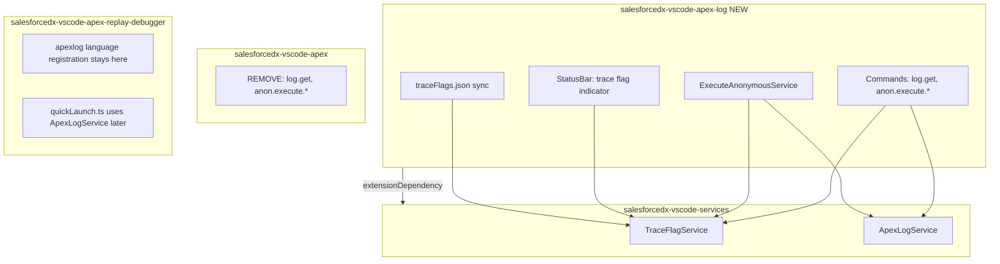

# salesforcedx-vscode-apex-log Extension

## Architecture Overview



## Phase 1: New Services in salesforcedx-vscode-services

### TraceFlagService

Location: `packages/salesforcedx-vscode-services/src/core/traceFlagService.ts`

Uses `connection.tooling.*` directly (no `@salesforce/apex-node` dependency -- web-safe). Type API responses with `@salesforce/types/tooling` (`TraceFlag`, `DebugLevel`) and validate/decode with Effect.Schema where needed.

```typescript
export class TraceFlagService extends Effect.Service<TraceFlagService>()('TraceFlagService', {
  accessors: true,
  dependencies: [ConnectionService.Default],
  effect: Effect.gen(function* () {
    const connectionService = yield* ConnectionService;
    return {
      getTraceFlags, // all DEVELOPER_LOG flags for current user
      getTraceFlagForUser, // specific user's flag
      createTraceFlag, // create with debug level
      updateTraceFlag, // extend expiration, update debug level
      deleteTraceFlag, // by ID
      ensureTraceFlag, // get-or-create for current user (used by execute anon)
      cleanupExpired, // delete expired flags
      getOrCreateDebugLevel,
      getUserId
    };
  })
}) {}
```

Errors (in `packages/salesforcedx-vscode-services/src/errors/`):

- `TraceFlagCreateError`
- `TraceFlagUpdateError`
- `TraceFlagNotFoundError`
- `DebugLevelCreateError`
- `UserIdNotFoundError`

### ApexLogService

Location: `packages/salesforcedx-vscode-services/src/core/apexLogService.ts`

Type API responses with `@salesforce/types/tooling` (`ApexLog`). Decode list results with Effect.Schema for safe parsing.

```typescript
export class ApexLogService extends Effect.Service<ApexLogService>()('ApexLogService', {
  accessors: true,
  dependencies: [ConnectionService.Default],
  effect: Effect.gen(function* () {
    const connectionService = yield* ConnectionService;
    return {
      listLogs, // query ApexLog records (returns structured data)
      getLogBody, // GET /sobjects/ApexLog/{id}/Body (returns string)
      deleteLogs // bulk delete by IDs
    };
  })
}) {}
```

Both services get exported via the services API in `src/index.ts` activate return value, and added to `SalesforceVSCodeServicesApi` type in `salesforcedx-vscode-services-types`.

## Phase 2: New Extension Scaffolding

### Directory: `packages/salesforcedx-vscode-apex-log/`

Modeled on [org-browser](packages/salesforcedx-vscode-org-browser/) structure:

```
packages/salesforcedx-vscode-apex-log/
  src/
    index.ts                    # activate/deactivate
    constants.ts
    messages/
      i18n.ts                   # message strings
      index.ts                  # createNls
    services/
      extensionProvider.ts      # AllServicesLayer (like org-browser)
      executeAnonymousService.ts
    commands/
      executeAnonymous.ts       # Effect-based reimplementation
      logGet.ts                 # Effect-based reimplementation
    statusBar/
      traceFlagStatusBar.ts     # green/red indicator
    schemas/
      logCategory.ts            # LogCategorySchema, LogCategoryLevelSchema
      traceFlagConfig.ts        # TraceFlagsJsonSchema, TraceFlagEntrySchema
      executeResult.ts          # ExecuteAnonymousResultSchema
      apexLogListItem.ts        # ApexLogListItemSchema
    traceFlags/
      traceFlagJsonSync.ts      # bidirectional JSON file sync
    logs/
      logStorage.ts             # save/open log files
  test/
    playwright/
      specs/
      fixtures/
      web/
  package.json
  package.nls.json
  tsconfig.json
  esbuild.config.mjs
  playwright.config.web.ts
  playwright.config.desktop.ts
  jest.config.js
```

### package.json key fields

```json
{
  "name": "salesforcedx-vscode-apex-log",
  "displayName": "Salesforce Apex Log",
  "main": "./dist/index.js",
  "browser": "./dist/web/index.js",
  "extensionDependencies": ["salesforce.salesforcedx-vscode-services"],
  "activationEvents": ["workspaceContains:sfdx-project.json", "onFileSystem:memfs"],
  "dependencies": {
    "@salesforce/effect-ext-utils": "*",
    "@salesforce/types": "^1.6.0",
    "@salesforce/vscode-i18n": "*",
    "effect": "^3.19.14"
  },
  "devDependencies": {
    "@salesforce/core": "^8.23.3",
    "@salesforce/playwright-vscode-ext": "*",
    "esbuild": "0.25.12",
    "salesforcedx-vscode-services": "*"
  }
}
```

### Wireit scripts

Same pattern as org-browser: `compile`, `vscode:bundle`, `test`, `test:web`, `test:desktop`, `test:e2e`, `lint`, `run:web`, `vscode:package`. Add to root `package.json` wireit deps for `compile`, `lint`, `test`, `vscode:bundle`.

## Phase 3: Commands (Move from apex ext)

### sf.apex.log.get (reimplemented with Effect)

```typescript
const logGetEffect = Effect.fn('ApexLog.logGet')(function* () {
  const api = yield* (yield* ExtensionProviderService).getServicesApi;
  const logService = yield* api.services.ApexLogService;
  const logs = yield* logService.listLogs();
  // QuickPick selection
  const selected = yield* selectLog(logs);
  const body = yield* logService.getLogBody(selected.id);
  // Save to .sf/orgs/{orgId}/logs/{id}.log and open
  yield* saveAndOpenLog(selected.id, body);
});
```

### sf.anon.apex.execute.document / sf.anon.apex.execute.selection

Reimplemented with Effect. Key change: **always** creates a temporary trace flag, retrieves the log, opens it.

```typescript
const executeAnonymousEffect = Effect.fn('ApexLog.executeAnonymous')(function* (code: string) {
  const api = yield* (yield* ExtensionProviderService).getServicesApi;
  const traceFlagService = yield* api.services.TraceFlagService;
  const logService = yield* api.services.ApexLogService;

  // 1. Ensure trace flag is active
  const { created, traceFlagId } = yield* traceFlagService.ensureTraceFlag();

  // 2. Execute via Tooling API REST (POST executeAnonymous)
  const result = yield* executeAnonymousService.execute(code);

  // 3. Retrieve the log generated by execution
  const logs = yield* logService.listLogs(); // most recent
  const body = yield* logService.getLogBody(logs[0].id);

  // 4. Save exec result + log
  yield* saveExecResult(code, result, body); // .sf/orgs/{orgId}/anonymousApex/
  yield* openLog(body);

  // 5. If we created the trace flag just for this, deactivate after
  if (created) yield* traceFlagService.deleteTraceFlag(traceFlagId);

  return result;
});
```

### ExecuteAnonymousService (local to apex-log ext)

Uses `connection.tooling.executeAnonymous()` directly (or REST POST to `/services/data/vXX.0/tooling/executeAnonymous/?action=executeAnonymous`). No `@salesforce/apex-node` dependency needed for web compat.

### Remove from salesforcedx-vscode-apex

Remove from `packages/salesforcedx-vscode-apex/src/index.ts`:

- `sf.apex.log.get` registration
- `sf.anon.apex.execute.document` registration
- `sf.anon.apex.execute.selection` registration

Remove files:

- `packages/salesforcedx-vscode-apex/src/commands/apexLogGet.ts`
- `packages/salesforcedx-vscode-apex/src/commands/anonApexExecute.ts`

Keep: `sf.apex.debug.document` in apex ext for now (debug variant, decide later).

## Phase 4: Status Bar + Trace Flag JSON

### Status Bar (`src/statusBar/traceFlagStatusBar.ts`)

Pattern: follows [sourceTrackingStatusBar.ts](packages/salesforcedx-vscode-metadata/src/statusBar/sourceTrackingStatusBar.ts) -- Effect streams, `Effect.addFinalizer`, `Effect.sleep(Duration.infinity)`.

- ID: `"apex-trace-flag-status"`
- Active: `$(debug-alt) Tracing until HH:mm` (green-ish via ThemeColor)
- Inactive: `$(debug-disconnect) No Tracing`
- Click: opens `traceFlags.json` for the current org
- Tooltip: MarkdownString with trace flag details + "Click to manage trace flags"
- Reacts to: org changes (via `TargetOrgRef` stream), timer for expiration

### traceFlags.json (`src/traceFlags/`)

Location: `.sf/orgs/{orgId}/traceFlags.json`

#### JSON Structure

```json
{
  "$schema": "./traceFlags.schema.json",
  "defaultDebugLevels": {
    "apexCode": "FINEST",
    "apexProfiling": "INFO",
    "callout": "INFO",
    "database": "INFO",
    "system": "DEBUG",
    "validation": "INFO",
    "visualforce": "FINER",
    "workflow": "INFO"
  },
  "defaultDurationMinutes": 30,
  "traceFlags": [
    {
      "id": "0Af...",
      "tracedEntityName": "Shane McLaughlin",
      "tracedEntityId": "005...",
      "logType": "DEVELOPER_LOG",
      "startDate": "2026-02-16T10:00:00.000Z",
      "expirationDate": "2026-02-16T10:30:00.000Z",
      "debugLevel": {
        "apexCode": "FINEST",
        "visualforce": "FINER"
      },
      "isActive": true
    }
  ]
}
```

- `defaultDebugLevels`: used when creating new trace flags (editable)
- `defaultDurationMinutes`: used when creating/extending (editable)
- `traceFlags[]`: current state from org (refreshed on open/poll)
  - `isActive`: computed from `expirationDate > now` (read-only, for display)

#### Sync Behavior

- **On file open**: query org for current trace flags, write to file
- **On poll** (configurable interval, e.g. every 2 min when file is open): refresh from org
- **On save**: reconcile -- update debug levels, extend expirations; entries removed from array get deleted from org; new entries (no `id`) get created
- **Cleanup**: expired flags get a visual indicator (`"isActive": false`) and can be bulk-deleted via a command or by removing from the array and saving

#### Schema file

Generate a JSON schema and register it via `contributes.jsonValidation` in `package.json`:

```json
"jsonValidation": [
  {
    "fileMatch": ".sf/orgs/*/traceFlags.json",
    "url": "./resources/traceFlags.schema.json"
  }
]
```

This gives users IntelliSense for debug level values (enum: NONE, ERROR, WARN, INFO, DEBUG, FINE, FINER, FINEST).

## Phase 5: Execute Anonymous Result Storage

Location: `.sf/orgs/{orgId}/anonymousApex/`

```
.sf/orgs/{orgId}/anonymousApex/
  2026-02-16T100000Z.apex       # the code that was executed
  2026-02-16T100000Z.result.json # execution result metadata
  2026-02-16T100000Z.log        # the apex debug log
```

`result.json`:

```json
{
  "success": true,
  "compiled": true,
  "compileProblem": null,
  "exceptionMessage": null,
  "exceptionStackTrace": null,
  "line": -1,
  "column": -1,
  "executedAt": "2026-02-16T10:00:00.000Z"
}
```

This gives a browsable history of anonymous apex executions per org.

## Phase 6: Remove from Legacy Locations

1. Remove trace flag helpers from `packages/salesforcedx-utils-vscode/src/helpers/traceFlags.ts` (replaced by TraceFlagService)
2. Remove `sf.start.apex.debug.logging` / `sf.stop.apex.debug.logging` from `packages/salesforcedx-vscode-core/` (replaced by status bar + JSON)
3. Remove `handleTraceFlagCleanup` from core's workspace context handler
4. Update `salesforcedx-vscode-expanded` extension pack to include `salesforcedx-vscode-apex-log`

## Phase 7: Testing

### Playwright E2E (read skill files for patterns)

Tests in `packages/salesforcedx-vscode-apex-log/test/playwright/specs/`:

- `executeAnonymous.spec.ts`: execute .apex file, verify log opens, verify result stored
- `logGet.spec.ts`: list logs, select one, verify it opens
- `traceFlagStatusBar.spec.ts`: verify status bar shows correct state, click opens JSON
- `traceFlagJson.spec.ts`: open file, modify debug levels, save, verify org updated

### Unit Tests (jest)

- TraceFlagService: mock connection.tooling calls
- ApexLogService: mock tooling queries
- ExecuteAnonymousService: mock tooling API
- JSON sync logic: mock file system + service calls

## Types & Schemas (Effect.Schema + @salesforce/types)

All domain types use Effect.Schema for runtime validation, encoding, and decoding. Existing Salesforce API types come from `@salesforce/types` ([forcedotcom/wsdl](https://github.com/forcedotcom/wsdl), [partner.ts](https://github.com/forcedotcom/wsdl/blob/7fd4f2bbc93d4716c80fc144885738f61a0e66f0/src/partner.ts), [tooling.ts](https://github.com/forcedotcom/wsdl/blob/main/src/tooling.ts)).

### Dependency

```json
"dependencies": {
  "@salesforce/types": "^1.6.0",
  "effect": "^3.19.14"
}
```

### Reuse from @salesforce/types

| Import                                                                                                                                | Use                                                              |
| ------------------------------------------------------------------------------------------------------------------------------------- | ---------------------------------------------------------------- |
| `@salesforce/types/tooling`: `LogCategory`, `LogCategoryLevel`, `ApexLogLevel`, `TraceFlag`, `DebugLevel`, `ApexLog`, `TraceFlagType` | API response typing, TraceFlag/DebugLevel/ApexLog sObject shapes |
| `@salesforce/types/partner`: `LogInfo`, `Error`                                                                                       | Execute anonymous / Tooling API error shapes                     |

Use as **type constraints** where we pass through Tooling API responses. For our schemas, we define Effect.Schema that validate/decode to these shapes or subsets.

### Effect.Schema usage

1. **Enums** – `Schema.Literal` union for `ApexLogLevel` (NONE, FINEST, …) and `LogCategory` (ApexCode, Database, …). Match `@salesforce/types/tooling` [ApexLogLevel](https://github.com/forcedotcom/wsdl/blob/main/src/tooling.ts) (DebugLevel fields) and [LogCategory](https://github.com/forcedotcom/wsdl/blob/main/src/tooling.ts).
2. **Domain structs** – `Schema.Struct` for traceFlags.json, execute result, simplified ApexLog list items.
3. **Decoding** – `Schema.decodeUnknown` / `Schema.decodeUnknownSync` for JSON files and API responses.
4. **Encoding** – `Schema.encode` for writing traceFlags.json.
5. **JSON Schema** – Use `Schema.toJson()` (or equivalent) to produce `traceFlags.schema.json` for `contributes.jsonValidation`.

References: [Effect Schema intro](https://effect.website/docs/schema/introduction/), [effect-best-practices](../.claude/skills/effect-best-practices/SKILL.md).

### Schema module layout (`packages/salesforcedx-vscode-apex-log/src/schemas/`)

```
schemas/
  logCategory.ts      # ApexLogLevelSchema, LogCategorySchema (Schema.Literal unions)
  traceFlagConfig.ts  # TraceFlagsJsonSchema, TraceFlagEntrySchema, DefaultDebugLevelsSchema
  executeResult.ts   # ExecuteAnonymousResultSchema (success, compiled, compileProblem, etc.)
  apexLogListItem.ts # ApexLogListItemSchema (id, Application, DurationMilliseconds, StartTime, LogLength)
```

### Example: traceFlags.json schema

```typescript
// schemas/logCategory.ts
import { Schema } from 'effect';

// ApexLogLevel from @salesforce/types/tooling (DebugLevel fields)
const APEX_LOG_LEVEL_VALUES = [
  'NONE',
  'INTERNAL',
  'FINEST',
  'FINER',
  'FINE',
  'DEBUG',
  'INFO',
  'WARN',
  'ERROR'
] as const;
export const ApexLogLevelSchema = Schema.Union(...APEX_LOG_LEVEL_VALUES.map(v => Schema.Literal(v)));
export type ApexLogLevel = Schema.Schema.Type<typeof ApexLogLevelSchema>;

// Align with @salesforce/types/tooling LogCategory
const LOG_CATEGORIES = [
  'ApexCode',
  'ApexProfiling',
  'Callout',
  'Database',
  'System',
  'Validation',
  'Visualforce',
  'Workflow',
  'Nba',
  'Wave',
  'Data_access',
  'All'
] as const;
export const LogCategorySchema = Schema.Union(...LOG_CATEGORIES.map(c => Schema.Literal(c)));
```

```typescript
// schemas/traceFlagConfig.ts
import { Schema } from 'effect';
import { ApexLogLevelSchema } from './logCategory';

const DebugLevelOverridesSchema = Schema.Struct({
  apexCode: Schema.optional(ApexLogLevelSchema),
  apexProfiling: Schema.optional(ApexLogLevelSchema),
  callout: Schema.optional(ApexLogLevelSchema),
  database: Schema.optional(ApexLogLevelSchema),
  system: Schema.optional(ApexLogLevelSchema),
  validation: Schema.optional(ApexLogLevelSchema),
  visualforce: Schema.optional(ApexLogLevelSchema),
  workflow: Schema.optional(ApexLogLevelSchema)
});

export const TraceFlagEntrySchema = Schema.Struct({
  id: Schema.optional(Schema.String),
  tracedEntityName: Schema.String,
  tracedEntityId: Schema.String,
  logType: Schema.Literal('DEVELOPER_LOG'),
  startDate: Schema.String,
  expirationDate: Schema.String,
  debugLevel: Schema.optional(DebugLevelOverridesSchema),
  isActive: Schema.Boolean
});

export const DefaultDebugLevelsSchema = DebugLevelOverridesSchema;

export const TraceFlagsJsonSchema = Schema.Struct({
  defaultDebugLevels: Schema.optional(DefaultDebugLevelsSchema),
  defaultDurationMinutes: Schema.optional(Schema.Number),
  traceFlags: Schema.Array(TraceFlagEntrySchema)
});
```

### Example: execute result schema

```typescript
// schemas/executeResult.ts
import { Schema } from 'effect';

export const ExecuteAnonymousResultSchema = Schema.Struct({
  success: Schema.Boolean,
  compiled: Schema.Boolean,
  compileProblem: Schema.NullOr(Schema.String),
  exceptionMessage: Schema.NullOr(Schema.String),
  exceptionStackTrace: Schema.NullOr(Schema.String),
  line: Schema.Number,
  column: Schema.Number,
  executedAt: Schema.String // ISO datetime
});
export type ExecuteAnonymousResult = Schema.Schema.Type<typeof ExecuteAnonymousResultSchema>;
```

### Services: Schema.TaggedError

All service errors use `Schema.TaggedError` per effect-best-practices (see existing patterns in `connectionService.ts`, `projectService.ts`).

### JSON Schema for IntelliSense

Generate `resources/traceFlags.schema.json` from `TraceFlagsJsonSchema` (e.g. via build script using `Schema.toJson()` or `@effect/schema/json-schema`) and wire via `contributes.jsonValidation`.

## Cross-Cutting Concerns

### Web Compatibility

- All API calls via `connection.tooling.*` (already web-safe in services ext)
- No `@salesforce/apex-node` dependency (uses Node.js fs internally)
- File storage uses `vscode.workspace.fs` for web compat
- ExecuteAnonymous via REST: `POST /services/data/vXX.0/tooling/executeAnonymous/` with connection

### i18n

- `package.nls.json` for command titles, status bar text
- `src/messages/i18n.ts` for runtime messages (error text, notifications)
- Pattern: `createNls({ instanceName: 'salesforcedx-vscode-apex-log', messages })` like org-browser

### ESLint

- Same rules as org-browser/metadata: no direct dep on services, use the API
- Circular dependency check via `dpdm`

### Replay Debugger Compatibility

- `apexlog` language registration stays in replay-debugger (no change)
- Log files saved with `.log` extension will still get syntax highlighting
- Replay debugger can adopt `ApexLogService` from services in a follow-up refactor

## Ideas for Future Enhancements (not in initial scope)

1. **CodeLens on .apex files**: "Execute Anonymous" | "Execute and Debug" above first line
2. **Log TreeView**: sidebar showing recent logs per org, with search/filter
3. **Custom log editor**: webview that parses log structure, filters by event type/level
4. **Debug level presets**: named configurations like "Performance Profiling", "Minimal", "Full Debug"
5. **Auto-tail**: when tracing is active, poll for new logs and notify
6. **Execution history QuickPick**: re-run previous anonymous apex from `.sf/orgs/{orgId}/anonymousApex/`
