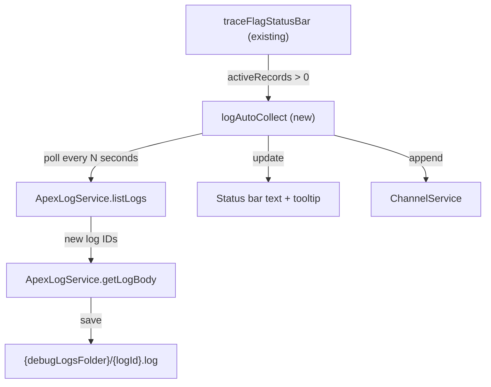

# Apex Log Auto-Collection

## Architecture

When active trace flags exist, a polling stream fetches new logs at a configurable interval and saves them to `{stateFolder}/tools/debug/logs/{logId}.log`. The poller shares the same Effect Stream lifecycle as the existing trace flag status bar.



## VS Code Setting

Add `contributes.configuration` to [package.json](packages/salesforcedx-vscode-apex-log/package.json):

```json
"configuration": {
  "title": "Salesforce Apex Log",
  "properties": {
    "salesforcedx-vscode-apex-log.logPollIntervalSeconds": {
      "type": "number",
      "default": 30,
      "minimum": 5,
      "maximum": 300,
      "description": "Polling interval in seconds for auto-collecting Apex debug logs when trace flags are active."
    }
  }
}
```

## New file: `logAutoCollect.ts`

Location: [src/logs/logAutoCollect.ts](packages/salesforcedx-vscode-apex-log/src/logs/logAutoCollect.ts)

Core logic:

- Maintain a `HashSet<string>` of already-fetched log IDs (in-memory, reset on org change)
- Poll cycle: `listLogs()` -> filter out known IDs -> `getLogBody()` for each new one -> save to disk via `FsService`
- Use `Stream.fromSchedule(Schedule.fixed(Duration.seconds(interval)))` gated by `Stream.filter(() => hasActiveTraceFlags && vscode.window.state.active)`
- On org change, clear the known-IDs set
- Wire into the same `traceFlagRefreshPubSub` so trace flag creation/deletion triggers an immediate poll

## User notification (layered)

1. **Status bar** -- when auto-collect is active, append a cloud-download icon to the existing trace flag text:

- Active + collecting: `$(debug-alt) Tracing until 2:30 PM $(cloud-download)`
- The tooltip gains a new section: "Auto-collected: 5 logs" with a link to open the logs folder

1. **Output channel** -- each fetched log gets a one-liner: `Auto-collected log {logId} ({user} - {operation})`
2. **File explorer** -- logs silently appear in `.sfdx/tools/debug/logs/` as `{logId}.log`

## Integration into activation

In [src/index.ts](packages/salesforcedx-vscode-apex-log/src/index.ts), fork `createLogAutoCollect(traceFlagRefreshPubSub)` into the extension scope alongside the status bar. They share the `traceFlagRefreshPubSub` so both react to trace flag changes.

## Shared state between status bar and poller

Create a `SubscriptionRef<LogCollectorState>` holding `{ isCollecting: boolean, collectedCount: number }`. The poller writes to it; the status bar reads it during refresh to decide whether to show the `$(cloud-download)` icon and count.

## Log storage: `logStorage.ts`

Location: [src/logs/logStorage.ts](packages/salesforcedx-vscode-apex-log/src/logs/logStorage.ts) (already imported but missing)

This file needs to be created regardless for the existing `logGet` and `executeAnonymous` commands. It will:

- Resolve the log directory via `FsService` + `ProjectService` (to get the workspace root and build the `.sfdx/tools/debug/logs/` path)
- `saveLog(logId, body)` -- write `{logId}.log`, return the URI
- `saveAndOpenLog(logId, body)` -- save + open in editor
- `saveExecResultAndOpenLog(code, result, body)` -- save exec result + log + open

The auto-collector calls `saveLog` (no open).

## Messages

Add to [i18n.ts](packages/salesforcedx-vscode-apex-log/src/messages/i18n.ts):

- `log_auto_collect_fetched`: `Auto-collected log %s (%s - %s)`
- `log_auto_collect_tooltip`: `Auto-collected: %s logs`
- `log_auto_collect_open_folder`: `Open logs folder`

## Verification

- compile, lint, test, bundle, knip, check:dupes per verification skill
