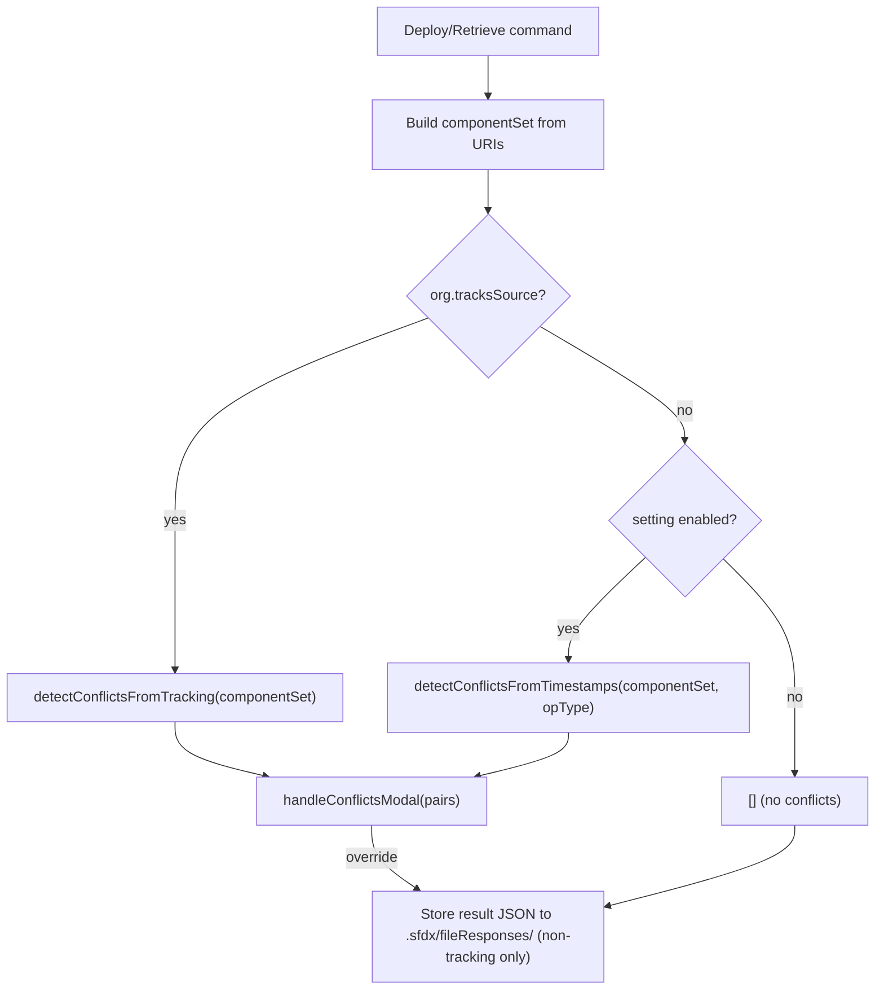

# Conflict Detection for Non-Tracking Orgs

## Core Problem

Deploying can silently overwrite another user's remote changes. Retrieving can silently overwrite local changes. Source tracking catches this on tracking orgs, but non-tracking orgs have no protection.

## Architecture



## Key Data Structures (SDR types)

- `RetrieveResult.response.fileProperties: FileProperties[]` -- each has `fullName`, `type`, `lastModifiedDate`
- `DeployResult.response.lastModifiedDate` -- deploy-level timestamp (not per-component)
- `DeployResult.getFileResponses(): FileResponse[]` -- each has `fullName`, `type`, `filePath`

## 1. Result Storage

Store raw deploy/retrieve result JSON in `.sfdx/fileResponses/`.

**New file**: `[packages/salesforcedx-vscode-metadata/src/conflict/resultStorage.ts](packages/salesforcedx-vscode-metadata/src/conflict/resultStorage.ts)`

- `storeDeployResult(result: DeployResult)` -- serialize `getFileResponses()` + `response.lastModifiedDate` to `deploy-{ISO timestamp}.json`
- `storeRetrieveResult(result: RetrieveResult)` -- serialize `response.fileProperties` to `retrieve-{ISO timestamp}.json`
- `buildTimestampIndex()` -- load all result files from disk, iterate newest-first, build a `Map<"type:fullName", lastModifiedDate>` keeping only the most recent entry per component. Return the map for O(1) lookups. Called once per conflict detection pass, not per component.

Storage dir: `.sfdx/fileResponses/` (already gitignored)

File format: JSON with `{ timestamp: string, type: 'deploy'|'retrieve', components: Array<{type, fullName, lastModifiedDate?}> }`

## 2. Timestamp-Based Conflict Detection (non-tracking)

**New file**: `[packages/salesforcedx-vscode-metadata/src/conflict/conflictDetectionTimestamp.ts](packages/salesforcedx-vscode-metadata/src/conflict/conflictDetectionTimestamp.ts)`

`detectConflictsFromTimestamps(componentSet, operationType: 'deploy' | 'retrieve')`

**Deploy flow** ("has the server copy changed since I last deployed/retrieved?"):

1. Retrieve componentSet to cache dir (reuse `retrieveToCacheDirectory`)
2. Read `fileProperties` from `retrieveResult.response.fileProperties`
3. Call `buildTimestampIndex()` once to get the full `Map<"type:fullName", lastModifiedDate>`
4. For each component, look up stored lastModifiedDate from the index
5. If no stored timestamp (first deploy) OR remote `lastModifiedDate > stored` -- potential conflict
6. For potential conflicts: byte-compare local vs cache (reuse `matchUrisToComponents` + `filesAreNotIdentical`)
7. Return `DiffFilePair[]`

**Retrieve flow** ("do I have local changes that would be lost?"):

1. Retrieve componentSet to cache dir
2. Byte-compare local vs retrieved remote content
3. If files differ -- potential conflict
4. Return `DiffFilePair[]`

## 3. Filter Tracking Conflicts to ComponentSet

**Modify**: `[conflictDetection.ts](packages/salesforcedx-vscode-metadata/src/conflict/conflictDetection.ts)`

Current `detectConflictsFromTracking` calls `tracking.getConflicts()` which returns ALL conflicts project-wide. Change signature to accept a componentSet and filter:

```typescript
const detectConflictsFromTracking = (componentSet: ComponentSet) => ...
```

After `tracking.getConflicts()`, filter conflicts to only those whose `type + name` matches a component in the componentSet. Use `type + fullName` matching (not filename) to handle bundle types correctly:

```typescript
const componentMembers = new Set(
  componentSet
    .getSourceComponents()
    .toArray()
    .map(c => `${c.type.name}:${c.fullName}`)
);
const relevant = conflicts.filter(c => componentMembers.has(`${c.type}:${c.name}`));
```

Then build componentSet from only the filtered conflict filePaths (not all conflicts).

## 4. Unified Conflict Flow

**Modify**: `[conflictFlow.ts](packages/salesforcedx-vscode-metadata/src/conflict/conflictFlow.ts)`

Change `handleConflictWithRetry` to accept componentSet and decide detection strategy:

```typescript
type HandleConflictOptions<A, E, R> = {
  retryOperation: Effect.Effect<A, E, R>;
  operationType: 'deploy' | 'retrieve';
  componentSet: ComponentSet;
};
```

New unified detection function:

```typescript
const detectConflicts = (componentSet, operationType) =>
  // check tracksSource from TargetOrgRef
  // if tracksSource: detectConflictsFromTracking(componentSet)
  // else if setting enabled: detectConflictsFromTimestamps(componentSet, operationType)
  // else: []
```

This replaces catching `SourceTrackingConflictError` as the entry point. Instead, deploy/retrieve commands call conflict detection proactively before the operation.

## 5. Restructure Deploy/Retrieve Commands

### Deploy: `[deploySourcePath.ts](packages/salesforcedx-vscode-metadata/src/commands/deploySourcePath.ts)`

Current flow: build componentSet -> check tracking conflicts (throws SourceTrackingConflictError) -> deploy -> catch error -> handleConflictWithRetry

New flow: build componentSet -> `detectConflicts(componentSet, 'deploy')` -> if conflicts, show UI -> on override, deploy with skipConflictCheck -> store result

The conflict check moves from inside `deployUris` to the outer `deploySourcePathsCommand`, passing the componentSet to the unified detection.

### Retrieve: `[projectRetrieveStart.ts](packages/salesforcedx-vscode-metadata/src/commands/retrieveStart/projectRetrieveStart.ts)`

Current flow is tracking-only (`getSourceTrackingOrThrow`, `maybeApplyRemoteDeletesToLocal`). For non-tracking orgs, this command won't work (no tracking). The timestamp-based conflict detection applies to path-based retrieve commands. `projectRetrieveStart` stays tracking-only but gains componentSet filtering.

After `maybeApplyRemoteDeletesToLocal` returns `componentSetFromNonDeletes`, pass that componentSet to `detectConflictsFromTracking` for filtered conflict checking, replacing the early `checkConflicts` call.

### Store Results After Deploy/Retrieve (non-tracking orgs only)

Only store results when `!tracksSource` -- tracking orgs don't need this data.

After successful deploy in `[deployComponentSet.ts](packages/salesforcedx-vscode-metadata/src/shared/deploy/deployComponentSet.ts)`: call `storeDeployResult(result)`.

After successful retrieve in `[retrieveComponentSet.ts](packages/salesforcedx-vscode-metadata/src/shared/retrieve/retrieveComponentSet.ts)`: call `storeRetrieveResult(result)`.

## 6. Setting Semantics

**Modify**: `[package.json](packages/salesforcedx-vscode-metadata/package.json)`

- `detectConflictsForDeployAndRetrieve` description changes to indicate it governs non-tracking orgs only
- Tracking orgs always check conflicts (no setting needed)

**Modify**: `[deployOnSaveSettings.ts](packages/salesforcedx-vscode-metadata/src/settings/deployOnSaveSettings.ts)` -- update the JSDoc to reflect new meaning.

## 7. Conflict View Update

**Modify**: `[package.json](packages/salesforcedx-vscode-metadata/package.json)` view `when` clause:

```diff
- "when": "sf:project_opened && sf:target_org_has_change_tracking && sf:has_conflicts"
+ "when": "sf:project_opened && sf:has_conflicts"
```

## Files Changed Summary

| File                                             | Change                                       |
| ------------------------------------------------ | -------------------------------------------- |
| `conflict/resultStorage.ts`                      | **NEW** -- store/read result JSON files      |
| `conflict/conflictDetectionTimestamp.ts`         | **NEW** -- timestamp-based detection         |
| `conflict/conflictDetection.ts`                  | Add componentSet filtering                   |
| `conflict/conflictFlow.ts`                       | Unified routing (tracking vs timestamp)      |
| `commands/deploySourcePath.ts`                   | Restructure: componentSet first, then detect |
| `commands/retrieveStart/projectRetrieveStart.ts` | Pass componentSet to filtered detection      |
| `shared/deploy/deployComponentSet.ts`            | Store deploy result                          |
| `shared/retrieve/retrieveComponentSet.ts`        | Store retrieve result                        |
| `settings/deployOnSaveSettings.ts`               | Update JSDoc                                 |
| `package.json`                                   | View `when` clause, setting description      |

## Known Gaps (from develop branch comparison)

**Deploy timestamp is client-side.** `DeployResult` has no per-component `lastModifiedDate`. The old approach used `new Date().toISOString()` as the baseline for deployed components. `storeDeployResult` must do the same -- use client timestamp per component, not a server timestamp.

**Component matching for bundles.** Current `matchUrisToComponents` in `diffHelpers.ts` matches by `basename` (filename). For bundle types (LWC, Aura), the retrieved cache layout may differ from the project layout. The old approach used `walkContent()` on both project and cache components to pair files. During implementation, verify that `matchUrisToComponents` handles bundles correctly; if not, switch to component-level matching via `walkContent()`.

**Out of scope for this PR (follow-ups):**

- Manifest-based deploy/retrieve (`deployManifest`, `retrieveManifest`) -- same pattern applies but different entry points
- Deploy-on-save on non-tracking orgs -- the old approach skipped timestamp detection for deploy-on-save (too slow/disruptive). Same default here.
- File cleanup/pruning of `.sfdx/fileResponses/` -- files are small JSON; accumulation is unlikely to be a problem short-term
- Timestamp fields in `DiffFilePair` for conflict tree tooltips -- nice-to-have, not blocking

## Pre-reading

Before writing code, read [effect-best-practices skill](/.claude/skills/effect-best-practices/SKILL.md) to enforce Effect-TS patterns (Effect.Service, Effect.fn with span names, Schema.TaggedError, etc).

## Verification

Full checklist per [verification skill](/.claude/skills/verification/SKILL.md):

1. `npm run compile`
2. `npm run lint`
3. `npx effect-language-service diagnostics --project tsconfig.json` (or `--file <path>` for changed files)
4. `npm run test`
5. `npm run vscode:bundle`
6. E2E tests for salesforcedx-vscode-metadata (web + desktop):

- `npm run test:web -w salesforcedx-vscode-metadata -- --retries 0`
- `npm run test:desktop -w salesforcedx-vscode-metadata -- --retries 0`

1. `npx knip` -- remove any unused exports introduced by these changes
2. `npm run check:dupes` -- verify no duplicated code in jscpd-report
