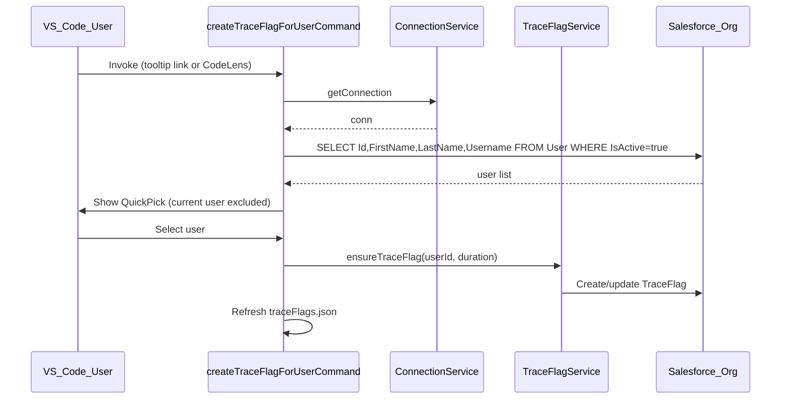

# Create Trace Flag for Other Users

## Architecture

`TraceFlagService.createTraceFlag(userId, debugLevelId, duration)` already supports arbitrary users. `ensureTraceFlag` wraps the check-and-create/update flow but hardcodes the current user. We change its signature to accept a `userId` param, then build the command and UI in the apex-log extension.

## Changes

### 1. TraceFlagService - change `ensureTraceFlag` signature

In `[traceFlagService.ts](packages/salesforcedx-vscode-services/src/core/traceFlagService.ts)`:

- Change `ensureTraceFlag(duration)` to `ensureTraceFlag(userId: string, duration?)` -- remove internal `getUserIdOrFail` call, accept userId as first arg

Callers to update:

- `[traceFlagJsonSync.ts:116](packages/salesforcedx-vscode-apex-log/src/traceFlags/traceFlagJsonSync.ts)` -- already has orgId context; get userId from TargetOrgRef and pass it
- `[executeAnonymous.ts:20](packages/salesforcedx-vscode-apex-log/src/commands/executeAnonymous.ts)` -- get userId via `traceFlagService.getUserId()` then pass it

### 2. New command in traceFlagJsonSync.ts

In `[traceFlagJsonSync.ts](packages/salesforcedx-vscode-apex-log/src/traceFlags/traceFlagJsonSync.ts)`:

- Add `createTraceFlagForUserCommand`:
  - Guard: no org -> warning
  - Query users directly via `conn.query('SELECT Id, FirstName, LastName, Username FROM User WHERE IsActive = true ORDER BY LastName, FirstName')`
  - Filter out current user (compare against userId from TargetOrgRef) before building picker items
  - Build `vscode.QuickPickItem[]` with `label: "FirstName LastName"`, `description: username`; store userId on a custom prop
  - Show `vscode.window.showQuickPick(items, { placeHolder: 'Select another user to trace' })`
  - If user picks one, call `traceFlagService.ensureTraceFlag(userId, duration)`
  - Refresh JSON via `ensureTraceFlagsFile(orgId)`

### 3. Register the command

In `[index.ts](packages/salesforcedx-vscode-apex-log/src/index.ts)`:

- Import `createTraceFlagForUserCommand`
- Register `sf.apex.traceFlags.createForUser` with PubSub publish (same pattern as existing commands)

### 4. package.json and package.nls.json

In `[package.json](packages/salesforcedx-vscode-apex-log/package.json)`:

- Add command entry for `sf.apex.traceFlags.createForUser` in `contributes.commands`
- Add commandPalette entry with `when: "sf:project_opened && sf:has_target_org"`

In `[package.nls.json](packages/salesforcedx-vscode-apex-log/package.nls.json)`:

- Add `"apexLog.command.traceFlagsCreateForUser": "SFDX: Create Trace Flag for Another User"`

### 5. i18n messages

In `[i18n.ts](packages/salesforcedx-vscode-apex-log/src/messages/i18n.ts)`:

- Add `trace_flag_pick_user: 'Select another user to trace'`
- Add `trace_flag_codelens_create_for_user: 'Add trace for another user'`
- Add `trace_flag_tooltip_add_user: 'Add trace for another user'`

### 6. Status bar tooltip - Users section

In `[traceFlagStatusBar.ts](packages/salesforcedx-vscode-apex-log/src/statusBar/traceFlagStatusBar.ts)`:

In `buildTooltip` (line 54), after the existing log-type sections and before the "Full details" link:

- Append a "Users" section header using existing `trace_flag_tooltip_users` key
- Add a command link: `[Add trace for another user](command:sf.apex.traceFlags.createForUser)`

### 7. CodeLens beside USER_DEBUG

In `[traceFlagsCodeLensProvider.ts](packages/salesforcedx-vscode-apex-log/src/traceFlags/traceFlagsCodeLensProvider.ts)`:

In `provideTraceFlagsCodeLens`, after the existing delete/create lenses:

- Find the position of `"USER_DEBUG"` in the document text
- Add a CodeLens at that line with command `sf.apex.traceFlags.createForUser` and title from `trace_flag_codelens_create_for_user`
- This lens always appears regardless of USER_DEBUG array contents

### 8. Verification

- Compile: `npm run compile` in both services and apex-log packages
- Lint: `npm run lint` in both
- Knip: check for unused exports
- Bundle: `npm run vscode:bundle` in apex-log package
