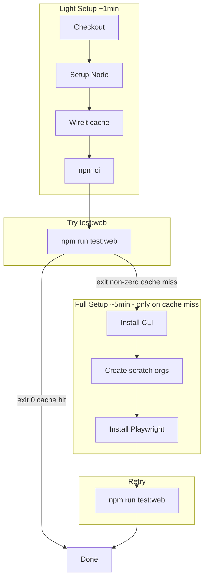

# E2E Workflow Early Cache Short-Circuit

## Problem

E2E workflows spend ~5 minutes on setup (Install Salesforce CLI, create scratch orgs, Install Playwright) before reaching the wireit test step. When wireit cache hits, none of that setup is needed—the test command is skipped entirely.

## Solution: Try Test First, Setup on Failure

Reorder steps so we run the wireit test command **before** the expensive setup. When cache hits, wireit skips the command and exits 0. When cache misses, Playwright runs and fails quickly (chromium not found). We then run full setup and retry.



## Why This Works

Wireit caches based on input file hashes. When we invoke `npm run test:web`, wireit either:

- **Cache hit**: Inputs match previous run → wireit returns success **without executing** the `playwright test` command. The command is never run, so we never need Playwright binaries, CLI, or scratch orgs.
- **Cache miss**: Inputs changed → wireit runs the command. Playwright starts, fails immediately ("chromium not found"), exits non-zero. We then perform full setup and retry.

The key: we only need CLI, orgs, and Playwright when the actual command runs. On cache hit it never runs.

## Key Behavior

- **Cache hit**: Wireit skips without running `playwright test`. No CLI, orgs, or browsers needed. Exit ~1 min instead of ~6 min.
- **Cache miss**: `playwright test` runs. Fails in seconds ("chromium not found"). Full setup, retry, tests run.

## Implementation

For each job in the six E2E workflows:

1. Keep: Checkout, Setup Node, Wireit cache, npm ci
2. **Add**: "Try E2E tests" step - run `npm run test:web` (or `test:desktop`) with `id: try-run`
3. **Make conditional**: Install CLI, scratch org setup, Playwright install - `if: steps.try-run.outcome == 'failure'`
4. **Make conditional**: "Run E2E tests (parallel)" - `if: steps.try-run.outcome == 'failure'`
5. Retry step: keep `if: steps.parallel-run.outcome == 'failure'` (unchanged)
6. Artifact upload: `if: always()` (unchanged—upload on both paths)

## Comments to Add to Workflow YAML

Add these comments above the relevant steps so future readers understand the logic:

```yaml
# Try E2E tests first. When wireit cache hits, it skips the command and exits 0—we never need CLI, orgs, or Playwright.
# When cache misses, Playwright runs and fails fast (no chromium). We then run full setup below and retry.
- name: Try E2E tests
  id: try-run
  run: npm run test:web -w ...
  ...

# Only run expensive setup when try-run failed (cache miss). On cache hit we never reach these steps.
- name: Install Salesforce CLI
  if: steps.try-run.outcome == 'failure'
  ...
```

## Workflows to Update

| Workflow                                                                   | Jobs                 |
| -------------------------------------------------------------------------- | -------------------- |
| [playwrightVscodeExtE2E.yml](.github/workflows/playwrightVscodeExtE2E.yml) | e2e-web, e2e-desktop |
| [servicesE2E.yml](.github/workflows/servicesE2E.yml)                       | e2e-web              |
| [metadataE2E.yml](.github/workflows/metadataE2E.yml)                       | e2e-web, e2e-desktop |
| [apexTestingE2E.yml](.github/workflows/apexTestingE2E.yml)                 | e2e-web, e2e-desktop |
| [orgBrowserE2E.yml](.github/workflows/orgBrowserE2E.yml)                   | e2e-web, e2e-desktop |
| [coreE2E.yml](.github/workflows/coreE2E.yml)                               | e2e-desktop          |

## Special Cases

- **playwrightVscodeExtE2E**: No scratch orgs, no CLI. Has explicit "Compile" step. Remove Compile (wireit handles via deps). Try test:web first; on failure, add Install Playwright, then retry.
- **servicesE2E**: Create scratch org before tests. Move that into the conditional block.
- **metadataE2E**: Dreamhouse clone, multiple orgs. All setup conditional.
- **apexTestingE2E**, **orgBrowserE2E**, **coreE2E**: Same pattern—all org/setup steps conditional on try-run failure.

## Step ID Usage

- `id: try-run` on the initial test step
- `if: steps.try-run.outcome == 'failure'` on all setup steps and the main run step
- When try-run fails, we run setup then the main "Run E2E tests" step (with same command as try-run). The retry step remains `if: steps.parallel-run.outcome == 'failure'` for the last-failed logic
