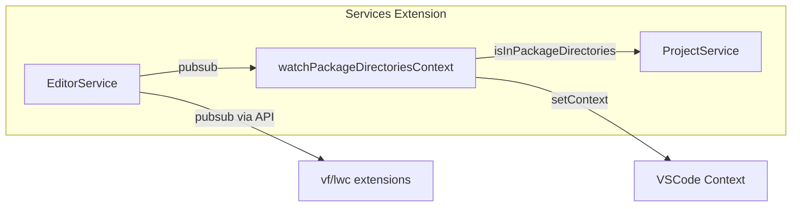

# EditorService PubSub

## Architecture



## Changes

### 1. EditorService - Add PubSub

[packages/salesforcedx-vscode-services/src/vscode/editorService.ts](packages/salesforcedx-vscode-services/src/vscode/editorService.ts)

- Change `effect` → `scoped` (like SettingsWatcherService)
- Add `pubsub: PubSub.PubSub<vscode.TextEditor | undefined>`
- Subscribe to `vscode.window.onDidChangeActiveTextEditor`
- Publish initial editor state
- Add finalizer for disposal

```typescript
import * as Effect from 'effect/Effect';
import * as PubSub from 'effect/PubSub';
import * as vscode from 'vscode';
import { URI } from 'vscode-uri';

export class EditorService extends Effect.Service<EditorService>()('EditorService', {
  accessors: true,
  scoped: Effect.gen(function* () {
    const pubsub = yield* PubSub.sliding<vscode.TextEditor | undefined>(10_000);
    const disposable = vscode.window.onDidChangeActiveTextEditor(editor => {
      Effect.runSync(PubSub.publish(pubsub, editor));
    });
    Effect.runSync(PubSub.publish(pubsub, vscode.window.activeTextEditor));
    yield* Effect.addFinalizer(() => Effect.sync(() => disposable?.dispose()));

    const getActiveEditorUri = Effect.fn('EditorService.getActiveEditorUri')(function* () {
      const editor = vscode.window.activeTextEditor;
      return editor
        ? URI.parse(editor.document.uri.toString())
        : yield* Effect.fail(new NoActiveEditorError({ message: 'No active text editor is currently open' }));
    });
    return { pubsub, getActiveEditorUri };
  })
}) {}
```

**Impact:** Consuming extensions already use `api.services.EditorService.Default` - no changes needed. Add to `globalLayers` in services activation.

### 2. ProjectService - Add isInPackageDirectories

[packages/salesforcedx-vscode-services/src/core/projectService.ts](packages/salesforcedx-vscode-services/src/core/projectService.ts)

Add method using `Effect.fn`:

```typescript
import * as path from 'node:path';
import { URI } from 'vscode-uri';

const isInPackageDirectories = Effect.fn('ProjectService.isInPackageDirectories')(function* (uri: URI) {
  const project = yield* getSfProject();
  const packageDirs = yield* Effect.promise(() => project.getSfProjectJson().getPackageDirectories());
  const projectPath = project.getPath();
  const packagePaths = packageDirs.map(d => path.join(projectPath, d.path));
  return packagePaths.some(p => uri.fsPath.includes(p)); // matches original behavior
});
```

Add to return object: `return { isSalesforceProject, getSfProject, isInPackageDirectories };`

### 3. Create editorContext.ts

[packages/salesforcedx-vscode-services/src/vscode/editorContext.ts](packages/salesforcedx-vscode-services/src/vscode/editorContext.ts)

Pattern like `context.ts`:

```typescript
import * as Effect from 'effect/Effect';
import * as Duration from 'effect/Duration';
import * as Stream from 'effect/Stream';
import * as vscode from 'vscode';
import { URI } from 'vscode-uri';
import { EditorService } from './editorService';
import { ProjectService } from '../core/projectService';

const setInPackageDirectoriesContext = (value: boolean) =>
  Effect.promise(() => vscode.commands.executeCommand('setContext', 'sf:in_package_directories', value)).pipe(
    Effect.catchAll(() => Effect.void)
  );

export const watchPackageDirectoriesContext = () =>
  Effect.gen(function* () {
    const [editorService, projectService] = yield* Effect.all([EditorService, ProjectService]);
    yield* Stream.fromPubSub(editorService.pubsub).pipe(
      Stream.debounce(Duration.millis(50)),
      Stream.runForEach(editor =>
        editor
          ? projectService.isInPackageDirectories(URI.parse(editor.document.uri.toString())).pipe(
              Effect.flatMap(setInPackageDirectoriesContext),
              Effect.catchAll(() => setInPackageDirectoriesContext(false))
            )
          : setInPackageDirectoriesContext(false)
      )
    );
  });
```

### 4. Activation Changes

[packages/salesforcedx-vscode-services/src/index.ts](packages/salesforcedx-vscode-services/src/index.ts)

- Import `EditorService`, `watchPackageDirectoriesContext`
- Add `EditorService.Default` to `globalLayers` (~line 152-167)
- Fork `watchPackageDirectoriesContext()` in `activationEffect` (with `Effect.forkIn`)

### 5. Remove from Core Extension

[packages/salesforcedx-vscode-core/src/index.ts](packages/salesforcedx-vscode-core/src/index.ts)

- Find `vscode.window.onDidChangeActiveTextEditor` subscription calling `checkPackageDirectoriesEditorView`
- Remove subscription

[packages/salesforcedx-vscode-core/src/context/packageDirectoriesContext.ts](packages/salesforcedx-vscode-core/src/context/packageDirectoriesContext.ts)

- Delete file if no other references

## Verification

Run from repo root, stop on failure:

1. `npm run compile`
2. `npm run lint` - fix new errors/warnings
3. `npm run test`
4. `npm run vscode:bundle`
5. `npm test:web --retries 0` (services/metadata extensions)
6. `npm test:desktop --retries 0` (services/metadata extensions)
7. `npx knip` - fix unused exports
8. `npm run check:dupes` - check jscpd-report
