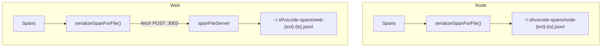

# File-based Span Export for AI Consumption

## Decisions

- **Directory with timestamped files** per session (each extension activation = new file)
- **Simplified JSON** — flat `{name, traceId, spanId, parentSpanId, durationMs, status, attributes}` per line. AI-optimized, not OTEL-compatible (OTLP HTTP is for tools)

## Paths

- **Node**: `~/.sf/vscode-spans/node-{extensionName}-{ISO-timestamp}.jsonl`
- **Web**: also `~/.sf/vscode-spans/web-{extensionName}-{ISO-timestamp}.jsonl` (via local span file server on port 3003)
- `node-` / `web-` prefix makes platform obvious when both exist in the same listing
- All spans in one directory regardless of platform
- AI finds latest: `ls -lt ~/.sf/vscode-spans/` → read top file
- Each `test:web` run = fresh VS Code instance = fresh file (small, focused)

## Format

One span per line, flat JSON:

```jsonl
{"name":"deploy","traceId":"abc123","spanId":"def456","parentSpanId":"","durationMs":1234,"status":"OK","startTime":"2026-02-25T10:30:00.000Z","attributes":{"componentCount":"5"}}
{"name":"import @salesforce/source-tracking","traceId":"abc123","spanId":"ghi789","parentSpanId":"def456","durationMs":890,"status":"OK","startTime":"2026-02-25T10:30:00.100Z","attributes":{}}
```

Uses existing `spanDuration` and `convertAttributes` from [spanUtils.ts](packages/salesforcedx-vscode-services/src/observability/spanUtils.ts).

## Shared Serialization

**File**: [spanUtils.ts](packages/salesforcedx-vscode-services/src/observability/spanUtils.ts)

Add `serializeSpanForFile(span: ReadableSpan): string` — converts a ReadableSpan to the flat JSON line format. Used by both Node and Web exporters.

```ts
const serializeSpanForFile = (span: ReadableSpan): string =>
  JSON.stringify({
    name: span.name,
    traceId: span.spanContext().traceId,
    spanId: span.spanContext().spanId,
    parentSpanId: span.parentSpanContext?.spanId ?? '',
    durationMs: spanDuration(span),
    status: span.status.code === SpanStatusCode.ERROR ? 'ERROR' : 'OK',
    startTime: new Date(span.startTime[0] * 1000 + span.startTime[1] / 1_000_000).toISOString(),
    attributes: convertAttributes(span.attributes)
  });
```

## Node Exporter

**File**: `packages/salesforcedx-vscode-services/src/observability/fileSpanExporterNode.ts`

- Implements `SpanExporter` (export, shutdown)
- On construction: create file path `join(Global.SF_DIR, 'vscode-spans', 'node-{extensionName}-{timestamp}.jsonl')`
- `mkdir -p` the directory via `fs.mkdirSync(dir, { recursive: true })`
- `export()`: append one JSON line per span via `fs.appendFileSync`
- Extension name comes from resource attributes on the first span batch

## Web Exporter

**Problem**: Web runs in browser with memfs — no real filesystem. Same reason OTLP works via HTTP to localhost.

**Solution**: Web exporter POSTs simplified span JSON to a local HTTP server that writes to disk. Same `~/.sf/vscode-spans/` dir as Node, `web-` prefix.

**File**: `packages/salesforcedx-vscode-services/src/observability/fileSpanExporterWeb.ts`

- Implements `SpanExporter`
- `export()`: serialize spans via `serializeSpanForFile`, POST as JSON array to `http://localhost:3003/spans`
- Uses `fetch` (available in browser)
- If server unreachable: log once, no-op (don't break the extension)
- Extension name sent as header or in payload for filename

**File**: `packages/salesforcedx-vscode-services/scripts/spanFileServer.ts`

Local HTTP server (like [o11yDebugServer.ts](packages/salesforcedx-vscode-services/scripts/o11yDebugServer.ts)):

- Listens on port 3003
- POST `/spans` — receives `{ extensionName: string, spans: string[] }` (array of JSON lines)
- Appends lines to `~/.sf/vscode-spans/web-{extensionName}-{timestamp}.jsonl` via `fs.appendFileSync`
- Creates directory if needed
- CORS headers for browser access
- One file per unique extensionName (timestamp set on first request per extension)
- Runnable via `npm run spans:server` (wireit, service mode)

### Wireit Config

In `salesforcedx-vscode-services/package.json`:

```json
"spans:server": "wireit"
```

```json
"spans:server": {
  "command": "ts-node scripts/spanFileServer.ts",
  "service": true,
  "files": ["scripts/spanFileServer.ts"]
}
```

Add `"spans:server"` as a dependency of `test:web` in every package that has one:

- `salesforcedx-vscode-services` — already local, add `"spans:server"` to deps
- `salesforcedx-vscode-metadata` — add `"../salesforcedx-vscode-services:spans:server"`
- `salesforcedx-vscode-org-browser` — add `"../salesforcedx-vscode-services:spans:server"`
- `salesforcedx-vscode-apex-testing` — add `"../salesforcedx-vscode-services:spans:server"`
- `playwright-vscode-ext` — add `"../salesforcedx-vscode-services:spans:server"`

Wireit `service: true` starts the server before tests run and shuts it down when the dependent command finishes.

### Usage

- `test:web` automatically starts span file server (no manual step)
- Manual dev: `npm run spans:server -w salesforcedx-vscode-services` in a terminal, then `npm run run:web`

## Config

**File**: [localTracing.ts](packages/salesforcedx-vscode-services/src/observability/localTracing.ts)

Add `getFileTracesEnabled()` — same pattern as `getLocalTracesEnabled`.

**File**: [package.json](packages/salesforcedx-vscode-services/package.json) contributes.configuration

Add `salesforcedx-vscode-salesforcedx.enableFileTraces`:

- type: boolean, default: false
- description from package.nls.json

## Wiring

**[spansNode.ts](packages/salesforcedx-vscode-services/src/observability/spansNode.ts)**:

```ts
...(getFileTracesEnabled() ? [new SpanTransformProcessor(new FileSpanExporterNode())] : [])
```

**[spansWeb.ts](packages/salesforcedx-vscode-services/src/observability/spansWeb.ts)**:

```ts
...(getFileTracesEnabled() ? [new SpanTransformProcessor(new FileSpanExporterWeb())] : [])
```

## Data Flow



## Cleanup

- `rm ~/.sf/vscode-spans/*` or `rm -rf ~/.sf/vscode-spans/`
- Both Node and Web spans land in the same directory
- Files accumulate across sessions; user/AI clears as needed

## Skill

Update `.claude/skills/span-file-export/SKILL.md` with:

- Directory-based paths and how to find latest file
- Simplified JSON format (not OTLP)
- Cleanup: `rm ~/.sf/vscode-spans/`
- Enable in settings (desktop + web via `.esbuild-web-extra-settings.json`)
- Use only 1: OTLP for humans, file for AI

## Verification

Per [verification skill](.claude/skills/verification/SKILL.md): compile, lint, test, bundle, knip, check:dupes.

### Manual span verification

After standard verification passes:

1. Enable file traces in `.esbuild-web-extra-settings.json`:

```json
{ "salesforcedx-vscode-salesforcedx.enableFileTraces": true }
```

1. Run `npm run test:web -w salesforcedx-vscode-services` (span file server starts automatically via wireit service dep) — check `~/.sf/vscode-spans/` for `web-` prefixed files
2. Run `npm run test:desktop -w salesforcedx-vscode-org-browser` — check `~/.sf/vscode-spans/` for `node-` prefixed files
3. Review the span files: confirm valid JSONL, flat format, reasonable span names and durations
4. Clean up: `rm -rf ~/.sf/vscode-spans/`
