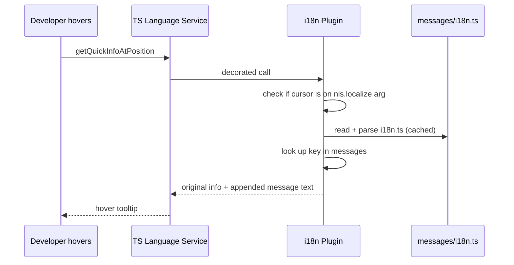

# i18n Hover via TypeScript Language Service Plugin (in existing i18n package)

## Why a TS plugin?

- **Zero install**: configured in `tsconfig.json`, works the moment a developer opens the repo
- **No activation dance**: runs inside the TS server that VS Code already starts
- **No VSIX building/installing**: no separate extension to manage
- Developers just need "Use Workspace Version" for TypeScript (already standard practice)

## Why inside the i18n package (not a new package)?

- The i18n package already owns the message format and conventions
- No new package to wire up, publish, or maintain
- Uses a subpath export (`@salesforce/vscode-i18n/tsPlugin`) as the plugin entry point
- **Zero new dependencies**: uses the injected `ts` module from tsserver to parse i18n files (native TS AST, not `@typescript-eslint/parser`)

Risk: TS plugin `name` resolution may not support subpath exports. If it doesn't, fallback is a tiny wrapper package. But Node `require()` respects `exports` maps, and tsserver uses `require()`, so this should work.

## Revert previous changes

Undo all changes from the earlier session:

- [eslint.config.mjs](eslint.config.mjs) - remove the `salesforcedx-vscode-i18n/src/vscode/` override
- [packages/salesforcedx-vscode-core/src/index.ts](packages/salesforcedx-vscode-core/src/index.ts) - remove `registerI18nHoverProvider` import and both registration calls
- [packages/salesforcedx-vscode-core/package.json](packages/salesforcedx-vscode-core/package.json) - remove `workspaceContains:packages/salesforcedx-vscode-core/package.json` activation event
- [packages/salesforcedx-vscode-i18n/package.json](packages/salesforcedx-vscode-i18n/package.json) - remove `exports`, `peerDependencies`, `dependencies`, `devDependencies` that were added
- Delete `packages/salesforcedx-vscode-i18n/src/vscode/hoverProvider.ts`

## Changes to `@salesforce/vscode-i18n`

### New files

```
packages/salesforcedx-vscode-i18n/src/
  tsPlugin.ts       (plugin factory, getQuickInfoAtPosition decorator)
  messageCache.ts   (parse i18n.ts files using native TS API, cache by path+mtime)
```

### How it works



### tsPlugin.ts

Standard TS plugin factory using `export =`:

```typescript
function init(modules: { typescript: typeof import('typescript/lib/tsserverlibrary') }) {
  const ts = modules.typescript;
  function create(info: ts.server.PluginCreateInfo) {
    const proxy: ts.LanguageService = Object.create(null);
    for (const k of Object.keys(info.languageService) as Array<keyof ts.LanguageService>) {
      const x = info.languageService[k]!;
      // @ts-expect-error
      proxy[k] = (...args: Array<{}>) => x.apply(info.languageService, args);
    }
    proxy.getQuickInfoAtPosition = (fileName, position) => {
      /* ... */
    };
    return proxy;
  }
  return { create };
}
export = init;
```

`getQuickInfoAtPosition` logic:

1. Call the original `getQuickInfoAtPosition` for the base hover info
2. Get the source file via `info.languageService.getProgram().getSourceFile(fileName)`
3. Use `ts.getTokenAtPosition(sourceFile, position)` to find the node
4. If the node is a `StringLiteral` whose parent is a `CallExpression` matching `nls.localize(...)` or `coerceMessageKey(...)`, extract the key string
5. Walk up from `fileName` to find `package.json` (package root), then find `**/messages/i18n.ts`
6. Look up key in cached messages, append as `displayParts` to the `QuickInfo` result

Step 4 uses the TS AST that tsserver already has -- no re-parsing the current document.

### messageCache.ts

Uses the injected `ts` module (not `@typescript-eslint/parser`) to parse i18n.ts:

```typescript
const sourceFile = ts.createSourceFile(filePath, content, ts.ScriptTarget.Latest, true);
```

Then walks the native TS AST to find `export const messages = { ... }` and extract key/value pairs. Equivalent logic to [packages/eslint-local-rules/src/i18nUtils.ts](packages/eslint-local-rules/src/i18nUtils.ts) but using `ts.SyntaxKind` instead of `AST_NODE_TYPES`.

Caches by file path + `fs.statSync(path).mtimeMs`. On hover, check mtime; if unchanged, return cached result. No file watchers needed.

### package.json changes

Add subpath export so tsconfig can reference the plugin:

```json
"exports": {
  ".": "./out/src/index.js",
  "./tsPlugin": "./out/src/tsPlugin.js"
}
```

No new `dependencies` or `peerDependencies`. The plugin uses the injected `ts` from tsserver and `node:fs`/`node:path` from Node stdlib.

### Enabling the plugin

Add to [tsconfig.common.json](tsconfig.common.json):

```json
"plugins": [{ "name": "@salesforce/vscode-i18n/tsPlugin" }]
```

Every package's tsconfig extends `tsconfig.common.json`, so all packages get it automatically.

VS Code users must use "Use Workspace Version" for TypeScript for plugins to load.

### ESLint override

Add to [eslint.config.mjs](eslint.config.mjs) for `packages/salesforcedx-vscode-i18n/src/tsPlugin.ts` and `packages/salesforcedx-vscode-i18n/src/messageCache.ts`:

- Allow `node:fs` (`no-restricted-imports: off`)
- Allow type assertions (`@typescript-eslint/consistent-type-assertions: off`)

## Verification

- `npm run compile` passes (including i18n package)
- `npm run lint -w @salesforce/vscode-i18n` passes
- `npm run test -w @salesforce/vscode-i18n` passes
- Manual: "TypeScript: Select TypeScript Version" -> "Use Workspace Version", open a TS file, hover over `nls.localize('some_key')`, see the message text appended to hover tooltip
