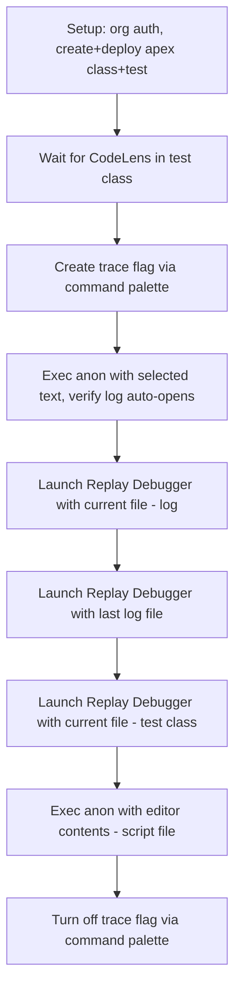

# Migrate Apex Replay Debugger E2E to Playwright

## Scope

Rewrite the old [apexReplayDebugger.e2e.ts](packages/salesforcedx-vscode-automation-tests/test/specs/apexReplayDebugger.e2e.ts) as a Playwright desktop-only spec in `salesforcedx-vscode-apex-replay-debugger`.

**Dropped steps** (per instructions):

- "Verify LSP finished indexing" via status bar -- replaced by waiting for CodeLens in editor
- "SFDX: Get Apex Debug Logs" -- exec anon auto-retrieves and opens logs now

**New patterns needed:**

- Trace flag commands via command palette (new apex-log commands replace old "Turn On/Off Apex Debug Log for Replay Debugger")
- Debug toolbar button interaction (no existing playwright-ext helper)
- CodeLens detection for LS readiness

## Test Flow



## Files to Create

### 1. Playwright config

**[playwright.config.desktop.ts](packages/salesforcedx-vscode-apex-replay-debugger/playwright.config.desktop.ts)** -- identical pattern to [apex-testing's config](packages/salesforcedx-vscode-apex-testing/playwright.config.desktop.ts):

```typescript
import { createDesktopConfig } from '@salesforce/playwright-vscode-ext';
export default createDesktopConfig();
```

### 2. Desktop fixtures

**[test/playwright/fixtures/desktopFixtures.ts](packages/salesforcedx-vscode-apex-replay-debugger/test/playwright/fixtures/desktopFixtures.ts)**

```typescript
import { createDesktopTest, MINIMAL_ORG_ALIAS } from '@salesforce/playwright-vscode-ext';

export const desktopTest = createDesktopTest({
  fixturesDir: __dirname,
  orgAlias: MINIMAL_ORG_ALIAS,
  additionalExtensionDirs: [
    'salesforcedx-vscode-apex',
    'salesforcedx-vscode-apex-log',
    'salesforcedx-vscode-apex-testing' // for test running support
  ],
  disableOtherExtensions: false,
  userSettings: {
    'github.gitAuthentication': false,
    'git.terminalAuthentication': false,
    'git.autofetch': false
  }
});
```

`salesforcedx-vscode-services` is auto-included by `createDesktopTest`. The replay-debugger package itself is the "host" extension (loaded from `packageRoot`).

### 3. Fixture index

**[test/playwright/fixtures/index.ts](packages/salesforcedx-vscode-apex-replay-debugger/test/playwright/fixtures/index.ts)** -- re-export `desktopTest as test`.

### 4. Spec file

**[test/playwright/specs/apexReplayDebugger.desktop.spec.ts](packages/salesforcedx-vscode-apex-replay-debugger/test/playwright/specs/apexReplayDebugger.desktop.spec.ts)**

Key implementation decisions per step:

**Setup step:**

- `setupMinimalOrgAndAuth(page)`, `ensureSecondarySideBarHidden(page)`
- Create `ExampleApexClass` (with `SayHello` method) via `createApexClass(page, name, content)`
- Create `ExampleApexClassTest` via `createApexClass(page, name, content)`
- Deploy via `deployCurrentSourceToOrg(page, { waitViaOutputChannel: true })`

**Wait for CodeLens:**

- Open `ExampleApexClassTest.cls` via `openFileByName(page, 'ExampleApexClassTest.cls')`
- Wait for CodeLens text ("Run Test" or "Debug Test") to appear in the editor DOM
- Locator: `page.locator('.contentWidgets .codelens-decoration a').filter({ hasText: /Run Test|Debug Test/ })`

**Create trace flag:**

- `executeCommandWithCommandPalette(page, apexLogNls['apexLog.command.traceFlagsCreateForCurrentUser'])`
- Verify: status bar button matching `/Trace flag active/` becomes visible

**Exec anon with selected text:**

- Open `ExampleApexClassTest.cls`
- Use Find widget (`Control+h` or `Control+f`) to locate and select `ExampleApexClass.SayHello('Cody');`
- `executeCommandWithCommandPalette(page, apexLogNls['apexLog.command.executeSelection'])`
- Wait for output channel "Apex" to contain "Compiled successfully" and "Executed successfully"
- Verify a `.log` file tab opens (editor tab title ends in `.log`)

**Launch Replay Debugger (log file):**

- The auto-opened log should be active editor
- `executeCommandWithCommandPalette(page, replayDebuggerNls.launch_apex_replay_debugger_with_selected_file)`
- Wait for debug toolbar to appear: `page.locator('.debug-toolbar')`
- Continue debug session: try clicking toolbar button `page.locator('.debug-toolbar').getByRole('button', { name: /Continue/ })`, fall back to `page.keyboard.press('F5')` if toolbar interaction fails
- Wait for toolbar to disappear (session ends)

**Launch Replay Debugger (last log):**

- `executeCommandWithCommandPalette(page, replayDebuggerNls.launch_from_last_log_file)`
- Handle input box: type log file path, confirm
- Continue via toolbar click or F5 fallback, wait for session end

**Launch Replay Debugger (test class):**

- `openFileByName(page, 'ExampleApexClassTest.cls')`
- `executeCommandWithCommandPalette(page, replayDebuggerNls.launch_apex_replay_debugger_with_selected_file)`
- Continue via toolbar click or F5 fallback, wait for session end

**Exec anon with editor contents:**

- `executeCommandWithCommandPalette(page, apexLogNls['apexLog.command.createAnonymousApexScript'])`
- Handle script name prompt, accept
- `executeCommandWithCommandPalette(page, apexLogNls['apexLog.command.executeDocument'])`
- Verify output channel

**Turn off trace flag:**

- `executeCommandWithCommandPalette(page, apexLogNls['apexLog.command.traceFlagsDeleteForCurrentUser'])`
- Verify status bar shows "Trace flag inactive"

### 5. Package.json changes

**[package.json](packages/salesforcedx-vscode-apex-replay-debugger/package.json)** -- add `test:desktop` wireit script:

```json
"test:desktop": {
  "command": "playwright test --config=playwright.config.desktop.ts",
  "env": { "VSCODE_DESKTOP": "1" },
  "dependencies": [
    "vscode:bundle",
    "../salesforcedx-vscode-services:vscode:bundle",
    "../salesforcedx-vscode-apex:vscode:bundle",
    "../salesforcedx-vscode-apex-log:vscode:bundle",
    "../salesforcedx-vscode-apex-testing:vscode:bundle",
    "../playwright-vscode-ext:compile"
  ],
  "files": [
    "playwright.config.desktop.ts",
    "test/playwright/**/*.ts",
    "package*.json"
  ],
  "output": []
}
```

### 6. CI workflow

**[.github/workflows/apexReplayDebuggerE2E.yml](.github/workflows/apexReplayDebuggerE2E.yml)** -- desktop-only (no web job). Follow the pattern in [apexTestingE2E.yml](.github/workflows/apexTestingE2E.yml) but:

- Only `e2e-desktop` job (matrix: `macos-latest`, `windows-latest`)
- `npm run test:desktop -w salesforcedx-vscode-apex-replay-debugger`
- Same try-run/parallel-run/retry-sequential pattern

## Verification

After implementation: compile, lint, bundle, knip, check:dupes per [verification skill](.claude/skills/verification/SKILL.md). Then run `test:desktop` locally.
