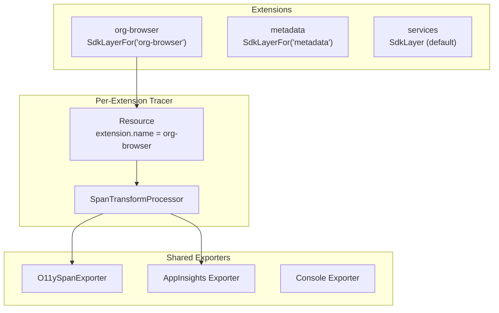

# O11y Exporter and Extension Span Attribution

## Overview

Add O11y support to the Effect/OpenTelemetry tracing in `salesforcedx-vscode-services` and provide per-extension SdkLayer instances so each extension's spans include the extension name in the resource attributes.

## Architecture



## Key Design Decision: Per-Extension SdkLayer

Similar to `ChannelServiceLayer('Org Browser')`, each extension gets its own `SdkLayerFor(extensionName)`:

- **Extension name in Resource attributes** - All spans from that extension automatically have `extension.name`
- **No need to wrap every entry point** - The layer handles attribution
- **Nested service calls attributed correctly** - When org-browser calls MetadataRetrieveService, those spans use org-browser's tracer
- **Minimal overhead** - Multiple tracer instances are lightweight; Effect doesn't register globally

## Implementation

### 1. O11y Span Exporter

Create [`packages/salesforcedx-vscode-services/src/observability/o11ySpanExporter.ts`](packages/salesforcedx-vscode-services/src/observability/o11ySpanExporter.ts):

```typescript
import { O11yService } from '@salesforce/o11y-reporter';
import { SpanExporter, ReadableSpan } from '@opentelemetry/sdk-trace-base';
import { ExportResult, ExportResultCode } from '@opentelemetry/core';

export class O11ySpanExporter implements SpanExporter {
  private o11yService: O11yService;
  private initialized = false;

  constructor(
    private extensionName: string,
    private endpoint: string
  ) {
    this.o11yService = O11yService.getInstance(extensionName);
  }

  private async ensureInitialized(): Promise<void> {
    if (!this.initialized) {
      await this.o11yService.initialize(this.extensionName, this.endpoint);
      this.o11yService.enableAutoBatching({ flushInterval: 30_000 });
      this.initialized = true;
    }
  }

  export(spans: ReadableSpan[], callback: (result: ExportResult) => void): void {
    this.ensureInitialized()
      .then(() => {
        spans.filter(isTopLevelSpan).forEach(span => {
          this.o11yService.logEvent({
            name: span.name,
            properties: convertAttributes(span.attributes),
            measurements: { duration: spanDuration(span) }
          });
        });
        callback({ code: ExportResultCode.SUCCESS });
      })
      .catch(err => {
        callback({ code: ExportResultCode.FAILED, error: err });
      });
  }

  shutdown(): Promise<void> {
    return this.o11yService.forceFlush();
  }
}
```

### 2. SdkLayerFor Factory

Modify [`packages/salesforcedx-vscode-services/src/observability/spans.ts`](packages/salesforcedx-vscode-services/src/observability/spans.ts):

```typescript
import { NodeSdkLayerFor } from './spansNode';
import { WebSdkLayerFor } from './spansWeb';

// Default layer for services extension itself
export const SdkLayer = process.env.ESBUILD_PLATFORM === 'web' ? WebSdkLayer : NodeSdkLayer;

// Factory for per-extension layers
export const SdkLayerFor = (extensionName: string) =>
  process.env.ESBUILD_PLATFORM === 'web' ? WebSdkLayerFor(extensionName) : NodeSdkLayerFor(extensionName);
```

### 3. Update spansNode.ts

Add factory function to [`spansNode.ts`](packages/salesforcedx-vscode-services/src/observability/spansNode.ts):

```typescript
export const NodeSdkLayerFor = (extensionName: string) => NodeSdk.layer(() => ({
  resource: {
    serviceName: extensionName,
    serviceVersion: '2025-01-08',
    attributes: { 'extension.name': extensionName }
  },
  spanProcessor: [
    ...(getConsoleTracesEnabled() ? [new SpanTransformProcessor(new ConsoleSpanExporter())] : []),
    ...(isTelemetryExtensionConfigurationEnabled()
      ? [new SpanTransformProcessor(new AzureMonitorTraceExporter({...}))]
      : []),
    ...(isO11yEnabled()
      ? [new SpanTransformProcessor(new O11ySpanExporter(extensionName, O11Y_ENDPOINT))]
      : []),
    ...(getLocalTracesEnabled() ? [new SpanTransformProcessor(new OTLPTraceExporter())] : [])
  ]
}));

// Keep existing NodeSdkLayer for backwards compatibility
export const NodeSdkLayer = NodeSdkLayerFor('salesforcedx-vscode-services');
```

### 4. Export from Services API

Update [`packages/salesforcedx-vscode-services/src/index.ts`](packages/salesforcedx-vscode-services/src/index.ts):

```typescript
export type SalesforceVSCodeServicesApi = {
  services: {
    // ... existing services
    SdkLayer: typeof SdkLayer; // Default (backwards compat)
    SdkLayerFor: typeof SdkLayerFor; // Per-extension factory
  };
};
```

### 5. Usage in Extensions

Update [`packages/salesforcedx-vscode-org-browser/src/services/extensionProvider.ts`](packages/salesforcedx-vscode-org-browser/src/services/extensionProvider.ts):

```typescript
import { EXTENSION_NAME } from '../constants';

export const AllServicesLayer = Layer.unwrapEffect(
  Effect.gen(function* () {
    const api = yield* extensionProvider.getServicesApi;
    return Layer.mergeAll(
      // ... other services
      api.services.SdkLayerFor(EXTENSION_NAME), // <-- Per-extension tracing
      api.services.ChannelServiceLayer(EXTENSION_NAME)
    );
  })
);
```

## Overhead Analysis

Per-extension SdkLayer creates:

- 1 `NodeTracerProvider` (lightweight, not globally registered)
- 1-4 `SpanProcessor` instances depending on config
- 1-4 `SpanExporter` instances
- 1 batching timer (30s interval)

For ~10 extensions: ~10 HTTP requests every 30s to O11y endpoint (batched). Memory overhead is negligible.

## Migration

Extensions using Effect tracing:

1. Change `api.services.SdkLayer` → `api.services.SdkLayerFor(EXTENSION_NAME)`
2. All spans automatically include `extension.name` attribute
3. No other code changes needed
