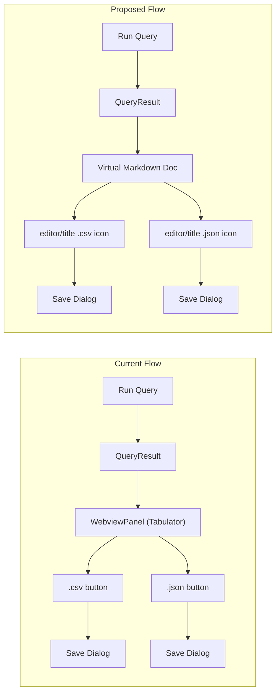

# Replace SOQL Query Results Webview with Markdown

## Architecture Change



## Key Decisions

- **Virtual document via `TextDocumentContentProvider`** with a custom `soql-results:` URI scheme. This gives us:
  - A `when` clause (`resourceScheme == soql-results`) for editor/title buttons
  - No "unsaved changes" prompt on close
  - Ability to update content on re-run without opening a new tab
- **Markdown table format** for the results, generated from the existing `buildFlattenedGridModel()` pipeline in `[dataQuery.ts](packages/salesforcedx-vscode-soql/src/commands/dataQuery.ts)`. The header will show query file name and record count (like the current view).
- **.csv/.json buttons** become VS Code `editor/title` menu contributions -- icon buttons in the editor tab bar, only visible when a `soql-results:` document is active. Reuse existing `[QueryDataFileService](packages/salesforcedx-vscode-soql/src/queryDataView/queryDataFileService.ts)` and data providers unchanged.
- **Large result sets**: The current Tabulator view paginates at 50 rows. With Markdown, the full text is in the document. VS Code text editors handle large documents well (virtualized rendering). We'll render all returned rows. If performance is a concern later, we can truncate and add a note.

## File Changes

### New file: `packages/salesforcedx-vscode-soql/src/queryDataView/queryResultsMarkdownProvider.ts`

Implements `vscode.TextDocumentContentProvider` for the `soql-results` scheme. Stores a map of URI -> Markdown content. Exposes:

- `update(uri, queryData, queryText, documentName)` -- generates Markdown from query results and fires `onDidChange`
- `provideTextDocumentContent(uri)` -- returns stored Markdown string

Markdown generation function: takes the flattened grid from `buildFlattenedGridModel()` (reuses `[getFlattenedSoqlGridPayload](packages/salesforcedx-vscode-soql/src/commands/dataQuery.ts)` or similar) and produces:

```markdown
# Query1.soql

Returned 2000 of 6416 total records

| Id         | Name          | Industry   | AnnualRevenue | NumberOfEmployees |
| ---------- | ------------- | ---------- | ------------- | ----------------- |
| 0013000... | ORG62 TRIA... | Technology | 17100000000   | 49000             |
| ...        | ...           | ...        | ...           | ...               |
```

### Modified: `[queryDataViewService.ts](packages/salesforcedx-vscode-soql/src/queryDataView/queryDataViewService.ts)`

The `QueryDataViewService` class is **replaced**. Instead of `createWebviewPanel` + Tabulator HTML:

1. Register the `TextDocumentContentProvider` for `soql-results:` scheme
2. `openQueryDataView` now: generates a `soql-results:` URI, calls the provider's `update()`, opens the document via `vscode.workspace.openTextDocument(uri)`, shows it in `ViewColumn.Two` with `language: 'markdown'`
3. Register two commands (`soql.results.saveAsCsv`, `soql.results.saveAsJson`) that call the existing `QueryDataFileService.save()` with stored query data

### Modified: `[soqlEditorInstance.ts](packages/salesforcedx-vscode-soql/src/editor/soqlEditorInstance.ts)` (lines 275-278)

`openQueryDataView` calls the new Markdown-based service instead of the old `QueryDataViewService`.

### Modified: `[package.json](packages/salesforcedx-vscode-soql/package.json)`

Add to `contributes`:

- Two new commands: `soql.results.saveAsCsv` and `soql.results.saveAsJson` with download/save icons
- `menus.editor/title` entries with `"when": "resourceScheme == soql-results"` so the buttons only appear on SOQL result tabs

### Files to delete / stop bundling

- `src/soql-data-view/index.html` -- no longer needed
- `src/soql-data-view/queryDataViewController.js` -- no longer needed
- `src/soql-data-view/queryDataView.css` -- no longer needed
- `src/soql-data-view/icons/` -- no longer needed
- `src/soql-data-view/tabulator.min.js` and `tabulator.min.css` -- no longer needed
- `[queryDataHtml.ts](packages/salesforcedx-vscode-soql/src/queryDataView/queryDataHtml.ts)` -- no longer needed
- Remove `src/soql-data-view/` from wireit bundle inputs in `package.json`
- Remove Tabulator/data-view constants from `[constants.ts](packages/salesforcedx-vscode-soql/src/constants.ts)`

### Files unchanged

- `[queryDataFileService.ts](packages/salesforcedx-vscode-soql/src/queryDataView/queryDataFileService.ts)` -- reused as-is
- `[dataProviders/](packages/salesforcedx-vscode-soql/src/queryDataView/dataProviders/)` (csv, json providers) -- reused as-is
- `[dataQuery.ts](packages/salesforcedx-vscode-soql/src/commands/dataQuery.ts)` flatten/grid logic -- reused as-is
- `[queryDataHelper.ts](packages/salesforcedx-vscode-soql/src/queryDataView/queryDataHelper.ts)` -- may still be used or simplified

## Verification

- Compile, lint, test, bundle, knip per verification skill
