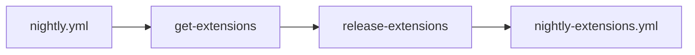
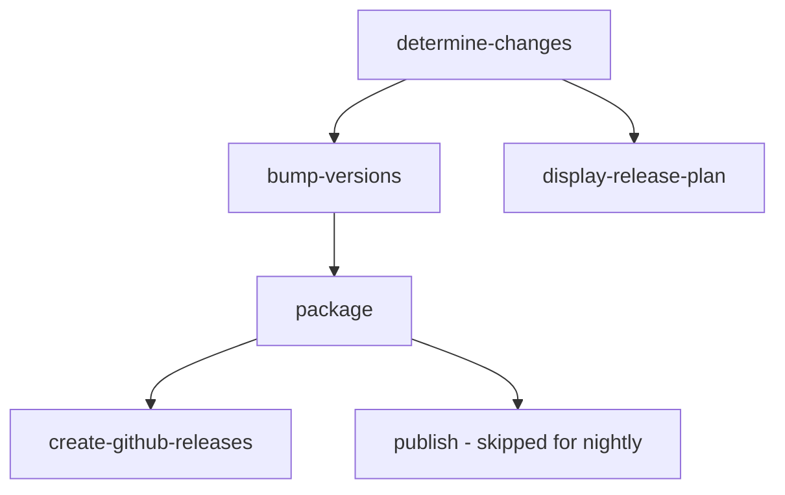
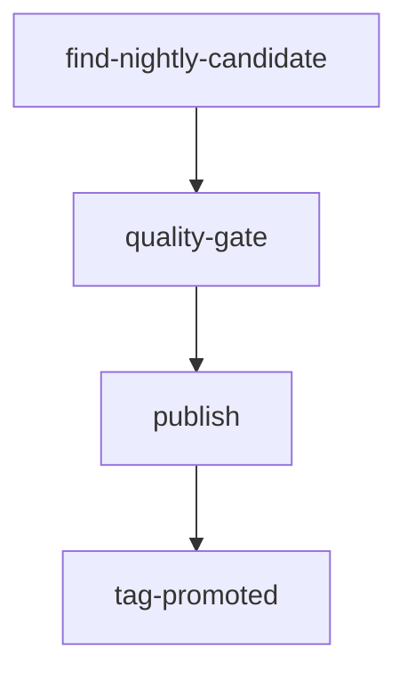

# Prerelease CI System for salesforcedx-vscode

This document describes the prerelease CI system ported from [apex-language-support](https://github.com/forcedotcom/apex-language-support) to enable automated nightly builds and weekly pre-release promotions.

## Overview

The prerelease CI system implements a **3-tier release pipeline**:

1. **Nightly Builds (Tier 1)** - Daily automated builds from `main` branch
2. **Pre-release Promotion (Tier 2)** - Weekly promotion of vetted nightly builds to marketplace
3. **Stable Release (Tier 3)** - Manual promotion of pre-releases to stable (future implementation)

## Architecture

### Workflows

#### 1. `nightly.yml` - Nightly Release Orchestrator

**Triggers:**
- Schedule: Daily at 4:00 AM UTC (`0 4 * * *`)
- Manual: `workflow_dispatch` with inputs for branch, extensions, dry-run

**Purpose:** Orchestrates nightly builds for VS Code extensions

**Flow:**


**What it does:**
- Discovers available VS Code extensions via `ext-package-selector` script
- Triggers `nightly-extensions.yml` with changed extensions
- Defaults to `pre-release: true` and `version-bump: auto`

#### 2. `nightly-extensions.yml` - Extension Build & Release

**Triggers:**
- Called by `nightly.yml` (`workflow_call`)
- Manual: `workflow_dispatch`

**Purpose:** Builds, versions, and publishes VS Code extensions

**Flow:**


**Key Jobs:**
1. **determine-changes**: Detects changed extensions using git diff + conventional commits
2. **bump-versions**: Bumps to odd minor versions (0.3.x, 0.5.x) for pre-releases
3. **package**: Builds VSIX files via `package.yml`
4. **create-github-releases**: Creates GitHub Releases with VSIX attachments
5. **publish**: Matrix publish to VSCE/OVSX (skipped for nightly, matrix returns empty)

**Scripts used:**
- `ext-change-detector.ts` - Detects changed extensions + analyzes conventional commits
- `ext-version-bumper.ts` - Bumps versions following odd/even scheme
- `ext-github-releases.ts` - Creates GitHub Releases with VSIX assets
- `ext-publish-matrix.ts` - Generates publish matrix (empty for nightly)

#### 3. `promote-prerelease.yml` - Weekly Pre-release Promotion

**Triggers:**
- Schedule: Wednesdays at 7:00 AM UTC (`0 7 * * 3`)
- Manual: `workflow_dispatch` with min-tag-age-days, dry-run

**Purpose:** Promotes vetted nightly builds to marketplace as pre-releases

**Flow:**


**Key Jobs:**
1. **find-nightly-candidate**: Finds eligible nightly builds (≥7 days old) via `ext-nightly-finder.ts`
2. **quality-gate**: Verifies CI passed on candidate commit via `check-ci-status` action
3. **publish**: Downloads VSIX from GitHub Release and publishes to VSCE + OVSX as pre-release
4. **tag-promoted**: Creates `marketplace-prerelease-<extension>-v<version>` tracking tag

**Quality Gates:**
- ✅ Nightly build must be ≥7 days old (configurable)
- ✅ CI must have passed on the candidate commit
- ✅ No existing marketplace-prerelease tracking tag for this version
- ✅ Floor check: derived stable version not already published

**⚠️ IMPORTANT - Multi-Extension Limitation:**

The current `promote-prerelease.yml` and `ext-nightly-finder.ts` are designed for **single-extension repositories** (apex-language-support has one extension). For salesforcedx-vscode with **multiple extensions**, the workflow needs one of these adaptations:

**Option A: Per-Extension Workflow Runs (Recommended)**
- Create matrix job that runs promotion for each extension independently
- Pass extension name to `ext-nightly-finder.ts` as parameter
- Each extension gets its own tracking tags

**Option B: Script Refactoring**
- Update `ext-nightly-finder.ts` to accept `EXTENSION_NAME` env var
- Update tracking tag logic (lines 135, 147) to use parameter instead of hardcoded `apex-lsp-vscode-extension`

**Current Status:** Workflows copied as-is. Promotion workflow will need adaptation before first use.

#### 4. `package.yml` - VSIX Packaging

**Triggers:**
- Called by other workflows (`workflow_call`)
- Manual: `workflow_dispatch`

**Purpose:** Creates VSIX files for VS Code extensions

**What it does:**
- Runs `npm run vscode:package` (or `:package:modern`) via Wireit
- Uploads VSIX artifacts with run isolation naming

---

## Version Scheme

**Critical:** This system uses VS Code's **odd/even minor version** scheme:

### Odd Minor = Pre-release
- `0.3.x`, `0.5.x`, `0.7.x` → Used for nightly + marketplace pre-release

### Even Minor = Stable
- `0.4.x`, `0.6.x`, `0.8.x` → Used for marketplace stable releases

### Conventional Commits → Bump Logic

When `PRE_RELEASE=true` (nightly builds):
- `fix:` → patch bump (0.5.0 → 0.5.1)
- `feat:` → jump to next odd minor (0.5.x → 0.7.0)
- `feat!:` → major bump + reset to x.1.0

When `PRE_RELEASE=false` (stable releases):
- `fix:` → patch bump (0.4.0 → 0.4.1)
- `feat:` → jump to next even minor (0.4.x → 0.6.0)
- `feat!:` → major bump + reset to x.0.0

---

## TypeScript Scripts

All scripts located in `.github/scripts/`:

### Extension Scripts (`ext-*`)

- **`ext-change-detector.ts`** - Detects changed extensions by comparing `packages/*/` against base branch; analyzes conventional commits to determine bump type (major/minor/patch)
- **`ext-nightly-finder.ts`** - Finds eligible nightly builds for pre-release promotion (age filter, CI status, tracking tags)
- **`ext-package-selector.ts`** - Discovers all VS Code extensions by checking for `publisher` field in package.json
- **`ext-version-bumper.ts`** - Bumps versions following odd/even scheme; creates git tags with format `<package>-v<version>-nightly.<YYYYMMDD>`
- **`ext-github-releases.ts`** - Creates GitHub Releases with VSIX attachments and changelog
- **`ext-publish-matrix.ts`** - Generates publish matrix for VSCE/OVSX (empty for nightly, populated for promotion)
- **`ext-release-plan.ts`** - Displays release plan in GitHub Actions summary

### NPM Scripts (`npm-*`)

- **`npm-change-detector.ts`** - Detects changed NPM packages
- **`npm-package-selector.ts`** - Selects NPM packages for release
- **`npm-package-details.ts`** - Extracts package details for notifications
- **`npm-release-plan.ts`** - Displays NPM release plan

### Utility Scripts

- **`utils.ts`** - Shared utilities (logging, GitHub Actions outputs, package info)
- **`types.ts`** - TypeScript type definitions
- **`index.ts`** - CLI entry point for all scripts

---

## Composite Actions

All actions located in `.github/actions/`:

### `check-ci-status`

**Purpose:** Verifies CI passed on a specific commit before promotion

**Inputs:**
- `commit-sha` - Commit to check
- `token` - GitHub token

**How it works:**
- Queries GitHub API for check runs on commit
- Fails if any required checks failed
- Prevents promoting broken builds

### `publish-vsix`

**Purpose:** Publishes VSIX files to marketplace with dry-run support

**Inputs:**
- `vsix-path` - Path to VSIX file
- `publish-tool` - Tool to use (`vsce` or `ovsx`)
- `pre-release` - Publish as pre-release (`true`/`false`)
- `dry-run` - Dry-run mode (`true`/`false`)

**Environment:**
- `VSCE_PERSONAL_ACCESS_TOKEN` - For VS Code Marketplace
- `OVSX_PAT` - For Open VSX Registry

**Features:**
- Validates VSIX file exists and has correct extension
- Audits publish attempts for compliance
- Supports dry-run for testing
- Skips duplicate publishes with `--skip-duplicate`

### `npm-install-with-retries`

**Purpose:** Installs npm dependencies with retry logic

**Features:**
- Retries on network failures
- Improves reliability in CI environments

### `calculate-artifact-name`

**Purpose:** Calculates artifact names with run isolation

**Inputs:**
- `artifact-name` - Base name for artifact
- `dry-run` - Dry-run mode

**Outputs:**
- `artifact-name` - Calculated name with run number suffix

**Format:**
- Normal: `<base>-<run_number>-release`
- Dry-run: `<base>-<run_number>-dry-run`

---

## Tag Formats

### Nightly Tags
Format: `<package-name>-v<version>-nightly.<YYYYMMDD>`

Examples:
- `salesforcedx-vscode-apex-v0.5.0-nightly.20260519`
- `salesforcedx-vscode-core-v0.3.2-nightly.20260519`

### Tracking Tags

Created after successful marketplace publish to prevent duplicate promotions:

**Pre-release tracking:**
- Format: `marketplace-prerelease-<package>-v<version>`
- Example: `marketplace-prerelease-salesforcedx-vscode-apex-v0.5.0`

**Stable tracking:**
- Format: `marketplace-stable-<package>-v<version>`
- Example: `marketplace-stable-salesforcedx-vscode-apex-v0.6.0`

---

## Configuration

### Required Secrets

Set these in GitHub repository settings:

- **`IDEE_GH_TOKEN`** - GitHub personal access token with write access (for version bumps, releases, tags)
- **`VSCE_PERSONAL_ACCESS_TOKEN`** - Personal access token for Visual Studio Marketplace
- **`IDEE_OVSX_PAT`** - Personal access token for Open VSX Registry

### Branch Protection

Recommended branch protection rules for `main`:
- Require pull request reviews
- Require status checks to pass
- Include IDEE_GH_TOKEN's user (`svc-idee-bot`) in bypass list for automated version bumps

---

## Usage

### Manual Nightly Build

```bash
# Build changed extensions on main branch
gh workflow run nightly.yml

# Build specific extension
gh workflow run nightly.yml -f extensions=salesforcedx-vscode-apex

# Dry-run mode
gh workflow run nightly.yml -f dry-run=true -f extensions=changed
```

### Manual Pre-release Promotion

```bash
# Promote eligible nightly (default 7-day minimum age)
gh workflow run promote-prerelease.yml

# Custom minimum age (14 days)
gh workflow run promote-prerelease.yml -f min-tag-age-days=14

# Dry-run mode
gh workflow run promote-prerelease.yml -f dry-run=true
```

---

## Migration Notes

### Differences from apex-language-support

1. **Multiple Extensions**: salesforcedx-vscode has 20+ extensions vs 1 in apex-language-support
2. **Package Structure**: Both use `packages/*` structure ✅
3. **Build System**: Both use Wireit ✅
4. **Dependencies**: Added `simple-git@^3.36.0` to package.json dependencies

### What Works Out-of-the-Box

✅ Nightly builds (`nightly.yml` + `nightly-extensions.yml`)
✅ Version bumping with odd/even scheme
✅ GitHub Releases creation
✅ VSIX packaging
✅ Extension discovery scripts
✅ Conventional commit analysis

### What Needs Adaptation

⚠️ **Pre-release Promotion** (`promote-prerelease.yml`)
- Currently designed for single extension
- Needs per-extension workflow runs or script parameterization
- See "Multi-Extension Limitation" section above

⚠️ **Tracking Tags** (`ext-nightly-finder.ts`)
- Hardcoded extension name in lines 135, 147
- Needs to accept `EXTENSION_NAME` parameter

### Recommended Next Steps

1. ✅ Test nightly builds with `dry-run=true`
2. ⚠️ Adapt `promote-prerelease.yml` for multi-extension usage
3. ⚠️ Update `ext-nightly-finder.ts` to accept extension parameter
4. ✅ Configure required secrets in GitHub
5. ✅ Run first nightly build manually to verify

---

## Troubleshooting

### Common Issues

**Issue: "No eligible nightly candidate found"**
- Check if any nightly tags exist (≥7 days old)
- Verify tag format matches `<pkg>-v<version>-nightly.<date>`
- Check if already promoted (tracking tag exists)

**Issue: "Quality gate failed"**
- CI must pass on the candidate commit
- Check GitHub Actions runs for the commit SHA
- Re-run failed checks if needed

**Issue: "Publish failed with duplicate version"**
- Version already published to marketplace
- Check marketplace for existing version
- Bump version manually if needed

**Issue: "Permission denied on version bump commit"**
- Verify `IDEE_GH_TOKEN` has write access
- Check branch protection rules
- Ensure bot user in bypass list

### Debug Commands

```bash
# List nightly tags
git tag -l "*-nightly.*"

# List tracking tags
git tag -l "marketplace-*"

# Check extensions
npx tsx .github/scripts/index.ts ext-package-selector

# Find nightly candidate (dry-run)
MIN_TAG_AGE_DAYS=7 npx tsx .github/scripts/index.ts ext-nightly-finder

# Detect changed extensions
npx tsx .github/scripts/index.ts ext-change-detector
```

---

## Further Reading

- [Original apex-language-support workflows](https://github.com/forcedotcom/apex-language-support/tree/main/.github/workflows)
- [VS Code Publishing Extensions](https://code.visualstudio.com/api/working-with-extensions/publishing-extension)
- [Conventional Commits](https://www.conventionalcommits.org/)
- [Semantic Versioning](https://semver.org/)
