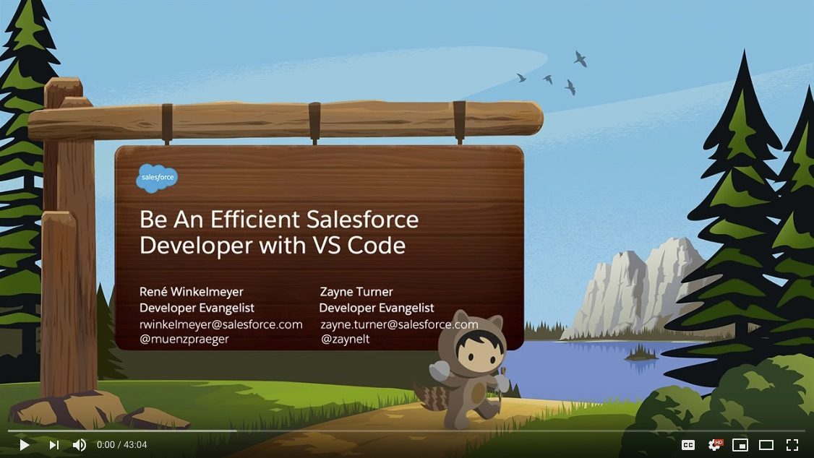

# Salesforce Extensions for VS Code

## Introduction

This repository contains the source code for Salesforce Extensions for VS Code: the Visual Studio Code (VS Code) extensions for Salesforce DX.

Currently, we have the following extensions:

- [salesforcedx-vscode](https://marketplace.visualstudio.com/items?itemName=salesforce.salesforcedx-vscode)  
   A top-level [extension pack](https://code.visualstudio.com/docs/extensionAPI/extension-manifest#_extension-packs) that automatically installs the following extensions for you.
- [salesforcedx-vscode-core](https://marketplace.visualstudio.com/items?itemName=salesforce.salesforcedx-vscode-core)  
   This extension interacts with the Salesforce CLI to provide basic Salesforce DX functionality.
- [salesforcedx-vscode-apex](https://marketplace.visualstudio.com/items?itemName=salesforce.salesforcedx-vscode-apex)  
   This extension uses the Apex Language Server to provide features such as syntax highlighting and code completion.
- [salesforcedx-vscode-apex-debugger](https://marketplace.visualstudio.com/items?itemName=salesforce.salesforcedx-vscode-apex-debugger)  
   This extension enables VS Code to use the real-time Apex Debugger with your scratch orgs and to use ISV Customer Debugger with your subscribers’ sandbox orgs.
- [salesforcedx-vscode-apex-replay-debugger](https://marketplace.visualstudio.com/items?itemName=salesforce.salesforcedx-vscode-apex-replay-debugger)  
   This extension enables VS Code to replay Apex execution from Apex debug logs.
- [salesforcedx-vscode-lightning](https://marketplace.visualstudio.com/items?itemName=salesforce.salesforcedx-vscode-lightning)  
   This extension supports Aura component bundles. It uses the HTML language server from VS Code.
- [salesforcedx-vscode-visualforce](https://marketplace.visualstudio.com/items?itemName=salesforce.salesforcedx-vscode-visualforce)  
   This extension supports Visualforce pages and components. It uses the HTML language server from VS Code.
- [salesforcedx-vscode-soql](https://marketplace.visualstudio.com/items?itemName=salesforce.salesforcedx-vscode-soql)  
   This extension enables you to interactively build a SOQL query via a form-based visual editor, view the query as you build, and save the output to a .csv or .json file.

## Be an Efficient Salesforce Developer with VS Code

Dreamforce 2018 session on how to use Visual Studio Code and Salesforce Extensions for VS Code:

### Getting Started

If you are interested in contributing, please take a look at the [CONTRIBUTING](CONTRIBUTING.md) guide.

If you are interested in building the extensions locally, please take a look at the developing [doc](contributing/developing.md).

You can find more information about using the Salesforce Extensions for VS Code in the [public documentation](https://developer.salesforce.com/docs/platform/sfvscode-extensions/guide). If the docs don’t cover what you are looking for, please feel free to open an issue.

For information about using the extensions, consult the README.md file for each package.
