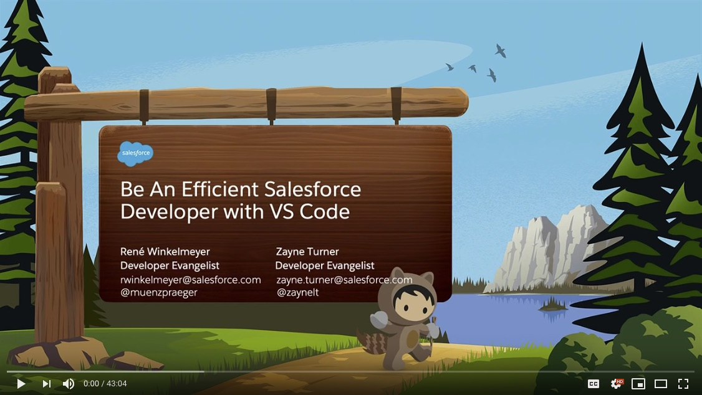

# Salesforce Extensions for VS Code

## Introduction

This repository contains the source code for Salesforce Extensions for VS Code: the Visual Studio Code (VS Code) extensions for Salesforce DX.

The extensions below live in `packages/` — see `packages/README.md` for what each one does and when to use it:

- [salesforcedx-vscode](https://marketplace.visualstudio.com/items?itemName=salesforce.salesforcedx-vscode) — top-level [extension pack](https://code.visualstudio.com/docs/extensionAPI/extension-manifest#_extension-packs) (see also `salesforcedx-vscode-expanded`)
- [salesforcedx-vscode-core](https://marketplace.visualstudio.com/items?itemName=salesforce.salesforcedx-vscode-core)
- [salesforcedx-vscode-apex](https://marketplace.visualstudio.com/items?itemName=salesforce.salesforcedx-vscode-apex)
- [salesforcedx-vscode-apex-replay-debugger](https://marketplace.visualstudio.com/items?itemName=salesforce.salesforcedx-vscode-apex-replay-debugger)
- [salesforcedx-vscode-apex-testing](https://marketplace.visualstudio.com/items?itemName=salesforce.salesforcedx-vscode-apex-testing)
- [salesforcedx-vscode-apex-log](https://marketplace.visualstudio.com/items?itemName=salesforce.salesforcedx-vscode-apex-log)
- [salesforcedx-vscode-apex-debugger](https://marketplace.visualstudio.com/items?itemName=salesforce.salesforcedx-vscode-apex-debugger)
- [salesforcedx-vscode-apex-oas](https://marketplace.visualstudio.com/items?itemName=salesforce.salesforcedx-vscode-apex-oas)
- [salesforcedx-vscode-lightning](https://marketplace.visualstudio.com/items?itemName=salesforce.salesforcedx-vscode-lightning)
- [salesforcedx-vscode-visualforce](https://marketplace.visualstudio.com/items?itemName=salesforce.salesforcedx-vscode-visualforce)
- [salesforcedx-vscode-lwc](https://marketplace.visualstudio.com/items?itemName=salesforce.salesforcedx-vscode-lwc)
- [salesforcedx-vscode-soql](https://marketplace.visualstudio.com/items?itemName=salesforce.salesforcedx-vscode-soql)
- [salesforcedx-vscode-org](https://marketplace.visualstudio.com/items?itemName=salesforce.salesforcedx-vscode-org)
- [salesforcedx-vscode-org-browser](https://marketplace.visualstudio.com/items?itemName=salesforce.salesforcedx-vscode-org-browser)
- [salesforcedx-vscode-metadata](https://marketplace.visualstudio.com/items?itemName=salesforce.salesforcedx-vscode-metadata)
- [salesforcedx-vscode-services](https://marketplace.visualstudio.com/items?itemName=salesforce.salesforcedx-vscode-services)

The extension packs also ship external extensions whose source lives in other repos (not in `packages/`): `salesforcedx-vscode-agents`, `salesforcedx-einstein-gpt`, `agentforce-vibes-autocomplete`, `salesforce-vscode-slds`, `sfdx-code-analyzer-vscode`, `salesforcedx-vscode-ui-preview` (expanded pack only), `salesforcedx-metadata-visualizer-vscode`, `apex-language-server-extension`.

## Be an Efficient Salesforce Developer with VS Code

Dreamforce 2018 session on how to use Visual Studio Code and Salesforce Extensions for VS Code:

### Getting Started

If you are interested in contributing, please take a look at the [CONTRIBUTING](CONTRIBUTING.md) guide.

If you are interested in building the extensions locally, please take a look at the developing [doc](contributing/developing.md).

You can find more information about using the Salesforce Extensions for VS Code in the [public documentation](https://developer.salesforce.com/docs/platform/sfvscode-extensions/guide). If the docs don't cover what you are looking for, please feel free to open an issue.

For information about using the extensions, consult the README.md file for each package.

### TypeScript Support for Lightning Web Components

Salesforce Extensions now fully support creating and developing Lightning Web Components using TypeScript. For details, see the [TypeScript LWC Support Guide](docs/TYPESCRIPT_LWC_SUPPORT.md).

## Project Governance & Support

- [License (BSD-3-Clause)](LICENSE.txt)
- [Code of Conduct](CODE_OF_CONDUCT.md)
- [Contributing Guide](CONTRIBUTING.md)
- [Security Policy](SECURITY.md)
- [How to License](how_to_license.md)

For questions, issues, or support, please open an issue in this repository or refer to the documentation above.
