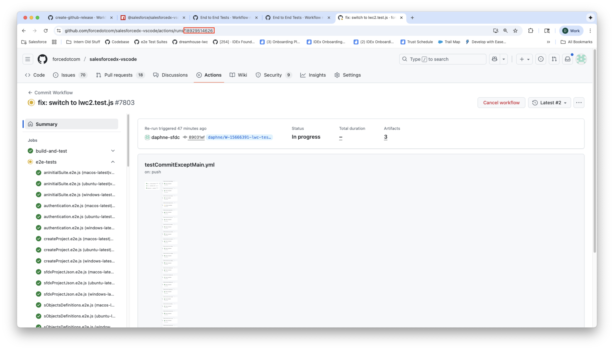
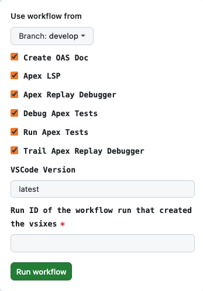

# Running E2E Tests

Prerequisite: Post a Github issue to ask for a value of `sfdxAuthUrl` from a member of the IDE Experience Team. We'll email it to you privately. You'll need this for the dev hub to create scratch orgs used to run the E2E tests.

## How to Run E2E Tests Locally

### Purpose:

During the development process, you'll want to do this in order to set breakpoints in your E2E code and debug.

### Setup:

1. Add the following line to the end of your **.zshrc** file: `export SFDX_AUTH_URL=<insert value of sfdxAuthUrl here>`
2. In the root [**package.json**](../package.json), scroll down to the `automation-test` script.
3. Replace the existing test name at the end of that line with the filename of the test you want to run.

   a. `"automation-test": "rm -rf ./e2e-temp && npm install && npm run compile && [ ! -d ./extensions ] && npm run vscode:package && mkdir -p ./extensions && find ./packages -name '*.vsix' -exec cp {} ./extensions/ \\; || true && VSIX_TO_INSTALL=./extensions node ./node_modules/@salesforce/salesforcedx-vscode-test-tools/lib/src/test-setup-and-runner.js --spec ./packages/salesforcedx-vscode-automation-tests/lib/test/specs/<insert your test name here>.e2e.js",`

### How to Run:

- If you want to run the test straight through, hover over the `automation-test` command and select **Run Test**.
- If you want to debug the E2E test code, set breakpoints in the E2E test file, hover over the `automation-test` command, and select **Debug Test**.

## How to Run E2E Tests In Your Fork on Github Actions

### Purpose:

Our system runs E2E tests on Github Actions to cover our main test cases. E2E tests are run on Mac, Windows, and Ubuntu. E2E tests are run on each commit that is pushed to the repo, part of our nightly build, and before releases. When you develop your feature, you should ensure our E2E tests remain all passing - otherwise you won't be able to merge your branch into develop.

### Setup:

1.  In Github, create a Personal Access Token for your account.
2.  Click on your profile photo in the top right corner and click on “Settings”.
3.  Scroll down and click “Developer settings” from the bottom of the left sidebar.
4.  Click on “Personal access tokens” in the left sidebar. From the dropdown, click “Fine-grained tokens”.

    a. Click the “Generate new token” button in the top right of the page. Give the new token permission for everything.

5.  Add the secret values to your repo.

    a. In Github, go to your repo and click on the “Settings” tab.

    b. Scroll down and click “Secrets and variables” in the left sidebar. From the dropdown, click “Actions”.

    c. Click the green “New repository secret” button.

    d. Secret #1:
    - Name: SFDX_AUTH_URL_E2E
    - Value: This is the `sfdxAuthUrl` that we emailed to you.

    e. Secret #2:
    - Name: ORG_ID_E2E
    - Value: `00DHr0000017bgfMAA`.

    f. Secret #3:
    - Name: IDEE_GH_TOKEN
    - Value: This is the personal access token that you generated in Step 4.

### How to Run:

If you update one of our existing E2E tests, it will be automatically triggered as part of our [Commit Workflow](../.github/workflows/testCommitExceptMain.yml). If you create a new E2E test, you must add it to the Commit Workflow and in the appropriate category (Apex, Core, Deploy and Retrieve, LSP, LWC, or SOQL).

#### Triggering the Workflows Manually:

To run all the E2E tests on GHA, go to the [**End to End Tests**](https://github.com/forcedotcom/salesforcedx-vscode/actions/workflows/e2e.yml) workflow.

In the dropdown, select your branch. For the VSIX box, enter the ID of your commit workflow, found in the URL. Example in the red box of the below screenshot.

Then click the green **Run workflow** button.

To run a single E2E test on GHA, find the test in its appropriate category: e.g. [**Apex End to End Tests**](https://github.com/forcedotcom/salesforcedx-vscode/actions/workflows/apexE2E.yml).

Uncheck all the boxes except for the one E2E test you want to run. Input the ID of your commit workflow into the VSIX box, then click **Run workflow**.

## Updating salesforcedx-vscode-test-tools

The salesforcedx-vscode-test-tools repo is a set of helper functions used to integrate the RedHat vscode-extension-tester repo. We created these helper functions to help us minimize calling vscode-extension-tester commands directly in our E2E tests, and also to remove duplicate code in common areas such as finding and right clicking a file in the sidebar or running a command in the command palette.

If you find yourself frequently calling vscode-extension-tester directly in your E2E test or writing duplicate code, please add a new helper function to salesforcedx-vscode-test-tools for your new functionality. You can use the new helper function by publishing a beta version of salesforcedx-vscode-test-tools on NPMJS. Here's how to do that:

1. Push your code changes to your branch in salesforcedx-vscode-test-tools.
2. Go to **Actions -> [create-github-release](https://github.com/forcedotcom/salesforcedx-vscode-test-tools/actions/workflows/create-github-release.yml)**.
3. Click on the **Run workflow** dropdown and select your branch. Keep the text box blank.
4. Click the green **Run workflow** button.
5. Go to [NPMJS](https://www.npmjs.com/package/@salesforce/salesforcedx-vscode-test-tools?activeTab=versions) to check that a new version of `@salesforce/salesforcedx-vscode-test-tools` is published under **dev**.
6. In **[packages/salesforcedx-vscode-automation-tests/package.json](../packages/salesforcedx-vscode-automation-tests/package.json)**, update the version of `@salesforce/salesforcedx-vscode-test-tools` in devDependencies to the version you just published.
7. Run `npm install`.
8. If running E2E locally, run the `automation-test` script in [**package.json**](../package.json). If running E2E on GHA, commit and push the changes to [packages/salesforcedx-vscode-automation-tests/package.json](../packages/salesforcedx-vscode-automation-tests/package.json) and [package-lock.json](../package-lock.json).

## Tips and Tricks

1. Use the existing E2E tests as examples of what's there. Our team came up with a lot of creative workarounds for flappers - go ahead and reuse them!
2. Improving a feature might break E2E for existing features that still work completely fine under manual testing. If you see that happening and can't fix the issue within an hour, please disable that step in the E2E test and let us know.
