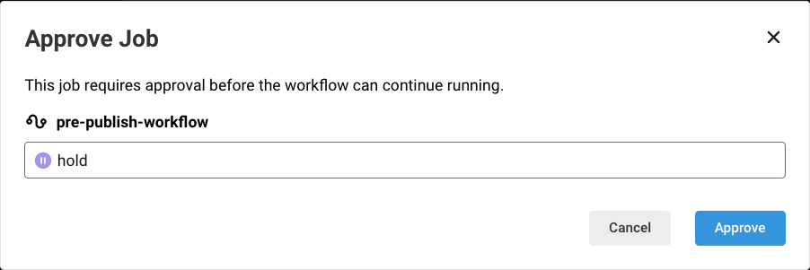

# Publishing

This is a guide for publishing to the Visual Studio Code Marketplace. Most contributors will not need to worry about publishing. However, it might be worthwhile familiarizing yourself with the steps in case you need to share the
extensions through the .vsix files.

# Goal

The goal of publishing is to take the extensions under `/packages`, bundle them as
.vsix files, and push them to the [Visual Studio Code
Marketplace](https://marketplace.visualstudio.com/vscode).

For more information about publishing take a look at:

- [Publishing VS Code Extensions][publish_vscode_ext]
- [Managing Extensions](https://code.visualstudio.com/docs/editor/extension-gallery)

# Prerequisites

1. Publisher has a valid CircleCI token for the forcedotcom organization. See [Create a Personal API token](https://circleci.com/docs/2.0/managing-api-tokens/#creating-a-personal-api-token) in the CircleCI docs.
1. Publisher is a part of the GitHub team 'PDT'.

# Steps

## Creating a Release Branch

The release branch is typically created from a scheduled job in CircleCI. This scheduled job creates the release branch off of the `develop` branch on Mondays at 3 PM GMT (i.e. 7AM or 8AM Pacific time depending on daylight savings). Release branches are in the format `release/vxx.yy.zz`.
Creating a release branch automatically generates the change log based off of the new commits that are being staged for production. The change log generator helps us automate the process of generating the `CHANGELOG.md` with the correct format and commits being staged.

## Verifying the Change Log

One of the members of [Doc Maintainers](https://github.com/orgs/forcedotcom/teams/doc-maintainers/members) would review the changelog and make any changes to the release branch.

## Merging the Release Branch into Main

After the change log has been approved and merged into your release branch, it's time to prepare main with the new changes for the publish. We currently use a CircleCI workflow that rebases `main` off of the release branch. We are specifically using the rebase strategy because we want all the commits from our release branch to be applied on top of the commits in main.

To run the merge process:

1. Switch local branch to develop
1. Perform a git pull
1. Open the Command Palette (press Ctrl+Shift+P on Windows or Linux, or Cmd+Shift+P on macOS).
1. Search for `Tasks: Run Task`.
1. Select `Launch Pre-Publish Steps`.
1. Approve the workflow in CircleCI:
   1. Navigate to the `#pdt_releases` channel in Slack.
   1. Soon you'll see a `Pending Approval for merge of release branch into main` option. Click the `Visit Workflow` button to navigate to CircleCI.
   1. Click the selection for `hold`.
   1. Click the `Approve` button. See  for an example.

## Publishing Main

After the pre-publish steps have run and main has been rebased off of the release branch, it's now time to publish main.

1. Open the Command Palette (press Ctrl+Shift+P on Windows or Linux, or Cmd+Shift+P on macOS).
1. Search for `Tasks: Run Task`.
1. Select `Publish Extensions`.
   1. You will be need the generated [CircleCI token](https://app.circleci.com/settings/user/tokens)
1. Approve the workflow in CircleCI:
   1. Navigate to the `#pdt_releases` channel in Slack.
   2. Soon you'll see a `Pending Approval for Publish` option. Click the `Visit Workflow` button to navigate to CircleCI.
   3. Wait for all tests to pass.
   4. Click the selection for `hold`.
   5. Click the `Approve` button. See  for an example.
   6. Check that [the extension](https://marketplace.visualstudio.com/items?itemName=salesforce.salesforcedx-vscode) has been updated and `main` is merged back into `develop` by the publish job.

## Post-Publishing the .vsix

1. Update the Salesforce Extension Pack to the version you just published. Either go to Extensions, select Salesforce Extension pack, and update... or go to https://marketplace.visualstudio.com/items?itemName=salesforce.salesforcedx-vscode, download the version you published, and install.
2. Restart Visual Studio Code
3. Test & validate the application.
4. Once validated, post an announcement in #platform-dev-tools

---

# Publishing a Beta Pre-Release

If there is a release with high-risk or large-scale changes, we can publish a pre-release to allow advanced users to test early. VSIX artifacts are uploaded to a github release as with our usual release but there is no publish to NPM or the VS Code Marketplace (yet).

## Steps

1. Create a release branch, and increment the version using Lerna, as shown in the `create-release-branch.js` file, starting at the creation of the release branch.
2. For the version number, keep the minor version the same and set the patch to use the following format: year month day hour minute. For example, v55.11.202208260522.
3. Push the branch to remote.
4. From the Actions tab in Github select the workflow 'Publish Beta Release to Github Only'.
5. Select 'Run Workflow', and run the workflow from the beta branch. The workflow can only be run someone with write privileges of this repo.
6. The workflow will create the git tag, the release, and attach the individual VSIX files to the release where they can be downloaded and tested.

Note that the beta branch, because of the unique versioning, should not be merged back to develop. When the code is ready for a standard release, the regular release branching process should be followed.

---

# Manual Publish

In the event that CircleCI is not a viable option for publishing, see the following...

The scripts/publish-circleci.js contains the end-to-end flow. You run this from the
**top-level** directory.

The files under scripts use [shelljs/shx](https://github.com/shelljs/shx) and
[shelljs/shelljs](https://github.com/shelljs/shelljs) to write scripts in a
portable manner across platforms.

1. `git checkout -t origin release/vxx.yy.zz`
1. `npm install`
1. `export SALESFORCEDX_VSCODE_VERSION=xx.yy.zz` (must match the branch version)
1. `export CIRCLECI_TOKEN=zyx` (must be a CircleCI admin in order to generate it)
1. `export CIRCLECI_BUILD=1234` (the build-all CircleCI build number)
1. `scripts/publish-circleci.js`

It is possible to run each step manually as illustrated below.

## Creating a Release Branch Manually

<b>Note that this isn't typically required due to the scheduled job in CircleCI</b>

1. Open the Command Palette (press Ctrl+Shift+P on Windows or Linux, or Cmd+Shift+P on macOS).
1. Search for `Tasks: Run Task`.
1. Select `Create Release Branch`.
1. Approve the workflow in CircleCI:
   1. Navigate to the `#pdt_releases` channel in Slack.
   1. Soon you'll see a `Pending Approval for Creation of Release Branch` option. Click the `Visit Workflow` button to navigate to CircleCI.
   1. Click the selection for `hold`.
   1. Click the `Approve` button. See  for an example.
1. Continue release normally, generating the change log.

## Generating a Major Release

The versioning we follow is intentionally mapped with Salesforce Core. When a major version bump occurs, such as 53.0 -> 54.0, we release a major version update as well.

1. Open the Command Palette (press Ctrl+Shift+P on Windows or Linux, or Cmd+Shift+P on macOS).
1. Search for `Tasks: Run Task`.
1. Select `Create Release Branch`.
1. Select 'Major' as the version.
1. Continue the rest of the release branch process documented above.
1. When generating the change log, manually input the major release version (ex: 54.0.0)
1. Do not publish the minor version generated in CircleCI.

## Downloading the .vsix from CircleCI

### Prerequisite

- Lerna is properly installed (`npm install -g lerna@3.13.1`).
- You've created a CircleCI token that grants you access to the artifacts generated per build. More info on CircleCI's doc [Create a Personal API token](https://circleci.com/docs/2.0/managing-api-tokens/#creating-a-personal-api-token).
- All tests have been run prior to publishing. We don't run the tests during the
  publishing cycle since it generates artifacts that we do not want to include
  in the packaged extensions.

### Steps

1. `npm install` to install all the dependencies and to symlink interdependent
   local modules.
1. You have set the `SALESFORCEDX_VSCODE_VERSION`, `CIRCLECI_TOKEN` and
   `CIRCLECI_BUILD` environment variables that give you access to download the
   CircleCI artifacts.
1. `npm run circleci:artifacts` downloads _each_ extension artifact as a .vsix
   and stores it in the corresponding packages/salesforcedx-vscode-\* path.

**At this stage, it is possible to share the .vsix directly for manual
installation.**

## Generating SHA256

Due to [vscode-vsce#191](https://github.com/Microsoft/vscode-vsce/issues/191)
the .vsix are neither signed nor verified. To ensure that they have not been
tampered with, we generate a SHA256 of the contents and publish that to
https://developer.salesforce.com/media/vscode/SHA256

### Prerequisite

- You have access to our S3 bucket at s3://dfc-data-production/media/vscode
- You have the [AWS CLI](https://aws.amazon.com/cli/) installed and configured
  via `aws configure` or have the `AWS_ACCESS_KEY_ID` and
  `AWS_SECRET_ACCESS_KEY` exported as environment variables.
- Verify you have access to our S3 bucket:

```
$ aws s3 ls s3://dfc-data-production/media/vscode/
```

### Steps

1. `npm run vscode:sha256` will compute the SHA256 for the .vsix generated in
   the previous stage.
1. The SHA256 are appended to the top-level SHA256 file.
1. This file is then copied over to our S3 bucket.
1. Finally the file is added to git so that it can be committed.

## Pushing .vsix to Visual Studio Marketplace

### Prerequisite

- You have a personal access token that for the salesforce publisher id that is
  exported as `VSCE_PERSONAL_ACCESS_TOKEN`. Go to [Publishing VS Code Extensions][publish_vscode_ext] for steps on getting your personal access token.
- Or, you have vsce installed and configured with the salesforce publisher id.
- Verify you have access to publish:

```
$ vsce login (publisher name)
```

### Steps

1. `npm run vscode:publish` takes the .vsix that you had _before_ and uploads
   it to the Visual Studio Code Marketplace.

It's **crucial** that you publish the .vsix that you had before so that the
SHA256 match. If you were to repackage, the SHA256 would be different.

## Merging Back From the Release Branch Into Develop and Main

### Prerequisite

- Artifacts have been published.

### Steps

See this
[guide](https://www.atlassian.com/git/tutorials/comparing-workflows#gitflow-workflow)
from Atlassian on the flow. These steps are manual because you might encounter merge conflicts.

1. `git checkout main`
1. `git pull` to get the latest changes (there shouldn't be any since you are
   the person releasing).
1. `git merge release/vxx.y.z`
1. `git push`
1. `git checkout develop`
1. `git pull` to get the latest changes.
1. `git merge release/vxx.y.z`
1. `git push`

# Tips

1. After publishing, you will need to run `npm run bootstrap` again to continue
   development. This is because the `npm run vscode:package` step does a `npm prune --production`. This is required due to the way Lerna does symlinking.
   See [vscode-vsce#52](https://github.com/Microsoft/vscode-vsce/issues/52) for
   more information.

1. In order to make a previously unpublished extension publishable there are a
   few things that need to get updated:
   1. In packages/salesforcedx-vscode/package.json the extension needs to get added
      to the list of `extensionDependencies`
   2. In the extension's package.json ensure that `bugs` and `repository` both have
      their `url` attributes set.
      For `bugs` the url is `https://github.com/forcedotcom/salesforcedx-vscode/issues`
      For `repository` the url is `https://github.com/forcedotcom/salesforcedx-vscode`
   3. In the extension's package.json, under `scripts` the following attributes need
      to be defined:
      `"vscode:prepublish": "npm prune --production"`
      `"vscode:package": "vsce package"`
      `"vscode:sha256": "node ../../scripts/generate-sha256.js >> ../../SHA256"`
      `"vscode:publish": "node ../../scripts/publish-vsix.js"`

[publish_vscode_ext]: https://code.visualstudio.com/docs/extensions/publish-extension
