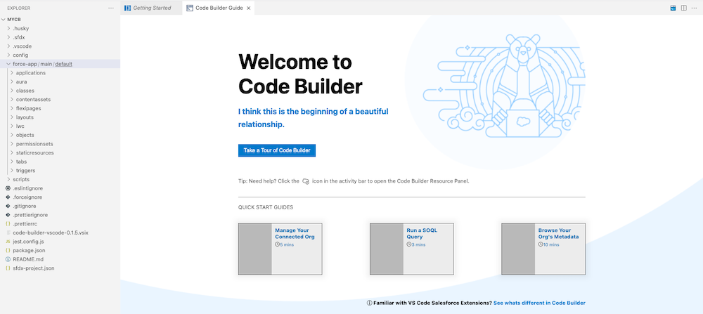

# Overview
Salesforce Code Builder is a web-based integrated development environment that has all the power and flexibility of Visual Studio Code, Salesforce Extensions for VS Code, and Salesforce CLI in your web browser. Code Builder provides a modern developer experience for all developers, regardless of expertise level. Code Builder makes it easy for admins and developers to seamlessly collaborate on the same project, in the cloud without having to worry about downloading software, setup or your machine specs.

The Code Builder dev environment that can be spun up in seconds and is custom to your Salesforce org and your specified project. Through Code Builder, access your favorite Salesforce languages and frameworks, such as Apex, SOQL, Visualforce, Aura, and Lightning Web Components. Access rich developer tools such as debuggers for Apex, Linting etc.
You can install Code Builder as a managed package in any supported Salesforce org edition.

> **_NOTE:_**  We provide Salesforce Code Builder to customers through a Beta program that requires agreement to specific terms and conditions. Code Builder is subject to change and isn't generally available unless or until Salesforce announces its general availability in documentation or in press releases or public statements. We can't guarantee general availability within any particular time frame or at all. Make your purchase decisions only on the basis of generally available products and features.

# Additional Resources

- [Salesforce Developer Tooling Learning Map](https://developertoolinglearningmap.herokuapp.com/)
- Trailhead: [Code Builder Quick Look](https://trailhead.salesforce.com/content/learn/modules/code-builder-quick-look)
  
# Bugs and Feedback
If you encounter any issues using Code Builder, or want to provide other types of feedback, such as initial impressions or feature requests, [file an issue](https://github.com/forcedotcom/try-code-builder-feedback/issues) in the GitHub repo. We want to understand what features and enhancements are important to you. 