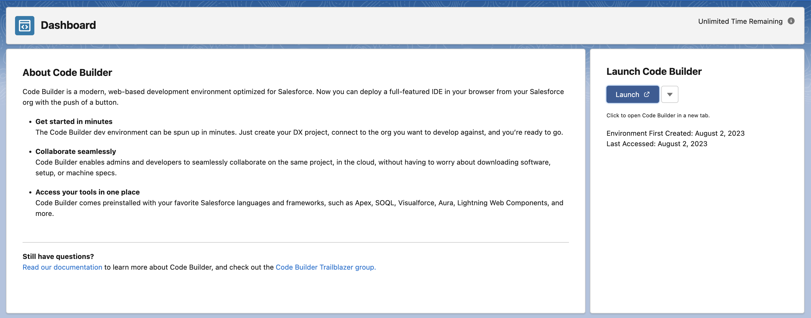

## Get Started with Code Builder

After your team manager or Salesforce admin has installed and configured Code Builder, you’ll be notified that the Code Builder org is ready for you to log in.

## Open Code Builder Dashboard

Are you ready to begin work? Log in to the Code Builder org, launch Code Builder, and get started.

1. Log in to the org where Code Builder is installed.
   Contact your team manager or Salesforce admin for org information and user credentials if you don’t have that information.
2. From the App Launcher, find and select **Code Builder Dashboard**.
   A Salesforce DX project has been created for you as part of the setup process.

3. Click **Launch** to open your Code Builder environment in a new tab.
4. Bookmark the URl to your new Code Builder environment to quickly access it from anywhere, anytime.

## Install Extensions from Open VSX Registry

Development experience in Code Builder can be greatly enhanced by installing additional extensions to your workspace. [Open VSX](open-vsx.org) is an Eclipse open-source project and alternative to the Visual Studio Marketplace. Extensions available here can be installed in Code Builder. You can browse and install these extensions from within VS Code. Bring up the Extensions view by clicking on the Extensions icon in the Activity Bar or the **View: Extensions** command (⇧⌘X).

## Reset your Code Builder Environment

Reset your Code Builder environment to start building from scratch. Resetting deletes all our data so you have a clean Salesforce DX to work with. To reset your project, click the dropdown next to the launch button and select **Reset Environment**.
