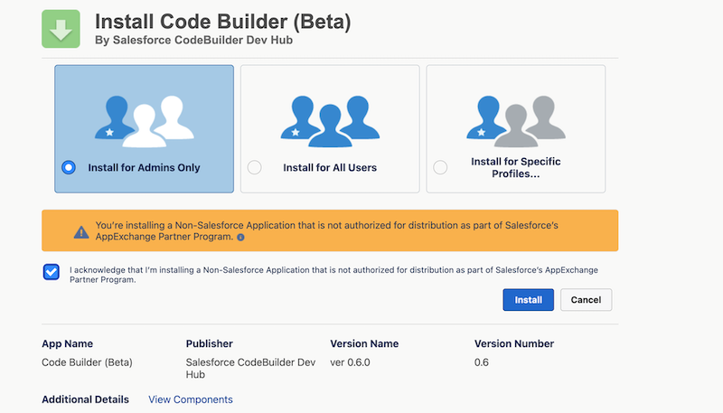
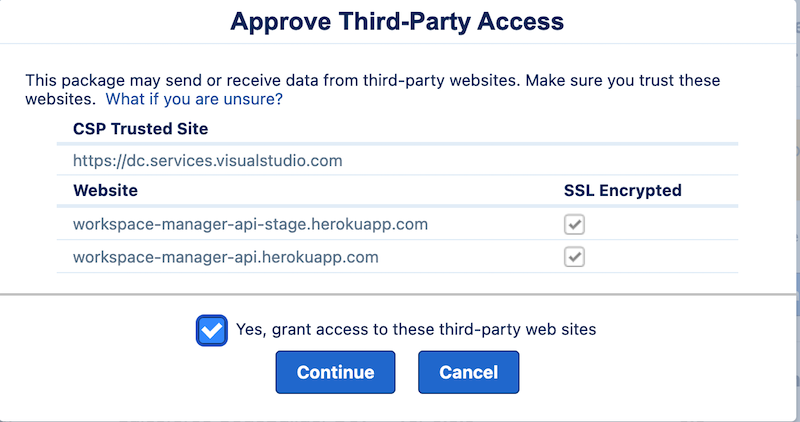

# Install the Code Builder Managed Package

Salesforce Code Builder is a second-generation (2GP) managed package that you can install in any supported Salesforce org edition. Before you install, make sure you have enabled **Unlocked Packages and Second-Generation Managed Packages** in your Dev Hub.

1. Click the install [link](https://login.salesforce.com/packaging/installPackage.apexp?p0=04t6g000008nwJuAAI)
2. Log into the org in which you want to install Code Builder.
3. Check Acknowledge and click **Install**.

4. Grant access and click **Continue**

5. Click **Done** when installation is Complete.

# Assign Permissions
As an admin, assign permissions to users who will use Code Builder:

1. From Setup, enter Permission in the Quick Find box, then select **Permission Sets**.
2. Select **CodeBuilder**.
3. Click **Manage Assignments** 
4. Click **Add Assignments**.
5. Select the checkboxes next to the names of the users you want assigned to the permission set, and click **Assign**.

Your users can now go to the App Launcher and launch **Code Builder(Beta)**.
