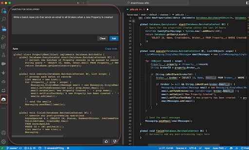
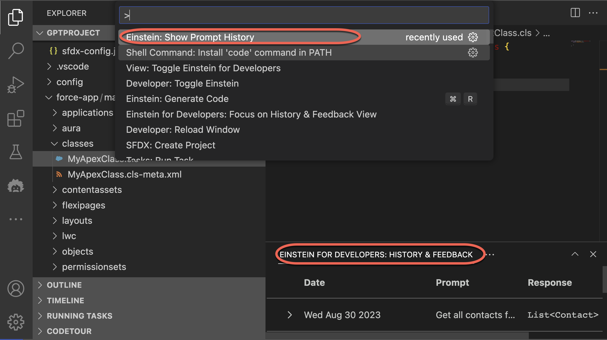

## Set Up Overview

A Salesforce admin or user with the appropriate permissions can install Einstein for Developers in a supported Salesforce org. A developer with access to the org can then:

1.  Install the extension in VS Code.
2.  Connect to an org with Einstein for Developers enabled.
3.  Use the extension to generate Apex code from natural language instructions.

### Required Salesforce Editions and User Permissions

**Available in**: Developer, Enterprise, Partner Developer, Performance and Unlimited Editions.

**Inoperable in**: Group, Professional and Essentials Editions

### User Permissions Needed

**Configure Einstein for Developers(beta)**: `CustomizeApplication` and `ModifyAllData`

## Enable Einstein for Developers

An Admin can enable Einstein for Developers in a supported Salesforce org by following the given steps.

1. From Setup, enter Einstein for Developers in the Quick Find box, then select Einstein for Developers.
   - If you don’t see Einstein for Developers as an option under Setup in your Developer Edition org, it was likely created before Einstein for Developers was introduced and doesn’t have the correct permissions. To continue, create another Developer Edition org.
2. Toggle Enable Einstein for Developers.

**Important**: We encourage you to thoroughly review the license agreement and review all terms and conditions. Then accept to enable Einstein for Developers.

Einstein for Developers is activated in the org. All the users in the org have access to the feature.

### Add Users to the Org

An admin can add additional users to the org as needed:

1. From Setup, enter Users in the Quick Find box, then select **Users**.
2. Click **New User** or **Add Multiple Users**.
3. Select the appropriate license type and profile based on the user’s role.
4. Select the **Generate passwords and notify user via email** checkbox.
5. Click **Save**.
   This procedure generates an email inviting the new users into the org.

### Visual Studio Code Version

VS Code releases a new version each month with new features and important bug fixes. You must be on VS Code Version 1.76 or higher to run the Einstein for Developers extension. You can manually check for updates from **Help** **> Check for Updates** on Linux and Windows or **Code > Check for Updates** on macOS.

## Install Salesforce Extension Pack and Einstein for Developers Extensions

To use Einstein for Developers locally, you must have the Salesforce Extensions pack installed in your VS Code for desktop application.

1. Install the [Salesforce Extension Pack](https://marketplace.visualstudio.com/items?itemName=salesforce.salesforcedx-vscode), if needed.
2. Install [Einstein for Developers](https://marketplace.visualstudio.com/items?itemName=salesforcedx-einstein-gpt).


## Connect to an Org

The Einstein for Developers(beta) tool is run in the context of a Salesforce org, in Salesforce DX project. To use this tool:

1. Go to **File** > **Open Folder** in the menu and open an existing Salesforce DX project in VS Code, or create a new one.

2. Run the **SFDX: Authorize an Org** command to connect to the Salesforce sandbox org or scratch org that has Einstein for Developers(beta) enabled.

The Einstein logo on the activity bar and in the status bar confirms that the extension is installed. Open the command palette and run `View: Show Einstein Developer Sidebar` to open the side bar.



### Use Einstein for Developers in a Scratch Org

Einstein for Developers(beta)is only available in scratch org editions that can author Apex:

- Developer Edition
- Enterprise Edition

Activate Einstein for Developers by turning on the `EinsteinGPTForDevelopers` scratch org feature:

1. Edit the `config/project-scratch-def.json` file in your DX project and add the “`EinsteinGPTForDevelopers`” feature to your existing feature list.

For example:

```
{
"orgName": "Acme Company",
"edition": "Developer",
"features":[“Communities”, “ServiceCloud, "EinsteinGPTForDevelopers"]
}
```

2. Save your changes to activate the feature.

## Show Einstein Feedback Console View

Run **Einstein: Show Prompt History** from the Command Palette to open the Feedback console. When opened, you can view a running history of your prompts and associated responses. Use 👍, 👎, and comments for each response to provide us feedback about the quality of the generated code. Your feedback during this beta is key to helping us improve AI model quality and overall product.


