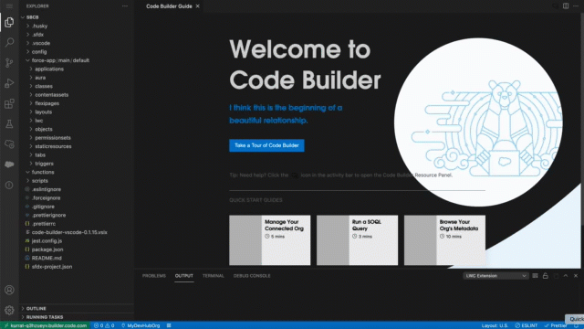

Salesforce Extensions for Visual Studio Code are a set of open-source extensions that come with rich tools for developing on the Salesforce platform. To make our extensions accessible across different machine specs and developer experiences, we offer two ways for you to leverage their power:
1. A desktop version of the extension pack that is available on the Visual Studio Code extensions marketplace. Requires downloading and installation of Visual Studio Code and the Salesforce extension pack.

2. Code Builder, a browser based development environment that is optimized for Salesforce and has everything you need to build applications on the platform without downloads and installations. It provides you the flexibility to work anywhere, from any computer, but with some limitations. Code Builder is currently in beta.

### Important Considerations for Code Builder Beta
* We've capped usage for beta at 20 hours for a maximum of 30 days. 
* We highly recommend that you save your work and close the browser tab that is running Code Builder to stop the usage clock when you aren’t using Code Builder.