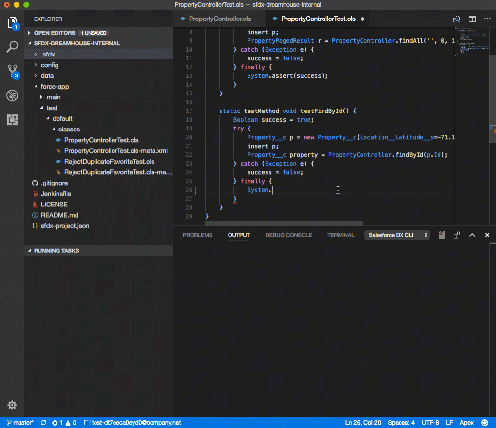

Download Salesforce Extensions for Visual Studio Code are a set of open-source extensions that come with rich tools for developing on the Salesforce platform. Download and install these extensions to start developing on the Salesforce platform. 

## Additional Resources

- [Salesforce Developer Tooling Learning Map](https://developertoolinglearningmap.herokuapp.com/)
- Trailhead: [Build Apps Together with Package Development](https://trailhead.salesforce.com/trails/sfdx_get_started)
- [Salesforce CLI Setup Guide](https://developer.salesforce.com/docs/atlas.en-us.sfdx_setup.meta/sfdx_setup)
- [Salesforce DX Developer Guide](https://developer.salesforce.com/docs/atlas.en-us.sfdx_dev.meta/sfdx_dev)

## Videos

- [Quick Tour of the Extensions](https://www.youtube.com/watch?v=njKzjOTzEjo&list=PLgIMQe2PKPSIVPDsaiYIMGnFxtcrUus6M&index=6&t=0s)
- [Language Support](https://youtu.be/s5X4yGBRWTM)
- [Accessing Orgs and Source](https://youtu.be/pi5Zho9ft3s)
- [Test and Debug](https://youtu.be/f6OacBmQk1g)
- [LWC Local Development](https://www.youtube.com/watch?v=8eRFE4t2VyU&list=PLgIMQe2PKPSJdFGHjGpjd1FbCsOqq5H8t&index=4)
- [Best Practices for Building with VS Code](https://www.youtube.com/watch?v=jn91h69qC-o)
- [Unlock Productivity with Modern, Open Tooling](https://play.vidyard.com/MaE5b4ZXZ9PBzWFp3ATWoy?chapter=9)

### Open Source

- [Roadmap](https://github.com/forcedotcom/salesforcedx-vscode/wiki/Roadmap)
- [Github Repository](https://github.com/forcedotcom/salesforcedx-vscode)

## Bugs and Feedback

To report issues with Salesforce Extensions for VS Code, open a [bug on GitHub](https://github.com/forcedotcom/salesforcedx-vscode/issues/new?template=Bug_report.md). If you would like to suggest a feature, create a [feature request on GitHub](https://github.com/forcedotcom/salesforcedx-vscode/issues/new?template=Feature_request.md).