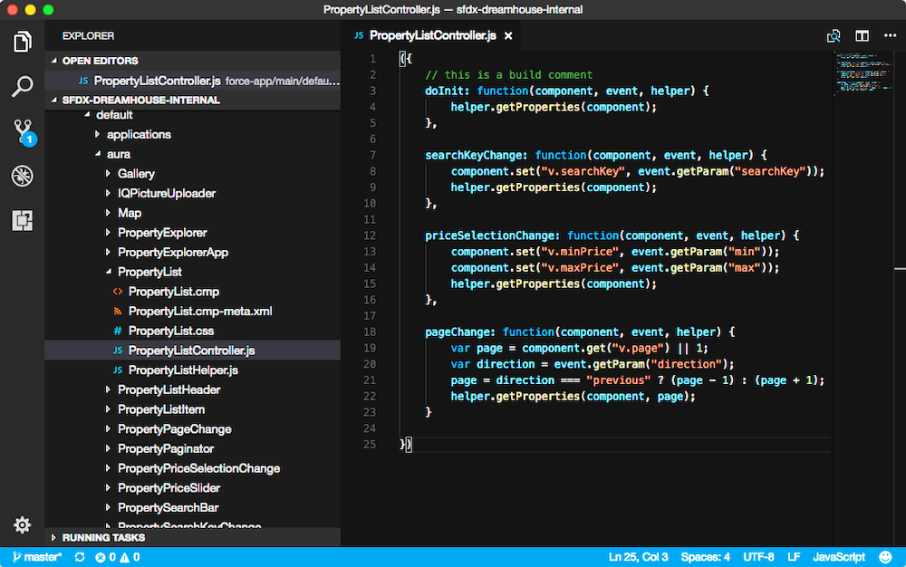
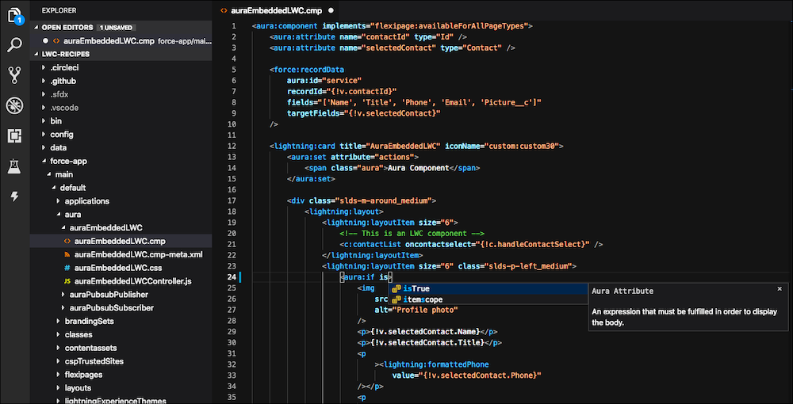
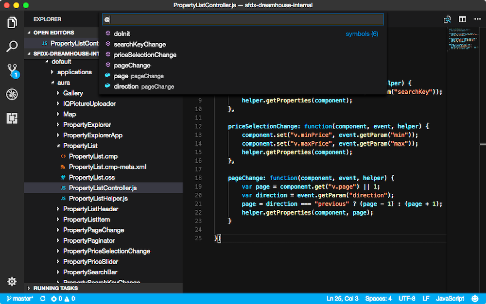
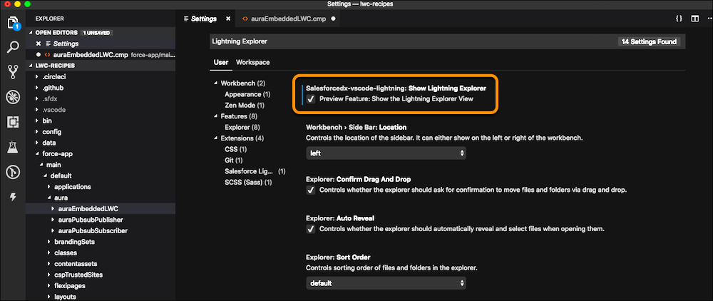
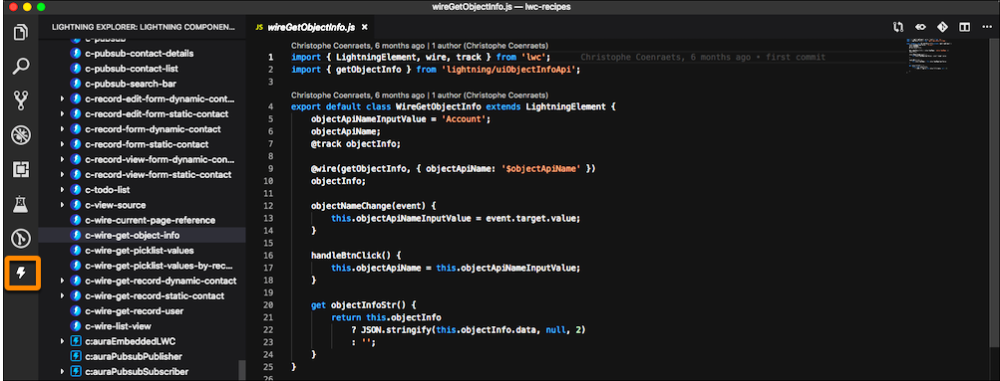
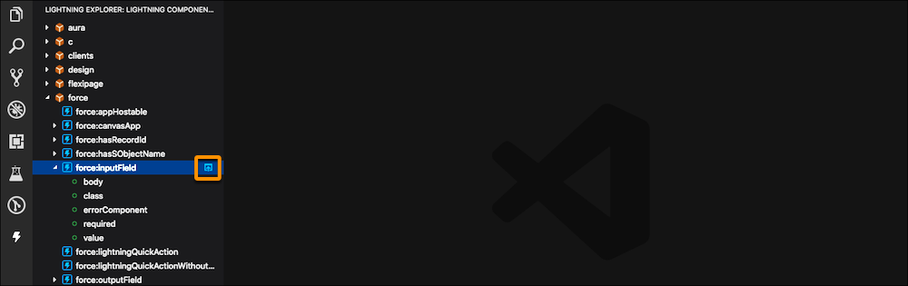

## 構文の強調表示

Aura コンポーネント拡張機能は、.cmp、.component、.app などのファイルの Aura マークアップ、HTML、CSS、JavaScript の構文を強調表示します。次の例では、JavaScript の構文が強調表示されています。

## コード補完

Aura マークアップで作業中に Ctrl+スペースキーを押すと、コード補完が起動します。タグの名前や属性に関する追加情報が直接エディタに表示されます。

#### タグ

- **注意:** ワークスペースに Lightning Web コンポーネントがある場合は、それらのコンポーネントも補完候補のリストに表示されます。適切な Aura 構文とともに、Lightning Web コンポーネントの候補が表示されます。

#### 属性

## カーソルを置くとコンポーネントドキュメントを表示

コンポーネントの名前または属性にカーソルを置くと、エディタにコンポーネントのドキュメントと、コンポーネントライブラリへのリンクが表示されます。Aura コンポーネントや、Aura コンポーネント内にネストされている Lightning Web コンポーネントの参照ドキュメントを確認できます。

以下は、`lightning:card` コンポーネントの参照ドキュメントです。

## 定義の表示または定義への移動

次の定義をプレビューや表示したり、定義に移動することができます。

- Aura タグ
- LWC タグ
- JavaScript
  - メソッド
  - 変数

定義をプレビューするには、Ctrl キー \(Windows、Linux\) または Cmd キー \(macOS\) を押したまま、定義を表示する項目にカーソルを置きます。

定義を表示するには、項目を右クリックして [Peek Definition \(定義をここに表示\)] を選択するか、Alt+F12 キーを押します。

定義の場所に移動するには、項目を右クリックして [Go to Definition \(定義へ移動\)] を選択するか、F12 キーを押します。

## アウトラインビュー

[Outline \(アウトライン\)] ビューでは、コンポーネントのアウトライン \(HTML のタグ、JavaScript のプロパティなど\) を確認できます。Windows または Linux は Ctrl+Shift+O キー、Mac は Cmd+Shift+O キーで起動します。

## Lightning Explorer \(ベータ\)

Lightning Explorer View はベータ機能としてのプレビュー版であり、Salesforce とのマスターサブスクリプション契約における「サービス」には含まれません。この機能はお客様各自の裁量で使用し、購入するときは、現在正式にリリースされている製品および機能に基づいて判断してください。Salesforce はこの機能の特定期間内の正式リリースまたはリリースの有無を保証しません。また、いかなる時点でもこの機能を終了できるものとします。Lightning Explorer は評価のみを目的とし、本番環境での使用はできません。この機能は、そのままの状態で提供され、サポートされておらず、ここから生じる、またはこれに関連する被害または損害に対して、Salesforce はいかなる責任も負いません。すべての制約、Salesforce の権利の保留、本サービスに関する義務、および関連する Salesforce 以外のアプリケーションならびにコンテンツの条件は、この機能の使用に等しく適用されます。この機能の使用は、[Salesforce.com Program Agreement \(Salesforce.com プログラム契約\)](https://trailblazer.me/resource/documents/documents/pdf/TermsOfUse_en_US.pdf) に準拠します。問題が発生した場合、または機能強化を求める場合は、GitHub の問題を登録してください。

Lightning Explorer では、Aura コンポーネントと Lightning Web コンポーネントの両方の参照ドキュメントを表示できます。有効にするには、**[Preferences \(個人設定\)] > [Settings \(設定\)]** に移動します。検索バーに「`lightning explorer`」と入力します。次に、**[salesforcedx-vscode-lightning:Show Lightning Explorer]** の横にあるチェックボックスをオンにします。

Lightning Explorer を使用するには、画面の左側にある稲妻アイコンをクリックします。名前空間をクリックすると、使用可能なコンポーネントがすべて表示されます。Lightning Web コンポーネントと Aura では稲妻アイコンが異なります。

c 名前空間にある `c-wire-get-object-info` Lightning Web コンポーネントが選択されています。このコンポーネントの名前をクリックすると、メインのコードパネルに対応するファイルが表示されます。

以下は `force:inputField` Aura コンポーネントです。コンポーネント名の右側にある青いアイコンをクリックすると、ブラウザにコンポーネントライブラリのコンポーネントの参照が開きます。

Aura コンポーネント拡張機能では、カスタム Aura コンポーネントとドキュメントも使用できます。Aura コンポーネントのドキュメントの作成についての詳細は、[『Lightning Aura Components Developer Guide \(Lightning Aura コンポーネント開発者ガイド\)』](https://developer.salesforce.com/docs/atlas.en-us.lightning.meta/lightning/components_documentation.htm)を参照してください。
