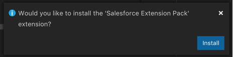

始める前にまず、必要なソフトウェアをコンピュータにインストールします。

## Visual Studio Code

macOS、Windows、Linux のいずれかを実行しているコンピュータに Visual Studio Code をインストールします。VS Code には[システム要件](https://code.visualstudio.com/docs/supporting/requirements)がさほどないため、大半のコンピュータで適切に機能します。

Visual Studio Code をインストールするには、<https://code.visualstudio.com> にアクセスし、緑の大きな **[Download \(ダウンロード\)]** ボタンをクリックします。ダウンロードが済んだら、インストーラを開き、手順に従ってインストールを完了します。

## Java Platform, Standard Edition Development Kit

Visual Studio Code 向け Salesforce 拡張機能の一部の機能は、Java Platform, Standard Edition Development Kit \(JDK\) に依存しています。JDK のバージョン 8 とバージョン 11 のいずれかをインストールしている必要があります。

JDK のバージョン 11 または 8 をまだインストールしていない場合は、[Java のインストールおよび設定方法の説明](java-setup)を参照してください。

## Salesforce CLI

Salesforce CLI は、Salesforce 組織に対してコマンドを実行したり、ローカルマシン上のソースファイルを操作したりするために使用します。VS Code 向け Salesforce 拡張機能では Salesforce CLI をバックグラウンドで使用するため、CLI を直接使用する予定がなくても、マシンにインストールする必要があります。

Salesforce CLI のインストールについての詳細は、[『Salesforce DX 設定ガイド』](https://developer.salesforce.com/docs/atlas.en-us.sfdx_setup.meta/sfdx_setup/sfdx_setup_install_cli.htm)を参照してください。

## Visual Studio Code 向け Salesforce 拡張機能

VS Code 向け Salesforce 拡張機能の連動関係をインストールしたら、Visual Studio Marketplace から Salesforce Extension Pack 拡張機能をインストールします。この機能パックには、Visual Studio Code を使用して Salesforce アプリケーションを開発するために必要なものがすべて揃っています。

この拡張機能をインストールするには、<https://marketplace.visualstudio.com/items?itemName=salesforce.salesforcedx-vscode> にアクセスして、緑の **[Install \(インストール\)]** ボタンをクリックします。インストールプロセスで、Visual Studio Code を開くように指示されます。Visual Studio Code が開くと、右下にダイアログボックスが開き、拡張機能をインストールするよう指示されます。**[Install \(インストール\)]** をクリックして続行します。

拡張機能がインストールされると、青い **[Reload \(再読み込み\)]** ボタンが表示されます。Visual Studio Code を再読み込みして、インストールを完了するには、このボタンをクリックします \(あるいは Visual Studio Code を閉じてもう一度開きます\)。
