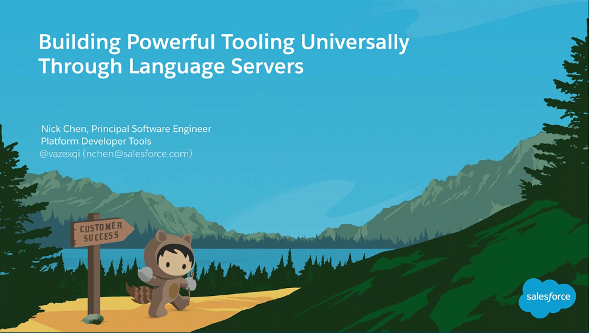
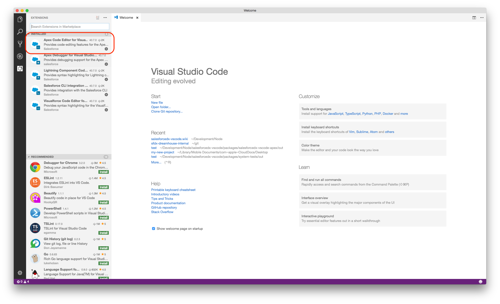
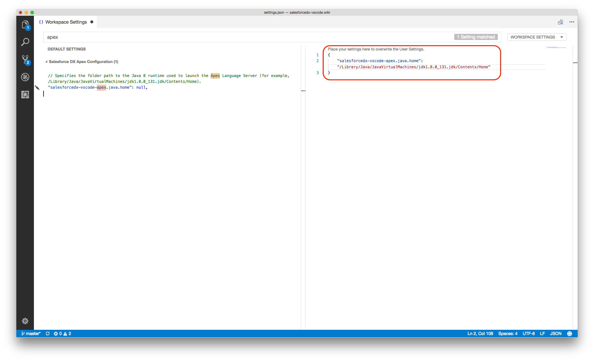
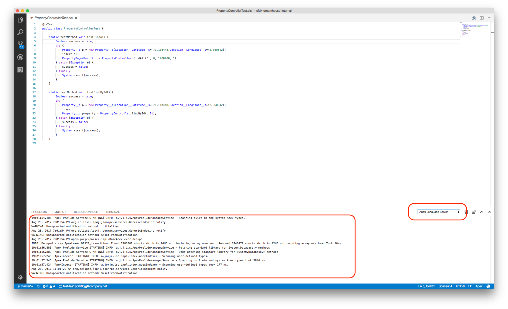

The Apex Language Server is an IDE-agnostic way for tools to access code-editing capabilities such as code completion, go to definition, find all usage, and refactoring. It provides a powerful way for Salesforce Extensions for VS Code to implement an Apex analyzer that’s also accessible to other IDEs.

The Apex Language Server is an implementation of the Language Server Protocol 3.0 [specification](https://github.com/Microsoft/language-server-protocol/blob/master/protocol.md). The Language Server Protocol allows a tool (in this case, VS Code) to communicate with a language smartness provider (the server). We built the Apex Language Server using this common specification to enable our tooling partners to improve the smartness of their tools.

For more information, please take a look at this Dreamforce ’17 presentation on "Building Powerful Tooling Universally Through Language Servers".

# For Consumers

## Installation

We recommend that you install the VS Code Extension Pack from the [VS Code Marketplace](https://marketplace.visualstudio.com/items?itemName=salesforce.salesforcedx-vscode). The extension pack includes the Apex Language Server and its integration with VS Code.

## Usage

See [Apex](introduction).

## Troubleshooting

### How do I know whether the salesforce.salesforcedx-vscode-apex extension is installed?

In the VS Code menu bar, select **View** > **Extensions**. If the extension is installed, you will see "Apex Code Editor for Visual Studio Code" on the left.

  

### Is the Apex Language Server active?

In the VS Code menu bar, select **View** > **Output** and select **Apex Language Server** from the drop-down list on the right. If you don't see an "Apex Language Server" entry, the language server didn’t activate. 

If the Apex Language Server didn’t activate, ensure that you've:

1. Opened a Salesforce DX project that has a valid `sfdx-project.json` file.
1. Opened the Salesforce DX project as a top-level folder.
1. Installed Java 1.8; you will see a warning if it's not installed.

If you’ve checked all of the above and nothing is working, check for errors in VS Code itself. In the VS Code menu bar, select **Help** > **Toggle Developer Tools**, click **Console**, and search for relevant messages.

### How do I configure the version of Java that the Apex Language Server uses?

By default, VS Code attempts to locate your local Java installation by looking for a `JAVA_HOME` or `JDK_HOME` environment variable on your computer. If VS Code cannot find your Java installation, or if you want it to use a different installation, change the `salesforcedx-vscode-apex.java.home` setting.

1. Select Code > Preferences > Settings (macOS) or File > Preferences > Settings (Windows or Linux).
1. Search for `apex`.
1. Change the `salesforcedx-vscode-apex.java.home` setting to the full pathname of your Java Runtime. Do  **not** set it to the Java executable itself.  For example, on macOS, set it to `/Library/Java/JavaVirtualMachines/jdk1.8.0_131.jdk/Contents/Home` and **not** `/Library/Java/JavaVirtualMachines/jdk1.8.0_131.jdk/Contents/Home/bin/java.`

  

### Are there any errors from the Apex Language Server?

If the Apex Language Server has activated, you can check its output to see if there are any errors. In the VS Code menu bar, select View > Output, select "Apex Language Server" from the drop-down list, and view the messages.

### How can I clear the cache?

Delete the `PROJECT_DIR/.sfdx/tools/apex.db` file and restart VS Code.

# For Developers

If you are a developer looking to integrate with the Apex Language Server, use the [apex-jorje-lsp.jar](https://github.com/forcedotcom/salesforcedx-vscode/blob/develop/packages/salesforcedx-vscode-apex/out/apex-jorje-lsp.jar) file. 

See the [languageServer.ts](https://github.com/forcedotcom/salesforcedx-vscode/blob/develop/packages/salesforcedx-vscode-apex/src/languageServer.ts) file for an example of initializing and communicating with the Apex Language Server.

For more information, consult these resources:

* [Language Server Protocol Specification](https://github.com/Microsoft/language-server-protocol)
* [Language Server Protocol - Eclipse Newsletter May 2017](http://www.eclipse.org/community/eclipse_newsletter/2017/may/article1.php)
* [VS Code's Implementation of the Language Server Protocol](https://github.com/Microsoft/vscode-languageserver-node)
* [Langserver.org - Information about other language servers and clients, e.g., Atom, Sublime, Vim, etc](http://langserver.org/)