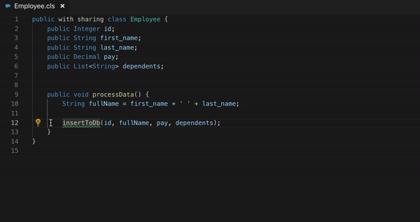
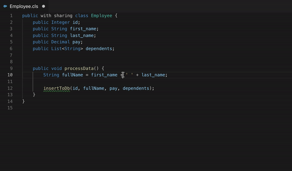

## Quick Fix: Declare Missing Methods

You can invoke quick fix when you reference a method that is not declared in your source.
There are 2 ways to invoke quick fix in VS Code.

1. When you click on the method name then a lightbulb will show up on the left side of the editor window. On clicking the lightbulb you will have the option to invoke the quick fix.

2. When you hover over the method name then the window that pops up has a quick fix link which when clicked provides you an option to invoke the quick fix.

