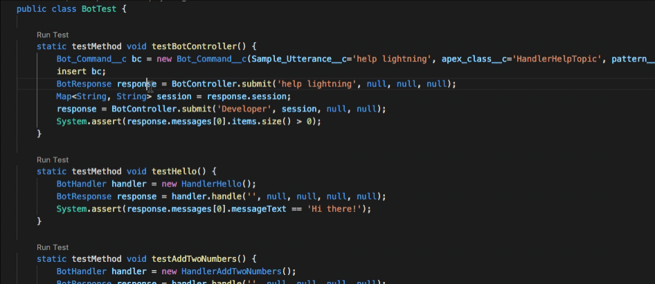
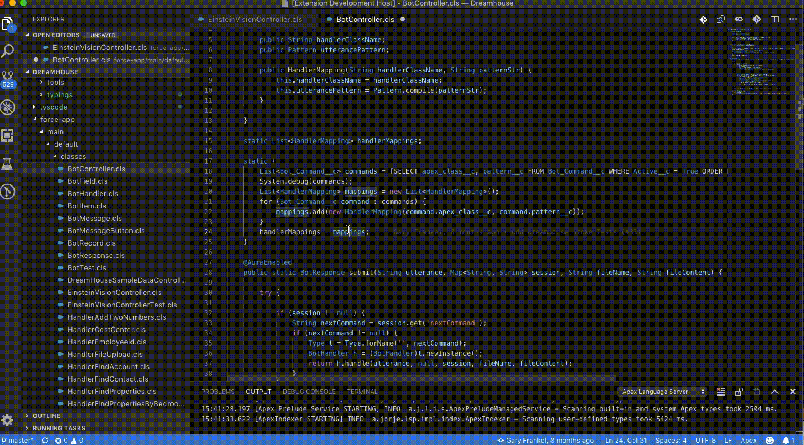
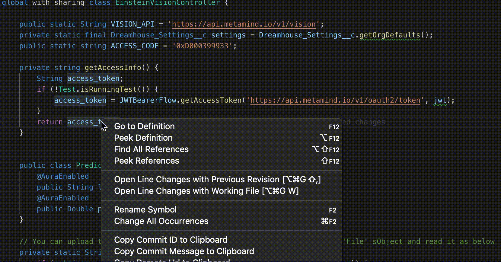
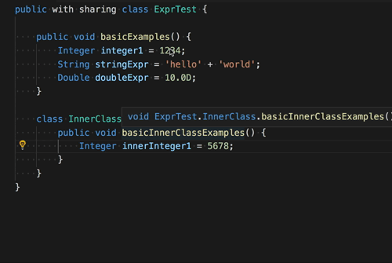
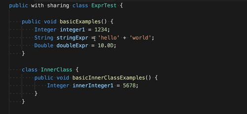
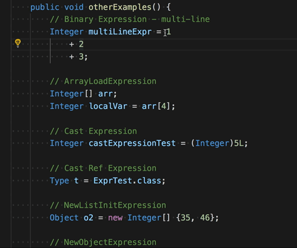

## Refactor: Rename

You can rename any valid Apex symbol defined in your source: methods, locals, fields, properties, constructors, or types (classes, triggers, or enums). To perform a rename, right-click the symbol that you want to rename and select **Rename Symbol**.

Validation of the new symbol name is performed before applying the rename. If the validation fails, an error message explains the reason why the rename refactoring could not be applied. Validation fails if the new name is not a valid Apex identifier or, sometimes, if the new name conflicts with an existing identifier name. (If these situations were allowed, a compiler error or a runtime behavior change could result.)

If the new name conflicts with an existing identifier name, we try to fully qualify the references to the existing name in contexts where the conflicts exist.

## Refactor: Extract Constant

You can extract valid literal expressions into constants. Literal expressions include: String, Integer, Long, Double, Decimal, and Boolean.

This constant will be instantiated below the class declaration. If the expression is contained within an innerclass, the constant will be instantiated below the innerclass declaration. The new constant will always be defined with modifiers private, static, and final.

At this time, there is no conflict detection for the new constant.

## Refactor: Extract Local Variable

You can extract valid expression types into local variables. Please note that not all expression types are supported at this time.

This new variable will be instantiated above the currently selected line. It will retain the formatting of the expression that is selected.

At this time, there is no conflict detection for the new variable and nested expressions are not supported.

