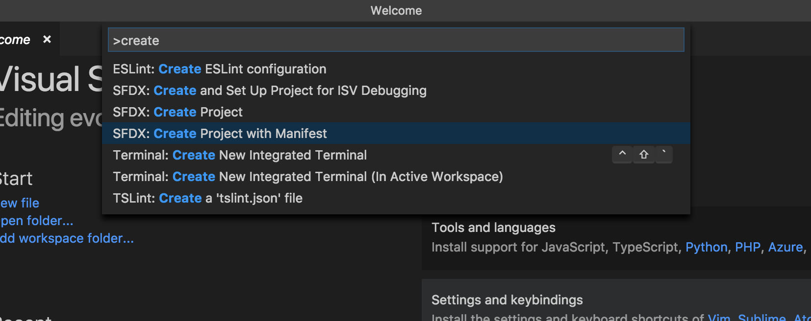
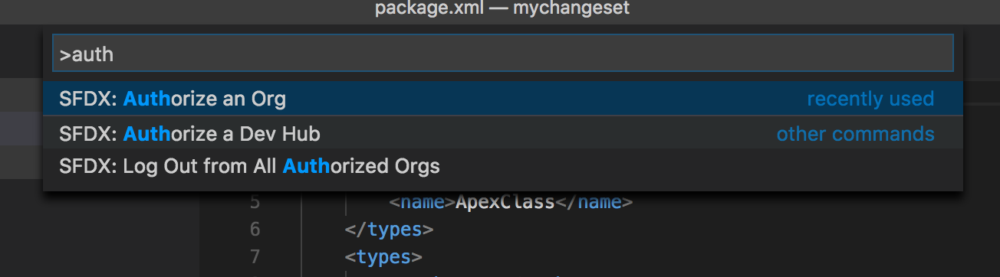
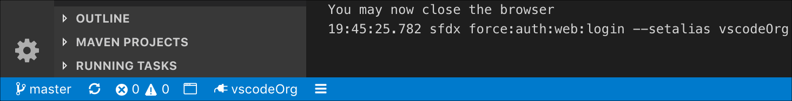
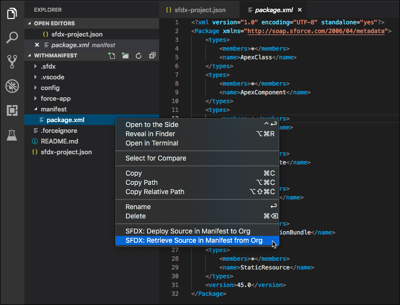

## Overview

Salesforce Extensions for VS Code supports Org Development and Package Development models to authorize, create and switch orgs in your project:

- **Org Development Model**: Allows you work with orgs that don’t have source tracking, such as sandbox, Developer Edition (DE) org, Trailhead Playground, or even a production org to retrieve and deploy code directly.
- **Package Development Model**: Allows you to create self-contained applications or libraries that are deployed to your org as a single package. These packages are typically developed against source-tracked orgs such as scratch orgs. This development model uses org source tracking, source control, and continuous integration and deployment.

Salesforce Extensions for VS Code runs commands against the org that you’ve set as your default org for development.

## Org Development Model

Use the Org Development model work with orgs that don’t have source tracking, such as sandboxes, Developer Edition (DE) orgs, or Trailhead Playgrounds, in Visual Studio Code. With this development model, you must track changes manually and deploy sets of changes to sandboxes and then to your production org. See the [Org Development Model](https://trailhead.salesforce.com/content/learn/modules/org-development-model) Trailhead module.


To start developing with this model:

- Create a project.
- Use the Org Picker to authorize an org you want develop against.
- Use Manifest or Org Browser to retrieve source from the default org.
- Deploy source to the default org.

## Create Project with Manifest

To create developing against non-source-tracked orgs:

1. Open the VS Code editor and from the Command Palette, run **SFDX: Create Project with Manifest**.



1. In the Side Bar of the code editor, click Org Picker. This opens the Command Palette and you can select the command to authorize an org, Dev Hub, or create a scratch org; Or you can select from the list of authorized orgs.

If this is the first time you are creating a project in VS Code and haven’t authorized an org, the display text for the Org Picker shows No Default Org Set.

1. Run **SFDX: Authorize an Org** and select a login URL, for example Sandbox.



After you provide an org alias, a browser window opens. Allow access, log in to your org, and then return to the VS Code window. The Org Picker now shows the alias provided while authorizing the org.



### The Manifest (`package.xml`) File

After connecting to a sandbox, DE org, or Trailhead Playground, use the package.xml file to retrieve the metadata from your org. When you run SFDX: Create Project with Manifest command, a package.xml file is created. Add the various metadata types you want to retrieve to this file. To understand how to work with different subsets of metadata in `package.xml` file, see [Sample package.xml Manifest Files](https://developer.salesforce.com/docs/atlas.en-us.api_meta.meta/api_meta/manifest_samples.htm) in the _Metadata API Developer Guide_.

### Retrieve Source

Org Development model doesn’t automatically track changes to your org, so be sure to keep track of the changes you retrieve.

> Note: Retrieving source from an org overwrites the local versions of the source files.



You can retrieve source for a manifest, a source file, a directory, or a folder:

- Manifest
  - In VS Code explorer or editor, right-click a manifest file and select **SFDX: Retrieve Source in Manifest from Org**.
  - With a manifest file open in the editor, open the Command Palette and run **SFDX: Retrieve Source in Manifest from Org**.
- Source File or Directory
  - In VS Code explorer, right-click a source file or a directory and select **SFDX: Retrieve Source from Org**.
  - With a source file open in the editor, right-click in the editing pane and select **SFDX: Retrieve This Source from Org**.
  - With a source file open in the editor, open the Command Palette and run **SFDX: Retrieve This Source from Org**.

When you select an item to retrieve source, only the existing nested items in the directory structure are retrieved. For example, if you retrieve source for the `classes` folder, the Apex classes that **currently exist in that directory** are retrieved. The command doesn’t retrieve all the Apex classes in the org; it only updates the classes that already exist in the folder. If you want to retrieve a new Apex class, add that class (or all Apex classes) to a `package.xml` file and retrieve source using the manifest file. You could also use a terminal to run `sfdx force:source:retrieve --metadata ApexClass:YourApexClass`.

The project structure after you retrieve source:

```text
your-app
├── README.md
├── sfdx-project.json
├── .sfdx
├── .vscode
│   ├── extensions.json
│   └── settings.json
├── force-app
|   └── main
|       └── default
|           ├── aura
|           ├── classes
|           └── objects
└── manifest
    └── package.xml
```

### Deploy Source

When you deploy the code changes, he local version of the source files overwrites the metadata in your org.


You can deploy source of a manifest, a source file, a directory, or a folder:

- Manifest
  - In VS Code explorer or editor, right-click a manifest file and select **SFDX: Deploy Source in Manifest in Org**.
  - With a manifest file open in the editor, open the Command Palette and run **SFDX: Deploy Source in Manifest in Org**.
- Source File or Directory
- In VS Code explorer, right-click a source file or a directory and select **SFDX: Deploy Source to Org**.
- With a source file open in the editor, right-click in the editing pane and select **SFDX: Deploy This Source File to Org**.
- With a source file open in the editor, open the command palette and run **SFDX: Deploy This Source File to Org**.

### Delete Source

You can delete source from your project and from your non-source-tracked org.

- In the VS Code explorer, right-click a manifest, a source file, or a directory and select **SFDX: Delete from Project and Org**.
- With a source file open in the editor, right-click the file and select **SFDX: Delete This from Project and Org**.
- With a source file open in the editor, open the Command Palette and run **SFDX: Delete from Project and Org**.

## Create Project and Use Org Browser

To develop in non-scratch orgs and use Org Browser to retrieve source:

1. Open the VS Code editor and from the Command Palette, run **SFDX: Create Project**.
1. In the Side Bar of the code editor, click Org Picker. This opens the Command Palette and you can select a command to authorize an org, Dev Hub, or create a scratch org; Or you can select from the list of authorized orgs.
1. Run **SFDX: Authorize an Org** and select a login URL, for example Sandbox. Log in to your org in the browser window and then return to the VS Code window.

Org Browser displays the available metadata types and their corresponding components in your default org. It saves the metadata of the default org in your local project under the .sfdx directory. See [Org Browser](../user-guide/org-browser).

### Retrieve Source

You can retrieve a component or multiple components to your local project from the default org. To do so, click the retrieve button next to the component or the metadata type.

You can also refresh metadata at org level, for a type, for folders in a type, and for components in a folder by clicking the refresh icon. Before refreshing the metadata, you can compare the differences between your local project and the metadata in your org. See [Source Diff](../user-guide/source-diff).

### Deploy Source

After you have made the code changes you can deploy source for a source file, a directory, or a folder.

- In VS Code explorer, right-click a source file or a directory and select **SFDX: Deploy Source to Org**.
- With a source file open in the editor, right-click in the editing pane and select **SFDX: Deploy This Source File to Org**.
- With a source file open in the editor, open the command palette and run **SFDX: Deploy This Source File to Org**.

> Note: To deploy files whenever you save them, select the workspace setting Push-or-deploy-on-save: Enabled. See [Deploy On Save](../user-guide-deploy-on-save).

## Package Development Model

Use package development model for developing against orgs with source tracking such as scratch orgs. This model tracks the changes you make on your local workstation and in your default development org. Use packaged sets of metadata to move changes between orgs. See the [Package Development Model](https://trailhead.salesforce.com/en/content/learn/modules/sfdx_dev_model) Trailhead module.

## Create Project

To start developing with this model:

1. Open the VS Code editor and from the Command Palette, run **SFDX: Create Project**.
   If you want to work on an existing project, choose **File** > **Open** and navigate to the project directory. Before you open an existing project in VS Code, make sure that your project has a `sfdx-project.json` file and that metadata is in source format.
   - For information on the project structure, see Project Setup (https://developer.salesforce.com/docs/atlas.en-us.sfdx_dev.meta/sfdx_dev/sfdx_dev_workspace_setup.htm) in the _Salesforce DX Developer Guide_.
   - You can work with source-tracked orgs only if your metadata is in source format. See Source Format (../user-guide/source-format).
1. In the Side Bar of the code editor, click Org Picker and this opens the Command Palette.
1. Run **SFDX: Authorize an Org**. If you don’t have a Dev Hub, see [Enable Dev Hub in Your Org](https://developer.salesforce.com/docs/atlas.en-us.sfdx_setup.meta/sfdx_setup/sfdx_setup_enable_devhub.htm) in the _Salesforce DX Setup Guide_.
1. Click Org Picker and run **SFDX: Create a Default Scratch Org** to create and set a scratch org as your default org for development.
1. Select the scratch org shape, enter an alias, and enter the duration when the scratch org expires. The Org Picker now shows the alias provided for the scratch org. You can click the browser icon () in the Side Bar to open the default org you are working against.
   To change the default org you’re developing against, click the Org Picker and select a different org. Or, open the Command Palette and run **SFDX: Authorize an Org** or **SFDX: Create a Default Scratch Org**.

### Push and Pull Source

When you use the package development model, it’s simple to keep your local project and default development org in sync. Because you deploy your changes to other orgs using packaged sets of metadata, there’s no need to manually track your changes.
VS Code is context aware that you are working in a scratch org and provides only push and pull commands, not commands to retrieve and deploy source.

#### Push Source

To push your source to the new scratch org or changes you made, run **SFDX: Push Source to Default Scratch Org**.

If you want the changes in the project to overwrite changes in the scratch org, run **SFDX: Push Source to Default Scratch Org and Override Conflicts**.

#### Pull Source

After you make changes in your browser, run **SFDX: Pull Source from Default Scratch Org** to update your project.

If you want the changes in the scratch org to overwrite changes in the project, run **SFDX: Pull Source from Default Scratch Org and Override Conflicts**.

#### View Changes

Before you push local changes to the scratch org or pull remote changes to the local project, you can see the changes in the Output panel. To do so, run **SFDX: View Changes in Default Scratch Org** from the Command Palette.
