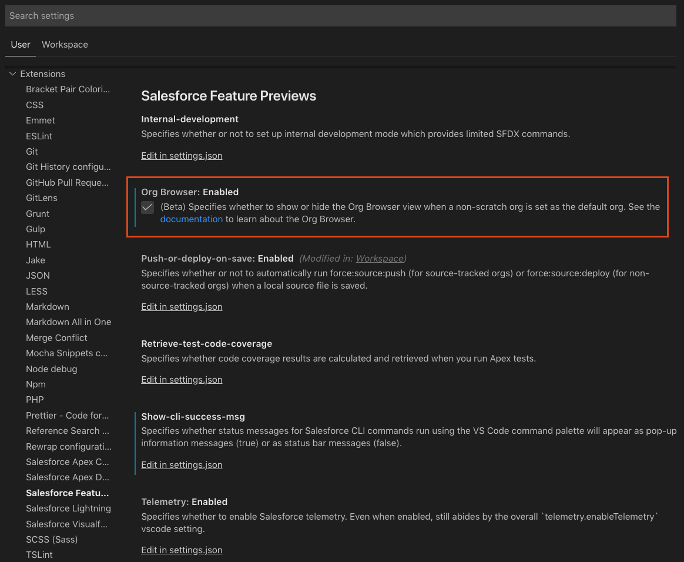
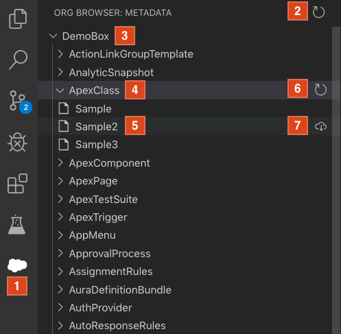
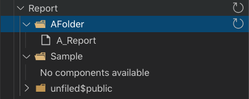

The Org Browser feature allows you to view the available metadata types and their corresponding components in the default org. It is another option for retrieving metadata source without having to use a [manifest file](./org-development-model#the-manifest-packagexml-file). The Org Browser is only available when working against non-scratch orgs, such as a production, sandbox, or devhub org.

> NOTICE: The Org Browser is currently in beta. If you find any bugs or have feedback, [open a GitHub issue](../bugs-and-feedback).

## Enable the org browser

Because the Org Browser is in beta, you will first need to enable it in your user or workspace settings. The setting is located under the "Salesforce Feature Previews" category. Alternatively, enter "Org Browser" in the search bar to find it. 

## Overview

1. Button to open the Org Browser.
2. Button to reload the available metadata types in the org.
3. Default org you are viewing the metadata for.
4. Metadata type
5. Metadata component whose type is the parent tree item.
6. Button for refreshing the available components for the metadata type.
7. Button for retrieving the source for the metadata component.

Open the Org Browser by clicking on the cloud icon in the VS Code sidebar. If you don't see the icon, make sure your [default org](./default-org) is set to a non-scratch org and that you have enabled the setting as described above.

## Listing Metadata

When you open the view you will see the metadata types available in the org. Expanding a type **(4)** will fetch a list of the components of that type. This information is saved in your local project under the .sfdx directory to minimize the number of calls to the org. If you need an updated list of components for a type, click the refresh button next to the type **(6)**.

Metadata types with folders (Reports, Dashboards, Documents, and EmailTemplates) will first fetch the available folders when they are expanded. Expanding a folder will then show you the components under that folder. Clicking the refresh button next to one of these folder metadata types will refresh the folders, not the components. You can refresh the components for a particular folder by clicking the button next to the folder instead. 

## Retrieving Components

A component can be retrieved to your local project by clicking the retrieve button **(7)** next to the component name. Currently, the component is retrieved into your default package directory, which is defined in the [sfdx-project.json](../getting-started/first-project#the-sfdx-projectjson-file) file. If you have an existing version of that component locally, you will be prompted to confirm if you want to overwrite the local version.