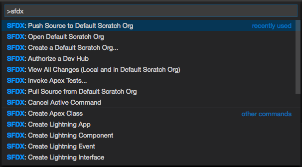
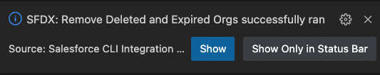
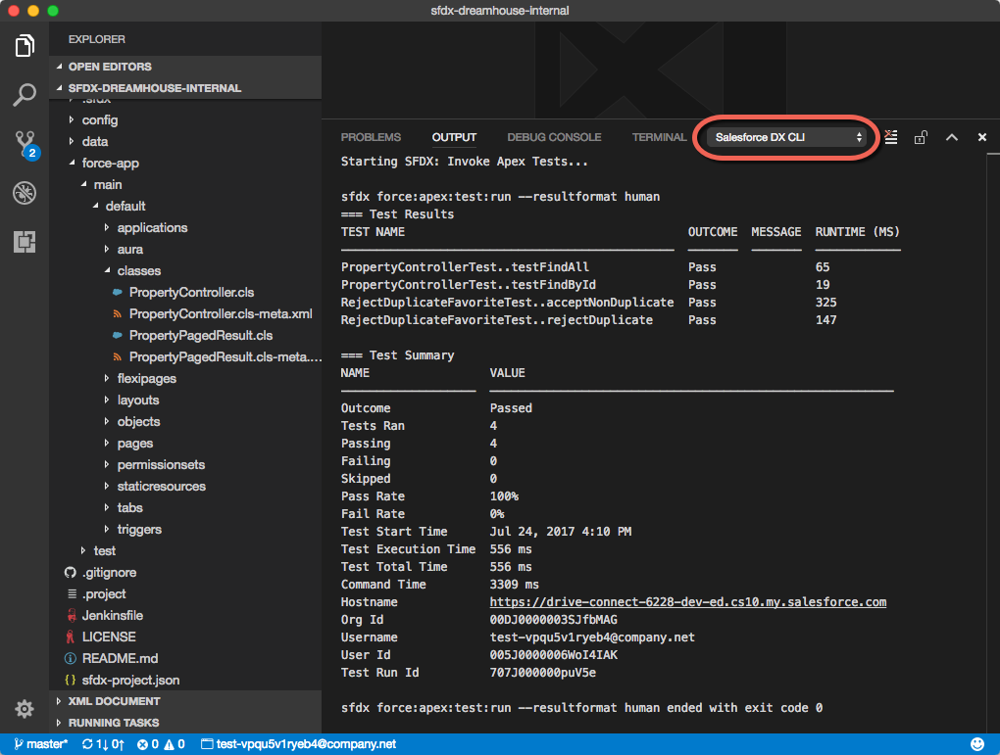

To run a command from Salesforce Extensions for VS Code, press Ctrl+Shift+P (Windows or Linux) or Cmd+Shift+P (macOS) and type **SFDX** in the command palette.  

When a command finishes running (due to success, failure, or cancellation), a notification displays at the top of the window.  

To see the output of the commands that you run, select **View** > **Output**, and then select **Salesforce CLI** from the dropdown menu. Alternatively, click **Show** in the completion notification.  

## Available Commands

Read on to learn about the commands available in Salesforce Extension for VS Code, their usage, the CLI command it executes under the hood, and further reference sources.

### Create Project

- **SFDX: Create Project**
  - Creates a Salesforce project in the current directory. This command creates the standard structure and a configuration file, which indicates that the directory is a Salesforce DX project.
  - Executes the CLI command `force:project:create --template standard`
  - See [Project Setup](https://developer.salesforce.com/docs/atlas.en-us.sfdx_dev.meta/sfdx_dev/sfdx_dev_workspace_setup.htm).
- **SFDX: Create Project with Manifest**
  - Creates a Salesforce project in the current directory, and generates a default manifest (package.xml) for fetching the components, such as Apex, Visualforce, and Lightning web components.
  - Executes the CLI command `force:project:create --template standard --manifest`
  - See [Sample `package.xml` Manifest Files](https://developer.salesforce.com/docs/atlas.en-us.api_meta.meta/api_meta/manifest_samples.htm).

### Authorize Org

- **SFDX: Authorize an Org**
  - Authorizes an org using the specified login URL and name, and sets the authenticated org as the default username.
  - Executes the CLI command `force:auth:web:login --setalias --instanceurl --setdefaultusername`. If you are in remote development environment, executes `force:auth:device:login`
  - See [Authorization](https://developer.salesforce.com/docs/atlas.en-us.sfdx_dev.meta/sfdx_dev/sfdx_dev_auth.htm).
- **SFDX: Authorize a Dev Hub**
  - Authorizes an org and sets the authenticated org as the default Dev Hub for scratch org creation.
  - Executes the CLI command `force:auth:web:login --setdefaultdevhubusername`. If you are in remote development environment, executes `force:auth:device:login --setdefaultdevhubusername`
  - See [Authorize an Org](https://developer.salesforce.com/docs/atlas.en-us.sfdx_dev.meta/sfdx_dev/sfdx_dev_auth_web_flow.htm).
- **SFDX: Create a Default Scratch Org**
  - Creates a scratch org and sets the created org as the default username.
  - Executes the CLI command `force:org:create --setdefaultusername`
  - See [Salesforce DX Usernames and Orgs](https://developer.salesforce.com/docs/atlas.en-us.sfdx_dev.meta/sfdx_dev/sfdx_dev_cli_usernames_orgs.htm).
- **SFDX: Open Default Org**
  - Opens the default org in a browser.
  - Executes the CLI command `force:org:open`
  - Read related info at [Create Scratch Orgs](https://developer.salesforce.com/docs/atlas.en-us.sfdx_dev.meta/sfdx_dev/sfdx_dev_scratch_orgs_create.htm).
- **SFDX: Delete from Project and Org**
  - Deletes source from the local project and from the non-source-tracked org.
  - Executes the CLI command `force:source:delete`
  - See [Delete Non-Tracked Source](https://developer.salesforce.com/docs/atlas.en-us.sfdx_dev.meta/sfdx_dev/sfdx_dev_develop_any_org.htm).
- **SFDX: Log Out from All Authorized Orgs**
  - Logs out of all your authorized Salesforce orgs without prompting for confirmation.
  - Executes the CLI command `force:auth:logout --all --noprompt`
  - See [Log Out of an Org](https://developer.salesforce.com/docs/atlas.en-us.sfdx_dev.meta/sfdx_dev/sfdx_dev_auth_logout.htm).

### Sync Org and Local Project

- **SFDX: Retrieve Source from Org**
  - Retrieves source for the selected file or directory from the default org. Use this command to retrieve source from orgs that don’t have source tracking, such as a sandbox or a production org. The source you retrieve overwrites the corresponding local source file.
  - Executes the CLI command `force:source:retrieve`
  - See [Develop Against Any Org](https://developer.salesforce.com/docs/atlas.en-us.sfdx_dev.meta/sfdx_dev/sfdx_dev_develop_any_org.htm).
- **SFDX: Retrieve This Source from Org**
  - Retrieves source for a file that’s open in the VS Code editor from an org.
  - Executes the CLI command `force:source:retrieve --sourcepath`
- **SFDX: Retrieve Source in Manifest from Org**
  - Retrieves metadata components listed in a manifest from an org to the local project.
  - Executes the CLI command `force:source:retrieve --manifest`
- **SFDX: Deploy Source to Org**
  - Deploys metadata in source format for the selected file or directory to an org. Use this command to deploy source to orgs that don’t have source tracking. The source you deploy overwrites the metadata in your org with the local versions.
  - Executes the CLI command `force:source:deploy`
- **SFDX: Deploy This Source to Org**
  - Deploys source for a file that’s open in the VS Code editor to an org.
  - Executes the CLI command `force:source:deploy --sourcepath`
- **SFDX: Deploy Source in Manifest to Org**
  - Deploys metadata components in a manifest to an org.
  - Executes the CLI command `force:source:deploy --manifest`
- **SFDX: Pull Source from Default Scratch Org**
  - Pulls changes from the scratch org to local project. If this command detects a conflict, it terminates the pull operation and displays the conflict information in the terminal. Use this command to pull source from orgs that have source tracking.
  - Executes the CLI command `force:source:pull`
  - See [Pull Source from the Scratch Org to Your Project](https://developer.salesforce.com/docs/atlas.en-us.sfdx_dev.meta/sfdx_dev/sfdx_dev_pull_md_from_scratch_org.htm).
- **SFDX: Pull Source from Default Scratch Org and Override Conflicts**
  - Pulls changes from the scratch org to local project. If conflicts exist, changes in the scratch org overwrite changes in the local project.
  - Executes the CLI command `force:source:pull --forceoverwrite`
- **SFDX: Push Source to Default Scratch Org**
  - Pushes the changes in the local project to the default org. If this command detects a conflict, it terminates the push operation and displays the conflict information in the terminal.
  - Executes the CLI command `force:source:push`
  - See [Push Source to the Scratch Org](https://developer.salesforce.com/docs/atlas.en-us.sfdx_dev.meta/sfdx_dev/sfdx_dev_push_md_to_scratch_org.htm).
- **SFDX: Push Source to Default Scratch Org and Override Conflicts**
  - Pushes the changes in the local project to the default org. If conflicts exist, changes in the local project overwrite changes in the scratch org.
  - Executes the CLI command `force:source:push --forceoverwrite`
- **SFDX: View All Changes (Local and in Default Scratch Org)**
  - Displays new, changed (indicates a conflict, if any), and deleted types in the default org (Remote) and your project (Local).
  - Executes the CLI command `force:source:status`
  - See [Track Changes](https://developer.salesforce.com/docs/atlas.en-us.sfdx_dev.meta/sfdx_dev/sfdx_dev_track_changes.htm).
- **SFDX: View Local Changes**
  - Displays the changes made in the local project, which can be useful to view before you push local changes to the scratch org.
  - Executes the CLI command `force:source:status --local`
  - See related info at [Push Source](https://developer.salesforce.com/docs/atlas.en-us.sfdx_dev.meta/sfdx_dev/sfdx_dev_push_md_to_scratch_org.htm).
- **SFDX: View Changes in Default Scratch Org**
  - Displays the changes made in the scratch org, which can be useful to view before you pull the scratch org changes to the local project.
  - Executes the CLI command `force:source:status --remote`

### Org Info

- **SSFDX: Display Org Details for Default Org**
  - Displays org description for the default org. Details include access token, alias, client ID, connected status, and more.
  - Executes the CLI command `force:org:display`
  - See [Authorization Information for an Org](https://developer.salesforce.com/docs/atlas.en-us.sfdx_dev.meta/sfdx_dev/sfdx_dev_auth_view_info.htm).
- **SFDX: Display Org Details...**
  - Displays org description for the specified org.
  - Executes the CLI command `force:org:display --targetusername`
- **SFDX: List All Aliases**
  - Displays the alias and the corresponding usernames for the orgs that you’ve authorized and the active scratch orgs that you’ve created. You can use the username or the alias you set while connecting to an org.
  - Executes the CLI command `force:alias:list`
  - See [Salesforce DX Usernames and Orgs](https://developer.salesforce.com/docs/atlas.en-us.sfdx_dev.meta/sfdx_dev/sfdx_dev_cli_usernames_orgs.htm).
- **SFDX: List All Config Variables**
  - Lists the configuration variables you’ve set, which includes the local values for the current project and all global values.
  - Executes the CLI command `force:config:list`

### Apex

- **SFDX: Create Apex Class**
  - Creates an Apex class and the associated metadata file in the default directory `force-app/main/default/classes`.
  - Executes the CLI command `force:apex:class:create`
  - See [Create an Apex Class](https://developer.salesforce.com/docs/atlas.en-us.sfdx_dev.meta/sfdx_dev/sfdx_dev_develop_create_apex.htm).
- **SFDX: Execute Anonymous Apex with Currently Selected Text**
  - Executes the currently selected anonymous block of Apex code.
  - Runs the CLI command `force:apex:execute`
  - See [Anonymous Blocks](https://developer.salesforce.com/docs/atlas.en-us.apexcode.meta/apexcode/apex_anonymous_block.htm).
- **SFDX: Execute Anonymous Apex with Editor Contents**
  - Executes the Apex code that’s open in the VS Code editor.
  - Runs the CLI command `force:apex:execute --apexcodefile`
- **SFDX: Get Apex Debug Logs...**
  - Fetches the most recent debug log from the default org.
  - Executes the CLI command `force:apex:log:get`
  - See [View Apex Debug Logs](https://developer.salesforce.com/docs/atlas.en-us.sfdx_dev.meta/sfdx_dev/sfdx_dev_develop_view_apex_debug_logs.htm).
- **SFDX: Invoke Apex Tests...**
  - Runs the Apex tests to test changes in your source code and displays the results in human-readable format.
  - Executes the CLI command `force:apex:test:run --resultformat human`
  - See [Testing](https://developer.salesforce.com/docs/atlas.en-us.sfdx_dev.meta/sfdx_dev/sfdx_dev_testing.htm).
- **SFDX: Create Apex Trigger**
  - Creates an Apex trigger and the associated metadata file in the default directory `force-app/main/default/triggers`.
  - Executes the CLI command `force:apex:trigger:create`
  - See [Create an Apex Trigger](https://developer.salesforce.com/docs/atlas.en-us.sfdx_dev.meta/sfdx_dev/sfdx_dev_develop_create_trigger.htm).
- **SFDX: Turn On Apex Debug Log for Replay Debugger**
  - Enables logging so that replay the debug log you retrieve from the default org.
  - Executes the CLI command `force:data:record:create --sobjecttype --values --usetoolingapi`
- **SFDX: Turn Off Apex Debug Log for Replay Debugger**
  - Disables the debugger session.
  - Executes the CLI command `force:data:record:delete --sobjecttype --sobjectid --usetoolingapi`
- **SFDX: Execute SOQL Query with Currently Selected Text**
  - Executes the selected query against the data in the default org.
  - Runs the CLI command `force:data:soql:query`
- **SFDX: Execute SOQL Query...**
  - Executes the query against the data in the default org.
  - Runs the CLI command `force:data:soql:query`
- **SFDX: Create and Set Up Project for ISV Debugging**
  - Creates the project setup in VS Code for the sandbox environment you want to debug.
  - Executes the CLI commands `force:config:set --isvDebuggerSid --isvDebuggerUrl --instanceUrl`, `force:mdapi:retrieve --retrievetargetdir --unpacked --targetusername`, `force:mdapi:convert --rootdir --outputdir force-app`, and `force:package:installed:list --targetusername`.

### Lightning Aura Components

- **SFDX: Create Lightning App**
  - Creates a Lightning app bundle with the specified name in the default directory `force-app/main/default/aura`.
  - Executes the CLI command `force:lightning:app:create`
  - See [Creating Apps](https://developer.salesforce.com/docs/atlas.en-us.lightning.meta/lightning/apps_intro.htm#!).
- **SFDX: Create Lightning Component**
  - Creates an Aura component with the specified name in the default directory `force-app/main/default/aura`.
  - Executes the CLI command `force:lightning:component:create`
  - Read more in [Lightning Aura Components Developer Guide](https://developer.salesforce.com/docs/atlas.en-us.lightning.meta/lightning/intro_framework.htm) and [Salesforce DX Developer Guide](https://developer.salesforce.com/docs/atlas.en-us.sfdx_dev.meta/sfdx_dev/sfdx_dev_develop_create_lightning.htm).
- **SFDX: Create Lightning Web Component**
  - Creates a Lightning web component with the specified name in the default directory `force-app/main/default/lwc`.
  - Executes the CLI command `force:lightning:component:create --type lwc`
  - See [Lightning Web Components Dev Guide](https://developer.salesforce.com/docs/component-library/documentation/lwc/lwc.create_components_introduction).
- **SFDX: Create Lightning Event**
  - Creates a Lightning event with the specified name in the default directory `force-app/main/default/aura`.
  - Executes the CLI command `force:lightning:event:create`
- **SFDX: Create Lightning Interface**
  - Creates a Lightning interface with the specified name in the default directory `force-app/main/default/aura`.
  - Executes the CLI command `force:lightning:interface:create`

### Visualforce

- **SFDX: Create Visualforce Page**
  - Creates a Visualforce page and the associated metadata file in the default directory `force-app/main/default/pages`.
  - Executes the CLI command `force:visualforce:page:create`
- **SFDX: Create Visualforce Component**
  - Creates a Visualforce component and the associated metadata file in the default directory `force-app/main/default/components`.
  - Executes the CLI command `force:visualforce:component:create`
