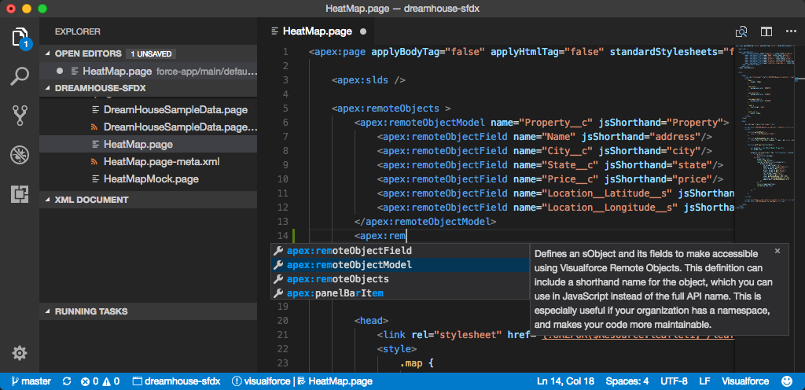
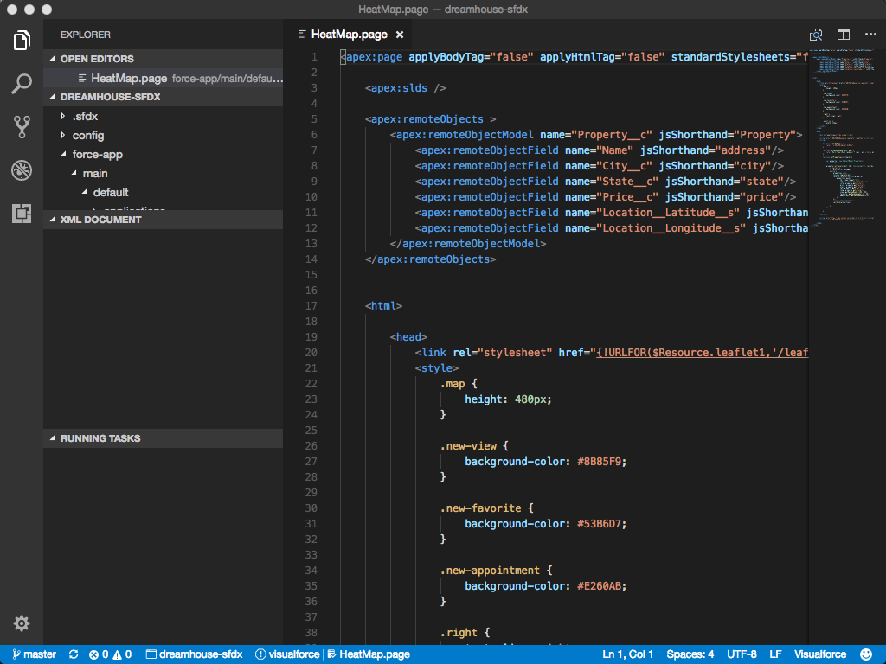
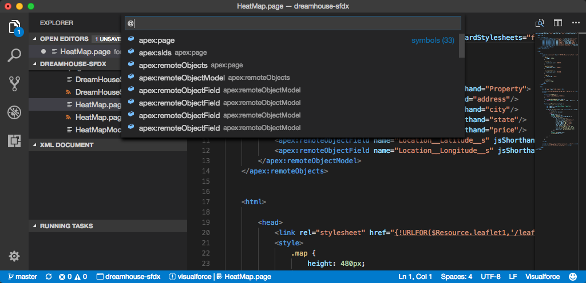

Features Provided by the Visualforce Extension

- Code completion (invoke using Ctrl+Space)

  - Standard Visualforce components (tags and attributes), with Salesforce documentation
  - HTML tags
  - CSS
  - JavaScript
    

- Syntax highlighting in some sections of various files (`.page`, `.component`, `.app`, and so on)

  - HTML portions
  - Embedded CSS and JavaScript portions
    

- Outline view (invoke using Ctrl+Shift+O on Windows or Linux, or Cmd+Shift+O on macOS)
  
