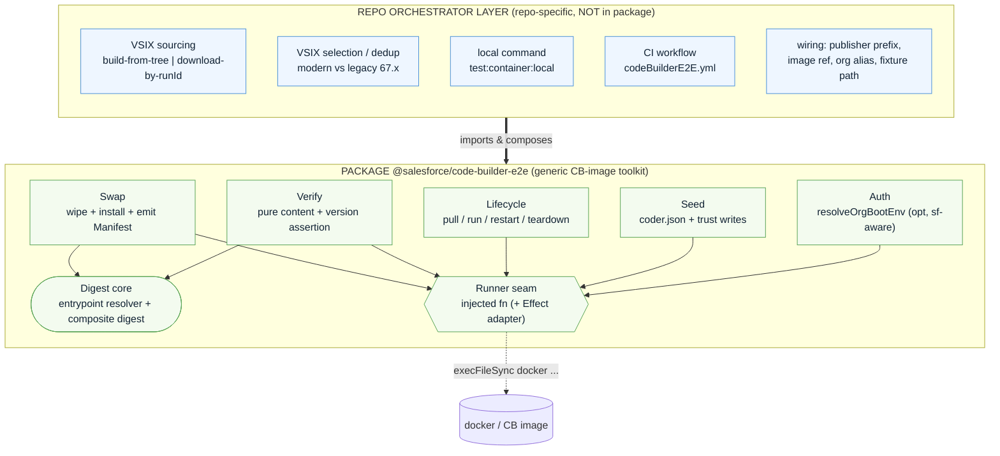
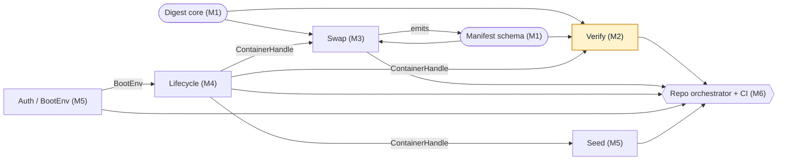
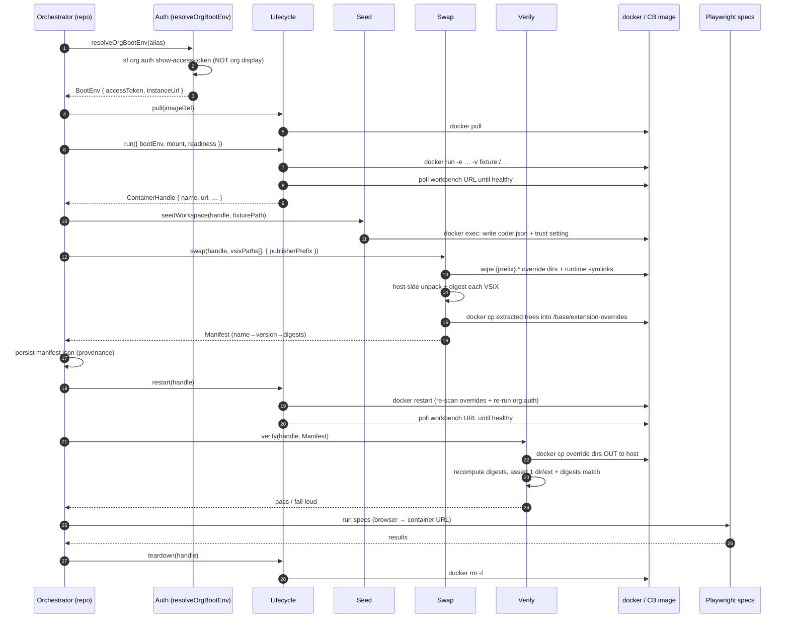
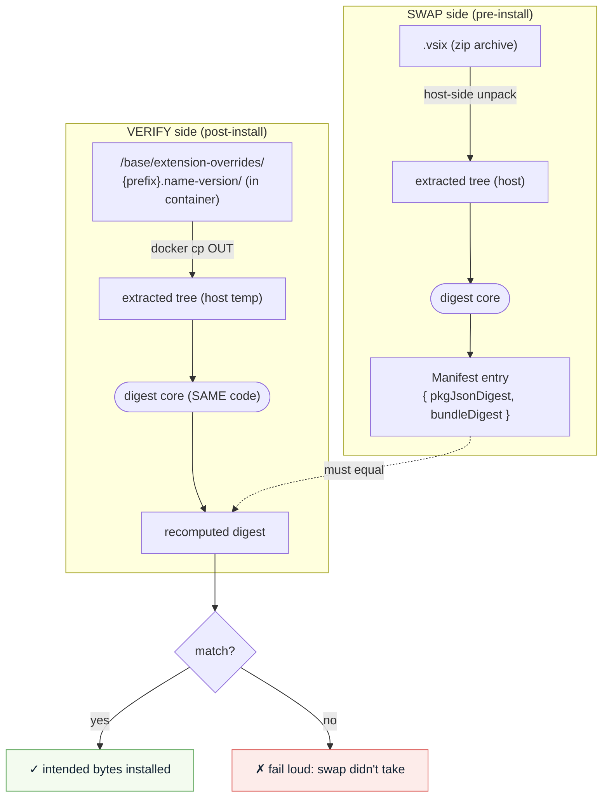
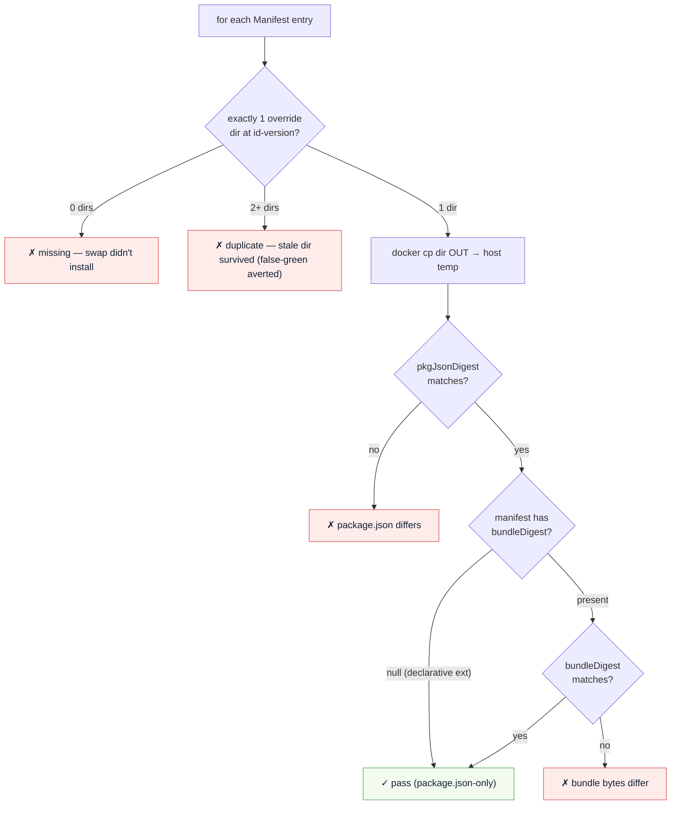
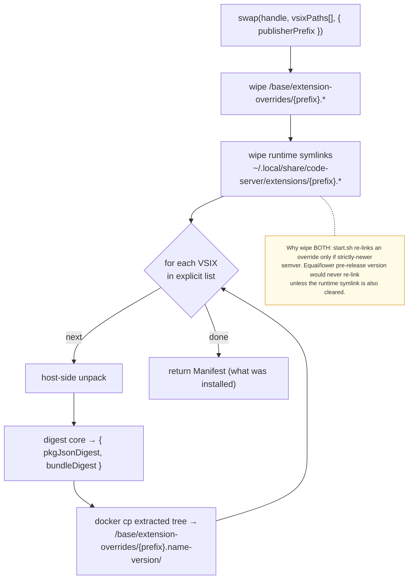
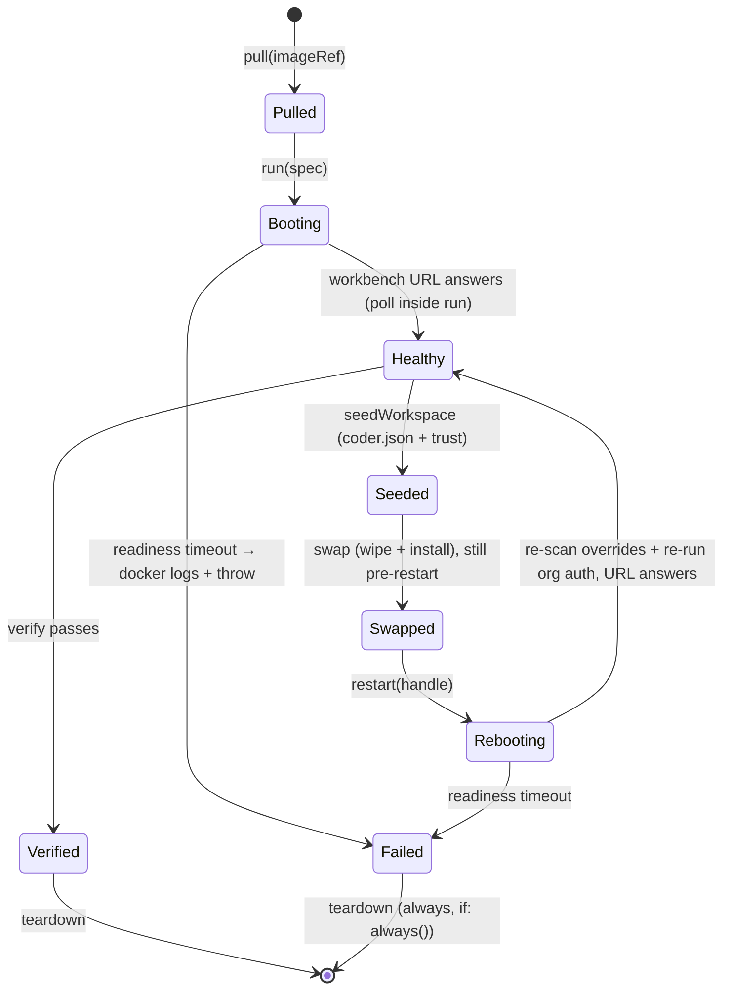
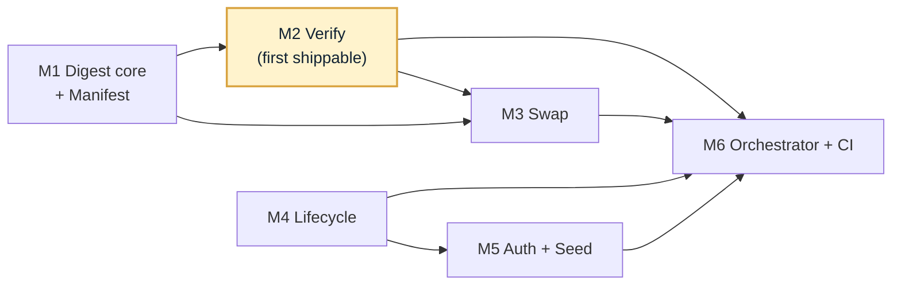
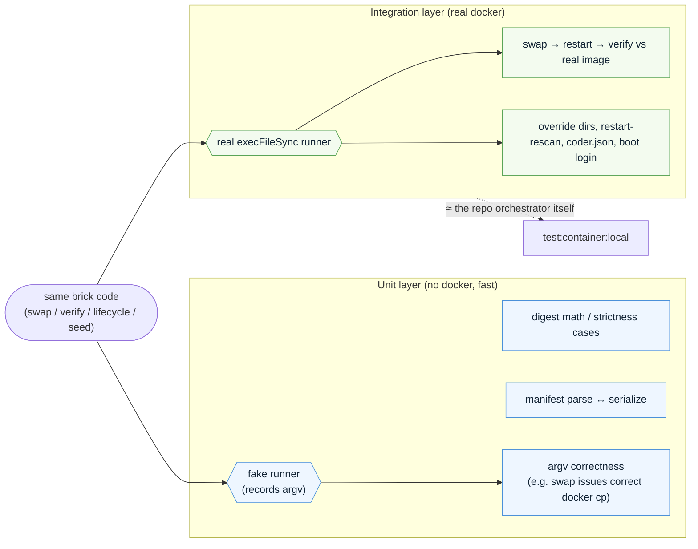

# Plan: A reusable Code Builder e2e toolkit

**Status:** Draft for review
**Author:** planning session (grill-me)
**Related:** PR [#7718](https://github.com/forcedotcom/salesforcedx-vscode/pull/7718) (W-23385030) · ADR [0022](../adr/0022-code-builder-e2e-desktop-build-over-browser.md)
**Working package name:** `@salesforce/code-builder-e2e`

---

## 1. Context & Motivation

Code Builder (Agentforce Vibes) serves a Salesforce-customized **code-server** with a
**Node extension host** behind a browser UI. It runs the **desktop** extension build, and
its e2e suite runs the existing desktop Playwright specs driven by a browser client pointed
at the container URL (ADR 0022). PR #7718 proved this end-to-end: pull the published
`workspace-manager/codebuilder` image, swap the unreleased monorepo VSIXes into the running
container at runtime, restart to re-scan and re-auth, gate on installed versions, then run
the specs — with **zero changes to `code-builder-images`**.

#7718 works, but it is **scripts, not a toolkit**. The swap, verify, seed, and lifecycle
logic live as standalone `ts-node` scripts (`codeBuilderSwapExtensions.ts`,
`codeBuilderVerifyExtensions.ts`, `codeBuilderSeedWorkspace.ts`, `codeBuilderLocalE2E.ts`)
wired specifically to this repo's extension set. Two forces motivate turning that proven
work into a reusable package:

1. **Reusability.** Every capability that touches the Code Builder image — VSIX swap,
   container lifecycle, version/content gating, workspace seeding, org boot-env injection —
   is generic to *any Salesforce team* running e2e against the same image with their own
   VSIXes. Today none of it is importable; a second team would copy-paste and re-derive the
   hard-won lessons.

2. **A known correctness bug that the redesign must close.** ADR 0022 documents the
   **false-green** risk: the current gate compares **installed semver, not bytes**. When an
   unreleased build shares a version with the baked copy (pre-release builds are not
   version-bumped), a swap that silently no-ops still passes the gate (`67.4.0 == 67.4.0`
   against the leftover baked copy). The ADR names the fix — **unconditional wipe by
   publisher glob + a content check** — but #7718 has not adopted it, and the swap/verify
   scripts share no code, so a content check *cannot* reconcile across the two sides as they
   stand. Closing this is a structural change, and the package is where it lands.

This plan turns #7718's proven pipeline into a layered, incrementally-delivered package,
recycling what is sound and redesigning the two things that must change: **the swap wipe
must be unconditional-by-publisher-glob** and **swap + verify must share a digest core** so
a content check can prove *the bytes under test are the bytes intended*.

---

## 2. Goals, Non-Goals & Constraints

### Goals

- **G1 — Importable TS library.** Ship `@salesforce/code-builder-e2e` exposing the pipeline
  as importable functions. Consumers write their own thin orchestrator by composing them.
- **G2 — Close the false-green.** Verify proves the installed extension is the intended
  bytes (composite content digest), not merely the intended semver. Swap guarantees a clean
  slate so no stale dir can survive to be falsely green.
- **G3 — Reuse-first for other Salesforce teams.** Every brick is generic to the CB image
  and parameterized (publisher prefix, image ref, org, fixture) so another Salesforce team
  adopts it with a thin wiring layer, not a fork. Build the generic case first; repo
  specifics are a top layer.
- **G4 — Incremental delivery.** Each brick is independently useful and shippable before the
  full system exists. Shipping order is **verify → swap → lifecycle → auth/seed →
  orchestrator + CI**.
- **G5 — Recycle #7718.** Preserve the proven pipeline shape (pull → swap → restart →
  gate → run), the `execFileSync`-with-arg-arrays idiom, the `playwright-vscode-ext`
  fixtures, and the fixture-mount seeding approach. Flag and redesign only what must change.

### Non-Goals

- **NG1 — Not a generic any-container toolkit.** This is a **Code Builder /
  workspace-manager image toolkit**. It is allowed to hard-know CB internals
  (`/base/extension-overrides`, runtime symlink dir, restart-to-rescan, `coder.json`,
  `start.sh` boot semantics). "Other teams" means other *Salesforce* teams on the **same
  image**, not a different image family. The image layout is **not** an abstracted pluggable
  adapter.
- **NG2 — The package does not source VSIXes.** Building (from working tree) and downloading
  (by Build All runId) are deeply repo-specific (`vscode:package`, the legacy/modern dance,
  wireit). The package starts at "here are VSIX paths." Sourcing lives in the repo's thin
  orchestrator.
- **NG3 — The package does not select/dedup VSIXes.** Swap takes an **explicit list**. The
  modern-vs-legacy (67.x) dedup is the consumer's job.
- **NG4 — No forced Effect buy-in.** The core is consumable without Effect. This repo, being
  Effect-native, wraps it; adopters not on Effect can still use every brick (see §12).
- **NG5 — No second team shipping target yet.** This monorepo is the **first and only**
  consumer. "Other Salesforce teams" is an honored **design constraint**, not a delivery
  milestone.

### Constraints

- **C1 — Package owns the docker lifecycle.** `docker` is a package dependency; `pull`,
  `run`, `restart`, `teardown` are package verbs (§7). This is a deliberate choice over
  "operate on a container the consumer runs."
- **C2 — Desktop build only.** The digest keys off `main`; `browser` is ignored (ADR 0022).
- **C3 — Do not rely on contracts `code-builder-images` can move under us** without a loud
  failure. The version/content gate is the safety net; the fixture **mount** (not the
  `SFDX_COBU_*` first-boot path) is the seeding mechanism.
- **C4 — Rolling `:latest` by default.** A CB image change can shift the baseline; that is
  the honest "what's live now" signal (image tag is a parameter).

---

## 3. Architecture Overview

### 3.1 Two layers

```
┌─────────────────────────────────────────────────────────────────────┐
│  REPO ORCHESTRATOR LAYER  (thin, repo-specific — NOT in the package)  │
│                                                                       │
│  • VSIX sourcing:  build-from-working-tree  |  download-by-runId      │
│  • VSIX selection/dedup:  modern vs legacy (67.x)                     │
│  • local command:  test:container:local  (scripts/codeBuilderLocalE2E)│
│  • CI workflow:  codeBuilderE2E.yml  (workflow_call into e2e.yml)     │
│  • wiring: publisher prefix, image ref, org alias, fixture path       │
└───────────────────────────────┬───────────────────────────────────────┘
                                 │ imports & composes
┌───────────────────────────────▼───────────────────────────────────────┐
│  PACKAGE  @salesforce/code-builder-e2e  (generic CB-image toolkit)      │
│                                                                         │
│   Lifecycle ── run/pull/restart/teardown ──► ContainerHandle (typed)    │
│   Auth      ── resolveOrgBootEnv(alias) (opt, sf-aware) ──► BootEnv      │
│   Swap      ── (handle, vsixPaths[], prefix) ──► Manifest  (mutates)     │
│   Seed      ── (handle, fixturePath) ──► void            (mutates)      │
│   Verify    ── (handle, Manifest) ──► assertion          (pure)         │
│         └────────────── Digest core (shared internal) ──────────────┘   │
│                                                                         │
│   Runner seam (plain injected fn; Effect adapter available) ── §12      │
└─────────────────────────────────────────────────────────────────────┘
```

The same split as a component view — note every arrow crosses the boundary **downward**
(the repo layer depends on the package, never the reverse), and everything docker-facing
funnels through the runner seam:



### 3.2 The two spine objects

Everything threads through two typed objects (both **Effect Schema** — §4, §12):

- **`ContainerHandle`** — returned by `run`, accepted by every other verb.
  `{ name, imageRef, publishedUrl, publishedPort, bootEnv }`. Downstream bricks never
  re-derive the URL or the boot env.
- **`Manifest`** — `name → version → { pkgJsonDigest, bundleDigest | null }`. **Emitted by
  swap, consumed by verify**, persisted to disk. It is both the swap→verify contract *and*
  the provenance artifact (the thing #7718 currently hand-rolls into log lines).

### 3.3 Brick dependency graph (delivery order)

```
  Digest core ──► Verify (brick #1, first shippable)
       │
       └────────► Swap (brick #2)  ──emits──► Manifest ──► Verify
                    │
  Lifecycle (brick #3) ──ContainerHandle──► Swap, Seed, Verify
       │
  Auth/BootEnv (brick #4) ──► Lifecycle.run
  Seed (brick #4) ──► (post-boot, on a handle)
       │
  Repo orchestrator (§7) composes all of the above
```

As a dependency graph (edge = "depends on / consumes"; the shaded node is the first
externally-shippable brick):



Verify ships first because it is independently useful (assert correctness after a *manual*
swap) **and** it is the brick carrying the known correctness risk — getting its contract
right de-risks everything downstream.

### 3.4 Runtime pipeline (end-to-end sequence)

How the composed system runs one e2e pass. The orchestrator (repo layer) drives; every
docker action goes through the package's runner seam. Note the **restart between swap and
verify** — that is the single lever that both re-scans the overrides *and* re-runs org auth
(§7.1), and verify only ever sees a fully-booted, swapped host.



---

## 4. The Manifest & Digest Contract

This is *the* correctness knob for the whole system, so it is specified before any brick.

### 4.1 The reconciliation problem

The digest must be computable **identically on both sides of the unpack transformation**,
and the two sides are **not the same bytes**:

- **Pre-install (swap side):** a `.vsix` is a **zip archive**.
- **Post-install (verify side):** the CB image consumes **extracted override *dirs*** at
  `/base/extension-overrides/{prefix}.<name>-<version>/` — loose files on disk, not the zip.

So `sha256(the .vsix)` is meaningless to verify. The digest is defined over content that
**survives unpacking**, and is computed on the **extracted tree** on both sides (swap
extracts host-side before install; verify copies the extracted dir back out — §5, §6).

The two sides must arrive at the *same* digest through different paths — this is the crux
that forces swap and verify to share one digest core (§4.4):



### 4.2 The composite digest (the contract)

Each extension's digest has **two parts**, both required:

1. **`pkgJsonDigest`** — `sha256` of the extension's `extension/package.json`. Cheap; present
   on both sides; changes when name/version/`main`/`packageUpdates`/etc. change. **Weakness on
   its own:** two builds with identical `package.json` but different bundle bytes collide.
2. **`bundleDigest`** — `sha256` of the actual shipped bundle entry file resolved from the
   `main` field. This is what really differs build-to-build and catches a bundle-only change
   that `pkgJsonDigest` misses.

Together: cheap gate + byte-level catch. Middle-ground for speed — we **do not** hash the
full recursive tree (unpack nondeterminism, files the image may add, brittleness); we hash
two well-defined files.

### 4.3 Strictness policy

The entrypoint resolver reads `extension/package.json` and resolves `main`:

| Case | Behavior |
|---|---|
| `main` present and resolves to a file | `bundleDigest = sha256(that file)` |
| `main` **absent** | **Valid** — `bundleDigest = null`, digest is package.json-only. A declarative-only extension (grammars/snippets/themes/`extensionPack`) legitimately has no bundle to catch. |
| `main` **present but unresolvable** | **Hard error.** A declared entrypoint that isn't there is a real broken build/swap — this is where "strict" earns its keep. |
| `browser` field | **Ignored.** CB runs the desktop/node build (ADR 0022). |

### 4.4 Shared entrypoint resolver + digest = one internal utility

**Departure from #7718:** swap and verify are currently separate scripts with no shared
code. Because the digest must match on both sides, they now **must** share:

- the **entrypoint resolver** (given an extension root — zip-extracted host dir or
  copied-out container dir — read `package.json`, resolve `main`, return path + bytes), and
- the **digest function** (produce `{ pkgJsonDigest, bundleDigest }` from an extracted root).

Factor both into **one internal digest-core module** both bricks depend on. Two copies would
be a correctness bug waiting to happen.

### 4.5 Schema & persistence

- **`Manifest` is an Effect Schema**, parsed/validated at every boundary and serialized to a
  `manifest.json`. Persisting it means CI can upload it and a human can diff *what we intended
  to test* — it subsumes #7718's hand-rolled provenance log block.
- Verify **holds no state and has no memory of the swap** — it takes the persisted (or
  in-memory) `Manifest` as its expected side and asserts. (Q4 decision: swap remembers what
  it installed *by emitting the manifest*; verify is a pure assertion over it.)

---

## 5. Brick #1 — Verify (first shippable)

**Contract:** pure assertion. **No mutation, no memory, no `sf`, no docker beyond `docker cp`.**

```
verify(handle: ContainerHandle, expected: Manifest): assertion
```

**What it does:**

1. For each entry in `expected`, `docker cp` the installed override dir
   (`/base/extension-overrides/{prefix}.<name>-<version>/`) **out** of the container to a
   host temp dir. *(Copy-out then hash on host — chosen for portability over speed; no
   dependency on in-container hashing tools; the slowness is acceptable.)*
2. Recompute `{ pkgJsonDigest, bundleDigest }` on the copied-out tree via the **shared digest
   core** (§4.4).
3. Assert, per extension: **exactly one** override dir at the expected id/version **and**
   both digests match the manifest. `bundleDigest: null` in the manifest ⇒ assert
   package.json-only (declarative extension).
4. Fail **loud** with a per-extension diff (expected vs actual digest, missing dir, duplicate
   dir) — a mismatch means *the swap didn't take*, not a test bug (surface this in the message,
   per the skill doc's existing framing).

The per-extension assertion, as a decision flow (all four gates must pass; any failure is
loud, never green):



**Standalone usefulness:** valuable even with nothing else built — hand-swap extensions,
hand-write a manifest (or reuse one swap emitted), and assert correctness. It is also the
foundation the CI gate step calls.

**Recycled from #7718:** the "exactly one dir per id at expected version" assertion and the
on-disk-`package.json` (activation-independent) approach.
**Redesigned:** adds the **content digest** (the false-green fix) and consumes a **typed
Manifest** rather than re-deriving expectations from the built-vsix dir.

---

## 6. Brick #2 — Swap

**Contract:** clean-slate install of an explicit VSIX list; emits the manifest.

```
swap(handle: ContainerHandle, vsixPaths: string[], opts: { publisherPrefix | prefixes }): Manifest
```

**What it does:**

1. **Unconditional wipe by publisher glob** (the ADR-recommended reliability fix). For each
   consumer-supplied prefix, delete **both**:
   - override dirs: `/base/extension-overrides/{prefix}.*`, and
   - **runtime symlinks**: `/home/codebuilder/.local/share/code-server/extensions/{prefix}.*`.

   > **Load-bearing (ADR 0022):** `start.sh` re-links an override into the runtime dir *only
   > when it is strictly-newer semver* than what's already linked. Clearing **both** locations
   > is what makes an equal-or-lower VSIX (the real pre-release-not-version-bumped case) load
   > at all. Wiping by **publisher glob** (not a hardcoded id list) ensures a baked extension
   > under an unlisted id cannot survive to be falsely green.

2. For each VSIX path (explicit list — **no directory scan, no dedup**; selection is the
   consumer's job per NG3): **unpack host-side**, compute its digest via the shared core,
   then `docker cp` the **extracted tree** into a fresh
   `/base/extension-overrides/{prefix}.<name>-<version>/`. *(Host-side unpack + cp the tree —
   the image consumes extracted dirs, not `.vsix` files; confirmed against #7718.)*
3. Return the **`Manifest`** of exactly what was installed (name→version→digests), for verify
   to assert against and for the orchestrator to persist.

**Note:** swap **mutates** but does **not** restart — applying the swap (re-scan + activation)
is `restart`'s job (§7). Sequence stays: `swap → restart → verify`.

Swap as a flow — the wipe clears **both** locations before any install, so nothing stale can
survive into verify:



**Recycled from #7718:** the unpack-into-`{prefix}.<name>-<version>/` layout, the runtime
symlink clearing, the `execFileSync` arg-array idiom.
**Redesigned:** wipe becomes **unconditional-by-publisher-glob** (was per-id `rm -rf`);
unpack moves **host-side**; swap now **emits the manifest** using the shared digest core.

---

## 7. Brick #3 — Lifecycle, and Brick #4 — Auth & Seed

### 7.1 Lifecycle (package owns docker)

```
pull(imageRef): void
run(spec): ContainerHandle          // spec: { imageRef, publishedPort, bootEnv, mounts, readiness }
restart(handle): ContainerHandle    // re-scan overrides + re-run boot auth (single lever)
teardown(handle): void
```

- **Typed `ContainerHandle`** (§3.2) — returned by `run`, accepted by every verb. Not a bare
  name string: the URL and boot env are facts downstream bricks must not re-derive.
- **Readiness folded into `run` and `restart`** — they return only once the workbench URL
  answers a health poll (params: timeout, interval, as options). You cannot obtain an
  unhealthy handle. Replaces #7718's two near-identical curl-poll loops.
- **`restart` is a single generic verb**, documented as "re-scans `/base/extension-overrides`
  (applies the swap) **and** re-runs `sfdx-org-auth.sh` (fresh org login)." These are
  physically one `docker restart`; splitting them would be a fiction the image doesn't
  support (ADR 0022 rejects reload-window for exactly this reason).
- **The fixture bind-mount is a `run` param** (mount happens at `docker run`), not a seed
  concern. Mount target `/home/codebuilder/fixture-project` (**not** the `SFDX_COBU_*` path —
  that collides with the first-boot generate, ADR 0022).

Container states — readiness is a self-transition inside `run`/`restart`, so a handle only
ever escapes into a `Healthy` state:



### 7.2 Auth / BootEnv (generic-but-Salesforce, opt-in `sf`)

**Two bricks, so the `sf` dependency is opt-in:**

- **Core (in `run`):** `bootEnv` is a **typed** input with the image's fixed known keys —
  `{ accessToken, instanceUrl }` — plus an `extraEnv: Record<string,string>` escape hatch.
  `run` stays **`sf`-free and unit-testable**; it just injects env the image needs at boot.
- **Optional helper:** `resolveOrgBootEnv(alias): BootEnv` — `sf`-aware, encapsulates the
  **hard-won redaction lesson**: read the token from `sf org auth show-access-token --json`,
  **not** `sf org display --json` (which redacts `accessToken` on recent CLI versions and
  boots the container with a bogus token → start-time login fails). The consumer *may* use
  this to produce the env, or supply their own. This is where the redaction fix (from the
  current PR #7846 work) becomes reusable so the next team doesn't re-hit it.

### 7.3 Seed (one brick, post-boot)

```
seedWorkspace(handle: ContainerHandle, opts: { fixturePath }): void
```

Owns **both** post-boot `docker exec` writes as one concern ("make the container open the
right workspace in the right mode before specs run"):

1. write `~/.local/share/code-server/coder.json` → `{"query":{"folder":"/home/codebuilder/fixture-project"}}`, and
2. write the **workspace-trust** setting (`security.workspace.trust.enabled = false`) so the
   Salesforce extensions activate (an untrusted workspace opens Restricted, commands never
   register). The setting is workspace-agnostic, so it covers the mount.

Runs **after** workbench-ready and **before** the swap restart, so the host boots opening the
fixture (ADR 0022). The **mount** is a `run` param (§7.1); seed does only the exec writes.

**Recycled from #7718:** `codeBuilderSeedWorkspace.ts` logic (coder.json + trust write),
the mount-over-first-boot-generate decoupling.
**Redesigned:** folded into one brick taking a `ContainerHandle`.

---

## 8. Incremental Delivery Plan

Each milestone is independently useful and independently testable (§12).

| # | Milestone | Independently delivers | Depends on |
|---|---|---|---|
| M1 | **Digest core + Manifest schema** | The digest math + the persisted, validated contract object. Testable with fixtures, no docker. | — |
| M2 | **Verify** | Assert correctness (semver **+ content**) after *any* swap, even a manual one. Closes the read side of the false-green. | M1 |
| M3 | **Swap** | Clean-slate install of an explicit list + manifest emission. Closes the write side (unconditional wipe). Composes with M2 into swap→verify. | M1 |
| M4 | **Lifecycle** | `pull/run/restart/teardown` + typed handle + folded readiness. Now the container can be stood up in-package. | — |
| M5 | **Auth + Seed** | `resolveOrgBootEnv` (redaction lesson) + `seedWorkspace`. Container boots authed and opens the fixture. | M4 |
| M6 | **Repo orchestrator + CI** | `test:container:local` + `codeBuilderE2E.yml` recomposed on the package; VSIX sourcing/dedup wired in. | M2–M5 |

M2 (verify) ships first per the Q3 decision. M1 is a prerequisite of M2, so it is the literal
first code, but verify is the first **externally meaningful** brick.

Milestone ordering and what unblocks what (M4 lifecycle runs in parallel with the
M1→M2→M3 content track; both converge at M6):



---

## 9. Repo Integration Layer (thin, repo-specific)

Lives in the repo, **not** the package (§2 NG2/NG3):

- **VSIX sourcing** — `buildVsixes()` (from working tree, default; `vscode:package` + the
  modern/legacy build) and `downloadVsixes(runId)` (Build All artifact via `gh`, for
  reproducing a CI failure against shipping bytes). Produces the explicit path list.
- **VSIX selection/dedup** — the modern-vs-legacy (67.x) filter that produces one VSIX per
  extension. This is the saga that motivated "swap takes an explicit list" — it stays out of
  the package.
- **Orchestrator** — `scripts/codeBuilderLocalE2E.ts` recomposed as a thin sequence of package
  calls: `resolveOrgBootEnv → pull → run(bootEnv, mount) → seedWorkspace → swap → restart →
  verify → run specs → teardown`. This *is* also the real-docker integration test (§12).
- **CI workflow** — `codeBuilderE2E.yml` recomposed on the package; stays `workflow_call` /
  `workflow_dispatch` until reliably green, then slots into `e2e.yml`'s fan-out (already
  threads the build runId). The redaction fix already landed here (PR #7846) migrates into
  `resolveOrgBootEnv`.
- **Wiring constants** — publisher prefix (`salesforce`), image ref, `MINIMAL_ORG_ALIAS`,
  fixture path.

---

## 10. Reusability Guide (second Salesforce team)

A second team on the same CB image adopts the package by writing **only** the §9 thin layer,
parameterized to them:

1. `npm i @salesforce/code-builder-e2e`.
2. Provide **their** VSIX paths (their build/download — the package never builds).
3. Call `swap(handle, theirVsixPaths, { publisherPrefix: 'theirPublisher' })`.
4. Call `resolveOrgBootEnv(theirAlias)` (or supply their own `{ accessToken, instanceUrl }`).
5. Point `seedWorkspace` at **their** fixture project.
6. Bring their own Playwright specs (reusing `playwright-vscode-ext` page objects, which take
   a plain `Page` — ADR 0022 keeps them Electron-decoupled).

Everything image-specific (override dir layout, runtime-symlink wipe, restart-rescan,
coder.json, boot-env keys, digest reconciliation) is **inside the package**. No fork.

---

## 11. Migration from #7718

| #7718 asset | Fate |
|---|---|
| `codeBuilderVerifyExtensions.ts` | → **package Verify brick** (+ content digest, typed Manifest). |
| `codeBuilderSwapExtensions.ts` | → **package Swap brick** (wipe → unconditional-by-glob; unpack → host-side; emits Manifest). |
| `codeBuilderSeedWorkspace.ts` | → **package Seed brick** (takes a handle). |
| `codeBuilderLocalE2E.ts` | → **repo orchestrator** (thin composition; also the integration test). |
| Two curl-poll readiness loops | → **folded into `run`/`restart`**. |
| Hand-rolled provenance log block | → **persisted `manifest.json`**. |
| `sf org auth show-access-token` fix (PR #7846) | → **`resolveOrgBootEnv`**. |
| Per-id `rm -rf` wipe | **Deleted** — replaced by unconditional publisher-glob wipe. |
| Separate swap/verify with no shared code | **Redesigned** — one shared digest core (required for content reconciliation). |
| `playwright-vscode-ext` container fixtures | **Kept unchanged** (plain `Page`, Electron-decoupled). |

---

## 12. Testing Strategy (docker seam)

**Layered (both), per Q12:**

- **Injectable command-runner seam.** Every container-facing brick takes an injected "run a
  command" function; default = real `execFileSync` (arg arrays, no shell interpolation —
  #7718 idiom). **Unit tests assert the exact argv** each brick builds (e.g. swap issues
  `docker cp <host-tree> <name>:/base/extension-overrides/…`) plus the pure logic (digest
  math, manifest parse/serialize, strictness cases) — fast, hermetic, no docker.
- **Real-docker integration suite.** A small suite exercises the true image contract
  (override dirs, restart-rescan, coder.json path, boot-env login) against the real image —
  essentially the repo orchestrator itself. Catches image-contract drift the fake seam can't.
- **Seam shape (Q12 follow-up):** the runner is a **plain injected function parameter**, with
  an **Effect service/layer adapter available**. This keeps "reusability as a core value"
  honest — a team **not** on Effect can still use every brick — while this Effect-native repo
  wraps it as a layer. `Manifest`/`ContainerHandle` are Effect Schema regardless (validation
  at boundaries), which does not force Effect on the *runner*.

The two test layers and what each covers (fast/hermetic on the left, high-fidelity on the
right; the same brick code runs under both, differing only in which runner is injected):



---

## 13. Risks & Open Questions

- **R1 — Digest brittleness.** `main`-file hashing assumes a stable, resolvable single entry.
  Multi-file bundles or a build that splits `main` would need the resolver extended. Mitigated
  by strict-on-unresolvable (fails loud, never false-green).
- **R2 — Image-contract drift.** Override-dir path, runtime-symlink location, `start.sh`
  relink rule, coder.json path are all CB-owned (ADR 0022, C3). The unconditional wipe removes
  the semver-precedence dependency, and verify fails loud on layout change — but a path move
  still breaks us. Integration suite (§12) is the early-warning.
- **R3 — Copy-out performance.** Verify copies every override dir out to hash on host. For a
  large extension set this is slower than in-container hashing; accepted for portability (Q5).
  Revisit only if it dominates run time.
- **R4 — `docker cp` of extracted trees vs. permissions/ownership.** Confirm cp'd trees land
  with ownership the host re-scan accepts (the `chown codebuilder:codebuilder` concern seen in
  the trust-write step may extend to swapped dirs). Validate in M3 integration.
- **R5 — Package boundary creep.** Pressure to pull VSIX sourcing/dedup into the package
  (NG2/NG3) will recur. Hold the line: the explicit-list contract is what keeps the package
  generic.
- **OQ1 — Package location & publish.** Internal monorepo package vs. independently published
  to npm. First consumer is in-repo; publishing is only needed when a real second team arrives
  (NG5). Recommend **in-repo package now, publish-ready structure**, defer actual publish.
- **OQ2 — Manifest persistence path & format** — where the orchestrator writes `manifest.json`
  and whether CI uploads it as an artifact (recommended: yes, it's the provenance record).

---

## 14. Appendix

- **ADR 0022** — desktop-build-over-browser, runtime extension-swap, the false-green
  consequence, workspace-seeding-by-mount. This plan implements 0022's recommended-but-not-yet-
  adopted **unconditional-wipe-by-publisher-glob + content-check** direction.
- **Glossary:**
  - *Override dir* — `/base/extension-overrides/{prefix}.<name>-<version>/`, the extracted
    extension tree the image loads.
  - *Runtime symlink* — `/home/codebuilder/.local/share/code-server/extensions/{prefix}.*`,
    relinked by `start.sh` only on strictly-newer semver; cleared by the wipe.
  - *Handle* — typed `ContainerHandle` threading through every verb.
  - *Manifest* — typed name→version→digests contract; swap emits, verify consumes, persisted.
  - *Boot env* — `{ accessToken, instanceUrl, extraEnv }` the image consumes at start for org
    login.
  - *Digest core* — shared internal: entrypoint resolver + composite (`pkgJsonDigest` +
    `bundleDigest`).
