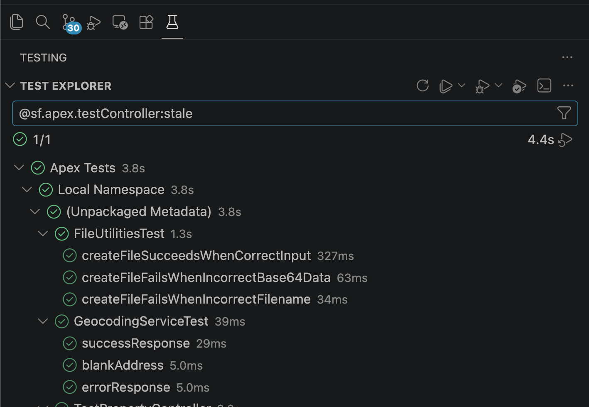

| 操作 | 動作 |
|------|------|
| **すべての結果をクリア** (テストエクスプローラー `...` メニュー) | ツリーから合格/不合格アイコンを削除します。結果ファイルはディスクに残り、次回の更新または再読み込みで復元されます。 |
| **SFDX: Apex テスト結果をクリア** (コマンドパレット) | 合格/不合格アイコンを削除し、**さらに** 保存された結果ファイルも削除します。更新や再読み込みで結果は復元されません。 |

