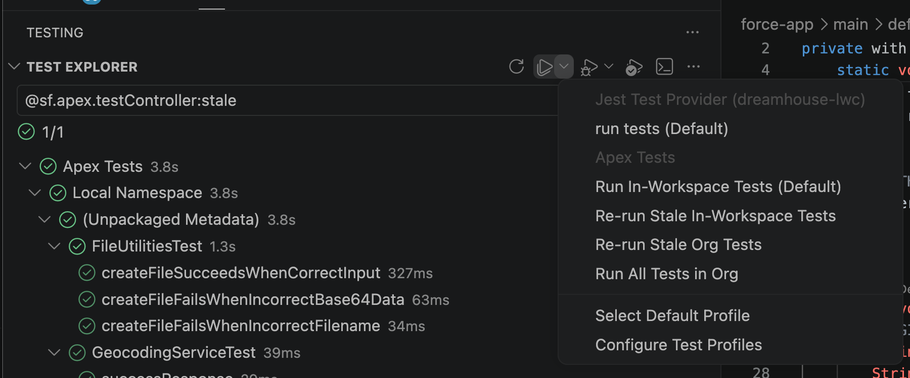

| イベント | テスト結果への影響 |
|--------|-----------------|
| **テストクラスをデプロイ** | そのクラスのすべてのメソッドが `@stale` としてマークされ薄暗く表示されます — 最後の実行以降にコードが変更されました。 |
| **テストを実行** | `@stale` タグが削除され、アイコンが通常の明るさに戻ります。 |
| **古いテストを再実行プロファイル** | まだ `@stale` タグが付いているメソッドのみを実行し、既に最新のテストをスキップします。 |

これはデプロイ時に自動的に行われます — 手動の更新は不要です。

