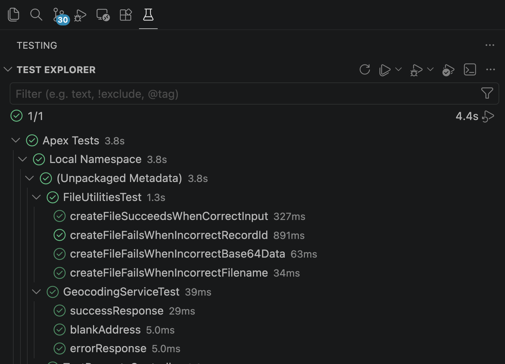

| 表示状態 | 意味 |
|---------|------|
| **明るい** 合格/不合格アイコン | このIDEセッションでテストが実行されました — 結果は最新です。 |
| **薄暗い** 合格/不合格アイコン | 前のセッションから復元された結果です — コードが変更されている可能性があります。 |
| `@stale` タグ | 古い結果のフィルター可能なマーカー。フィルター欄で `@stale` を使用するか、**古いテストを再実行** プロファイルを使用します。 |

**更新** は組織からテストを再検出し、結果を復元します。このセッションで実行されたテストは明るいまま、古い結果は薄暗く表示されます。

