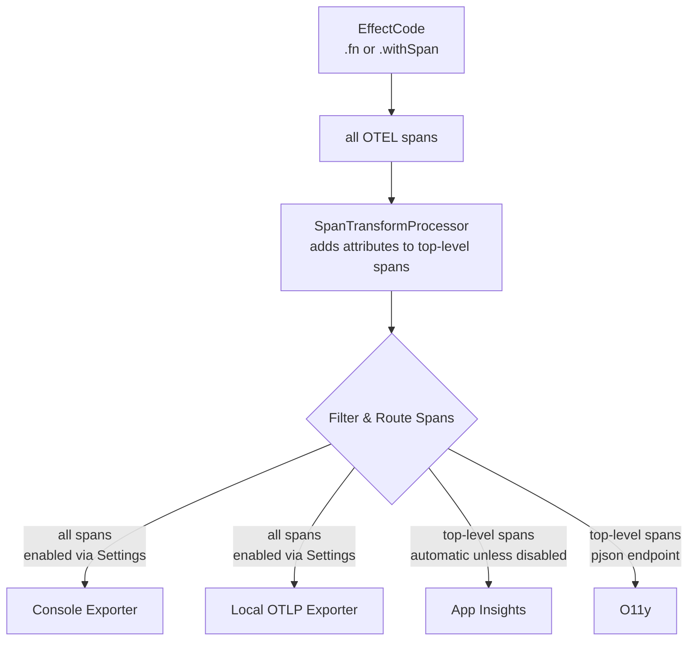

# Observability

This folder contains the observability infrastructure for Salesforce VS Code extensions using OpenTelemetry (OTEL) with Effect.

## Background & Links

- [OpenTelemetry](https://opentelemetry.io/) - Vendor-neutral observability framework
- [Effect OpenTelemetry](https://effect.website/docs/guides/observability/opentelemetry) - Effect's integration with OpenTelemetry

## Architecture Philosophy & Diagram

Our observability system follows a simple principle: **use only spans**. All observability data flows through OpenTelemetry spans, which are then filtered and routed to various destinations based on configuration.



### Key Points

- **All spans** can go to Console and Local OTLP (for trace/debugging/perf)
- **Top-level spans only** go to App Insights and O11y (to reduce noise) - see [Attributes](#automatic-attributes) for details on what attributes are automatically added
- App Insights is **automatic** (see [Automatic Configuration](#automatic-configuration) for details). It can be disabled via VSCode Settings.
- O11y requires configuration (see [O11y Configuration](#o11y-configuration))

## Usage with Code Examples

### Effect Span/Fn Options

#### Creating Spans

Use `Effect.withSpan()` to create a new span:

```typescript
import * as Effect from 'effect/Effect';

const deploy = (components: ComponentSet) =>
  Effect.gen(function* () {
    // ... your code ...
    return deployOutcome;
  }).pipe(Effect.withSpan('deploy', { attributes: { componentCount: components.size } }));
```

#### Automatic Spans with Effect.fn

`Effect.fn` automatically creates spans for functions, with the span name as part of the type. This is the preferred way to create functions that should be traced:

```typescript
const deleteComponentSet = Effect.fn('deleteComponentSet')(function* (options: { componentSet: NonEmptyComponentSet }) {
  // ... your code ...
  return result;
});

const clearDefaultOrgRef = Effect.fn('clearDefaultOrgRef')(function* () {
  yield* Ref.update(defaultOrgRef, current => {
    // ... your code ...
  });
});
```

The span name (`'deleteComponentSet'` or `'clearDefaultOrgRef'`) is part of the function's type signature, ensuring type safety and automatic span creation when the function is called. This eliminates the need to manually wrap functions with `Effect.withSpan()`.

#### Nested Spans

Spans can be nested by calling `Effect.withSpan()` within another span:

```typescript
const getTracking = () =>
  Effect.gen(function* () {
    const { SourceTracking } = yield* Effect.promise(() => import('@salesforce/source-tracking')).pipe(
      Effect.withSpan('import @salesforce/source-tracking')
    );

    return yield* Effect.tryPromise({
      try: () =>
        SourceTracking.create({
          /* ... */
        }),
      catch: error => new SourceTrackingError(error)
    }).pipe(Effect.withSpan('STL create'));
  }).pipe(Effect.withSpan('getTracking'));
```

### Attributes

#### Automatic Attributes

Top-level spans automatically receive additional attributes via `SpanTransformProcessor`:

- `extension.name` - Extension identifier
- `extension.version` - Extension version
- `orgId` - Salesforce org ID
- `devHubOrgId` - DevHub org ID
- `isSandbox` - Whether org is a sandbox
- `isScratch` - Whether org is a scratch org
- `tracksSource` - Whether source tracking is enabled
- `userId` - CLI user ID
- `webUserId` - Web user ID
- `telemetryTag` - Custom telemetry tag from settings
- VS Code environment attributes (machineId, sessionId, uiKind, version, platform info)

#### Manual Attributes

Add custom attributes using `Effect.annotateCurrentSpan()`:

```typescript
yield *
  Effect.annotateCurrentSpan({
    customAttribute: 'value',
    count: 42,
    enabled: true
  });
```

### Logging

When `enableConsoleTraces` is enabled, spans are exported to the console (browser console or Node.js console). This is useful for debugging and seeing what spans are being created.

### Putting an SDK in Your Layer

Each extension should set up its own SDK layer using `SdkLayerFor()`. Here's how to do it in your extension's service layer:

```typescript
import * as Layer from 'effect/Layer';
import * as Effect from 'effect/Effect';
import type { SalesforceVSCodeServicesApi } from 'salesforcedx-vscode-services';
import * as vscode from 'vscode';

export const AllServicesLayer = Layer.unwrapEffect(
  Effect.gen(function* () {
    const api = yield* extensionProvider.getServicesApi;
    const extension = vscode.extensions.getExtension(`salesforce.${EXTENSION_NAME}`);
    const extensionVersion = extension?.packageJSON?.version ?? 'unknown';
    const o11yEndpoint = process.env.O11Y_ENDPOINT ?? extension?.packageJSON?.o11yUploadEndpoint;

    return Layer.mergeAll(
      // ... other service layers ...
      api.services.SdkLayerFor({
        extensionName: EXTENSION_NAME,
        extensionVersion,
        o11yEndpoint
      })
      // ... other service layers ...
    );
  })
);
```

The SDK layer automatically handles:

- Platform detection (Node vs Web)
- Span processor configuration based on settings
- Top-level span filtering for App Insights and O11y (see [Architecture Philosophy](#architecture-philosophy--diagram))
- Attribute injection for top-level spans (see [Automatic Attributes](#automatic-attributes))

## Settings Configuration

### How to Enable VS Code Settings

To enable any VS Code setting:

- Open Settings (Cmd/Ctrl + ,)
- Search for the setting name
- Check the box for the setting
- Or add to your `settings.json`:

  ```json
  {
    "setting-name": true
  }
  ```

### Automatic Configuration

**App Insights**: Automatically enabled when telemetry is enabled (see [Telemetry Settings](#telemetry-settings)). No configuration needed. Top-level spans are automatically sent to Application Insights.

### O11y Configuration

**Option 1** (Recommended - works on both Node and Web): Set `o11yUploadEndpoint` in your extension's `package.json`:

```json
{
  "name": "your-extension",
  "version": "1.0.0",
  "o11yUploadEndpoint": "https://your-o11y-endpoint.com/upload"
}
```

**Option 2** (Node only): Set `O11Y_ENDPOINT` environment variable (takes precedence over package.json, but only works on Node platform, not Web)

> **Note**: The `O11Y_ENDPOINT` environment variable only works on Node, not Web. For Web compatibility, use Option 1.

### Debug Settings

#### `salesforcedx-vscode-salesforcedx.enableLocalTraces`

OTLP exporter to local endpoint (all spans).

**Setup**:

1. Start the local trace viewer using Docker:

   ```bash
   docker run -p 3000:3000 -p 4317:4317 -p 4318:4318 --rm -it docker.io/grafana/otel-lgtm
   ```

2. Enable the setting in VS Code (see [How to Enable VS Code Settings](#how-to-enable-vs-code-settings)):

   ```json
   {
     "salesforcedx-vscode-salesforcedx.enableLocalTraces": true
   }
   ```

This starts Grafana's OpenTelemetry LGTM stack on:

- Port 3000: Grafana UI (view traces at <http://localhost:3000>)
- Port 4317: OTLP gRPC endpoint
- Port 4318: OTLP HTTP endpoint

#### `salesforcedx-vscode-salesforcedx.enableConsoleTraces`

Console logging (all spans).

**Setup**: Enable the setting in VS Code (see [How to Enable VS Code Settings](#how-to-enable-vs-code-settings)):

```json
{
  "salesforcedx-vscode-salesforcedx.enableConsoleTraces": true
}
```

### Telemetry Settings

These settings must be enabled for App Insights and O11y to work:

- `telemetry.telemetryLevel` - VS Code telemetry level (must not be "off")
- `salesforcedx-vscode-core.telemetry.enabled` - Extension telemetry toggle (must be true for App Insights/O11y)

## Local Debugging

### O11y Debug Server

For debugging O11y events locally, use the debug server:

```bash
npm run o11y:debug
```

This starts a debug server on port 3002 that:

- Receives O11y events from extensions
- Decodes base64-encoded event data
- Displays events in a human-readable format
- Shows request headers and metadata

**To use it**:

1. Start the debug server: `npm run o11y:debug`

2. Configure your extension to send to localhost (see [O11y Configuration](#o11y-configuration) for general setup):
   - Set `o11yUploadEndpoint` in `package.json`:

     ```json
     {
       "o11yUploadEndpoint": "http://localhost:3002"
     }
     ```

   - Or set the `O11Y_ENDPOINT` environment variable (Node only):

     ```bash
     export O11Y_ENDPOINT=http://localhost:3002
     ```

3. Enable telemetry settings (see [Telemetry Settings](#telemetry-settings))

4. Run your extension - events will appear in the debug server console

The debug server shows:

- Request method and URL
- Request headers
- Decoded JSON events (extracted from base64-encoded data)
- Multiple events if batched together
