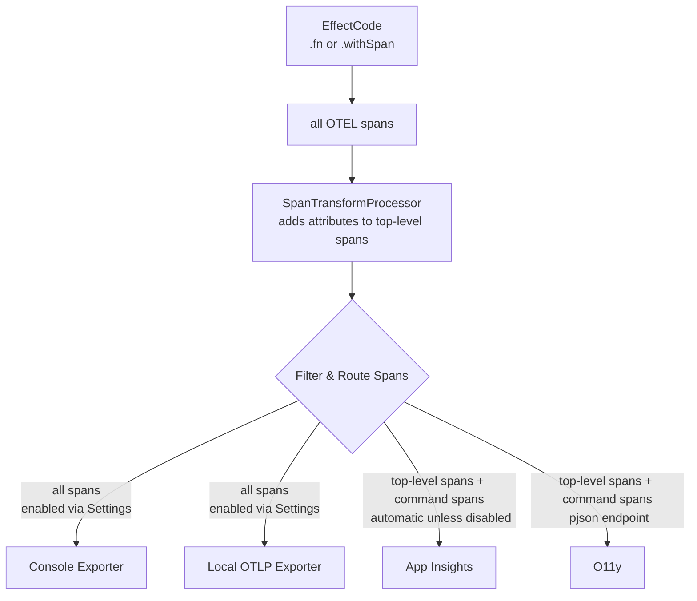

# Observability

This folder contains the observability infrastructure for Salesforce VS Code extensions using OpenTelemetry (OTEL) with Effect.

## Background & Links

- [OpenTelemetry](https://opentelemetry.io/) - Vendor-neutral observability framework
- [Effect OpenTelemetry](https://effect.website/docs/guides/observability/opentelemetry) - Effect's integration with OpenTelemetry

## Architecture Philosophy & Diagram

Our observability system follows a simple principle: **use only spans**. All observability data flows through OpenTelemetry spans, which are then filtered and routed to various destinations based on configuration.


```mermaid
flowchart TD
    A["EffectCode<br/>.fn or .withSpan"] --> B[all OTEL spans]
    B --> C["SpanTransformProcessor<br/>adds attributes to top-level spans"]
    C --> D{Filter & Route Spans}
    D -->|all spans<br/>enabled via Settings| E[Console Exporter]
    D -->|all spans<br/>enabled via Settings| F[Local OTLP Exporter]
    D -->|top-level spans + command spans<br/> automatic unless disabled| G[App Insights]
    D -->|top-level spans + command spans<br/> pjson endpoint| H[O11y]
```

### Key Points

- **All spans** can go to Console and Local OTLP (for trace/debugging/perf)
- **Top-level spans and command spans** go to App Insights and O11y (to reduce noise), except spans with `telemetryIgnore: true` - see [Attributes](#automatic-attributes) for details on what attributes are automatically added
- **Web App Insights** uses `ApplicationInsightsWebExporter` to stream each valid top-level span as a custom event while still honoring `telemetryIgnore`
- App Insights is **automatic** (see [Automatic Configuration](#automatic-configuration) for details). It can be disabled via VSCode Settings.
- O11y requires configuration (see [O11y Configuration](#o11y-configuration))

### App Insights Export Pipeline

Both `ApplicationInsightsWebExporter.export` and `ApplicationInsightsNodeExporter.export` build a single Effect pipeline so stream operations, span exporting, and success/failure handlers run together before the SpanExporter callback returns. For each batch of spans the exporter:

1. Pipes `Stream.fromIterable(spans)` through `Stream.filter(isSpanValidForProductionTelemetry)` so only the spans that belong in production telemetry are kept.
2. Runs each filtered span through `Stream.mapEffect(exportSpan)`, pushing every span into `exportSpan` which ultimately calls `getAppInsightsReporter().sendDangerousTelemetryEvent` or `sendDangerousTelemetryErrorEvent`.
3. Executes the stream with `Stream.runDrain`, then maps the succeeding effect to `resultCallback({ code: ExportResultCode.SUCCESS })`, keeping the callback inside the same pipeline as the stream.
4. Wraps the entire pipeline in `Effect.catchAll`, which logs the failure, reports the error to console, and calls `resultCallback({ code: ExportResultCode.FAILED, error: unknownToErrorCause(error).cause })`.
5. Observes the entire pipeline via `Effect.logDebug` statements at key points (batch start, per-span send, batch completion, errors).

Keeping the stream, exporter callback, and logging/failure telemetry in the same pipeline satisfies the SpanExporter contract while still letting the existing `exportSpan` helper handle per-span telemetry.

### Azure Application Insights Table Routing

Effect spans are routed to different Azure Application Insights tables depending on platform and configuration:

**Default Behavior (Backward Compatible):**

- **Web platform**: Uses `ApplicationInsightsWebExporter` with `TelemetryReporter.sendDangerousTelemetryEvent()` → routes to **customEvents** table
- **Node platform**: Uses `FilteredAzureMonitorTraceExporter` (standard Azure Monitor OTEL exporter) → routes to **dependencies** table

**Optional: Enable CustomEvents for Node**

Node platform can route to **customEvents** table (matching Web) by enabling the `enableCustomEventsFromSpans` flag:

```typescript
const config = api.services.getSdkLayerConfigFromContext(context);
config.enableCustomEventsFromSpans = true;  // Routes Node spans to customEvents

const services = AllServicesLayer.pipe(
  Layer.provide(api.services.SdkLayerFor(config))
);
```

The connection string is resolved from your extension's `package.json` (via `getSdkLayerConfigFromContext`) with precedence:
1. `otelConnectionString` — dedicated OTEL field, full format, used as-is
2. `aiKey` — legacy field; normalized from bare UUID to InstrumentationKey= format if needed
3. Undefined — falls back to `DEFAULT_AI_CONNECTION_STRING`

**Formats accepted:**
- **Full format**: `"InstrumentationKey=ec3632a4-...-...;IngestionEndpoint=...;..."`
- **Bare UUID**: `"ec3632a4-..."` (automatically normalized to full format)

**Example package.json**:

```json
{
  "otelConnectionString": "InstrumentationKey=your-key;IngestionEndpoint=https://..."
}
```

When enabled, Node uses `ApplicationInsightsNodeExporter` with the legacy `applicationinsights` SDK (v1.0.7) to route spans to customEvents.

**Why Legacy SDK for Node CustomEvents?**

TelemetryReporter (from `@vscode/extension-telemetry`) has **multiple fatal bugs on Node platform**:
1. **Constructor bug** (v1.5.1-v1.5.2): `TypeError: basicAISDK.ApplicationInsights is not a constructor` - imports browser SDK on Node
2. **keepNames bug** ([GitHub issue #2694](https://github.com/microsoft/ApplicationInsights-JS/issues/2694)): `Cannot redefine property: name` with esbuild keepNames=true

Both bugs cause silent failures where events never reach Azure.

The legacy `applicationinsights` SDK (v1.0.7) works reliably and is proven in production across all Salesforce VSCode extensions via utils-vscode. It provides:
- ✅ Disk caching for offline retry (`setUseDiskRetryCaching`)
- ✅ Proper Node.js support
- ✅ Routes to customEvents via `client.trackEvent()`

**Schema Differences:**

- **customEvents** (Web & Node with flag): Flat structure with all span attributes in `customDimensions`, measurements in `customMeasurements`
- **dependencies** (Node default): Standard OTEL span structure with `type`, `target`, `data`, and hierarchical attributes

**Trade-offs:**

When using `enableCustomEventsFromSpans=true` on Node:
- ✅ **Consistency**: Same table schema as Web platform
- ✅ **Disk caching**: Offline retry support (TelemetryReporter lacks this)
- ✅ **Reliable**: No TelemetryReporter bugs
- ⚠️ **Older SDK**: v1.0.7 from 2017 (but stable and maintained)

When using default (dependencies table):
- ✅ **Standard OTEL**: Native OpenTelemetry export format
- ✅ **Structured data**: Hierarchical span attributes
- ✅ **No extra deps**: Uses existing Azure Monitor exporter

## Usage with Code Examples

### Effect Span/Fn Options

#### Creating Spans

Use `Effect.withSpan()` to create a new span:

```typescript
import * as Effect from 'effect/Effect';

const deploy = (components: ComponentSet) =>
  Effect.gen(function* () {
    // ... your code ...
    return deployOutcome;
  }).pipe(Effect.withSpan('deploy', { attributes: { componentCount: components.size } }));
```

#### Automatic Spans with Effect.fn

`Effect.fn` automatically creates spans for functions, with the span name as part of the type. This is the preferred way to create functions that should be traced:

```typescript
const deleteComponentSet = Effect.fn('deleteComponentSet')(function* (options: { componentSet: NonEmptyComponentSet }) {
  // ... your code ...
  return result;
});

const clearDefaultOrgRef = Effect.fn('clearDefaultOrgRef')(function* () {
  yield* Ref.update(defaultOrgRef, current => {
    // ... your code ...
  });
});
```

The span name (`'deleteComponentSet'` or `'clearDefaultOrgRef'`) is part of the function's type signature, ensuring type safety and automatic span creation when the function is called. This eliminates the need to manually wrap functions with `Effect.withSpan()`.

#### Nested Spans

Spans can be nested by calling `Effect.withSpan()` within another span:

```typescript
const getTracking = () =>
  Effect.gen(function* () {
    const { SourceTracking } = yield* Effect.promise(() => import('@salesforce/source-tracking')).pipe(
      Effect.withSpan('import @salesforce/source-tracking')
    );

    return yield* Effect.tryPromise({
      try: () =>
        SourceTracking.create({
          /* ... */
        }),
      catch: error => new SourceTrackingError(error)
    }).pipe(Effect.withSpan('STL create'));
  }).pipe(Effect.withSpan('getTracking'));
```

### Attributes

#### Automatic Attributes

Top-level spans automatically receive additional attributes via `SpanTransformProcessor`:

- `extension.name` - Extension identifier
- `extension.version` - Extension version
- `orgId` - Salesforce org ID
- `devHubOrgId` - DevHub org ID
- `isSandbox` - Whether org is a sandbox
- `isScratch` - Whether org is a scratch org
- `tracksSource` - Whether source tracking is enabled
- `userId` - CLI user ID
- `webUserId` - Web user ID
- `telemetryTag` - Custom telemetry tag from settings
- VS Code environment attributes (machineId, sessionId, uiKind, version, platform info)

#### Manual Attributes

Two helpers, different targets:

- **`Effect.annotateCurrentSpan()`** — writes to the current fiber's span. Visible in console / file / local-OTLP traces. **Not visible in App Insights or O11y unless the current span is itself top-level or a command span**, because [the export filter](spanUtils.ts) only ships top-level + command spans.
- **`annotateRootSpan()` from `@salesforce/effect-ext-utils`** — walks up `Span.parent` to the trace root and annotates there. Reaches App Insights and O11y from anywhere in the call tree.

Rule of thumb: if the consumer is local debugging, use `Effect.annotateCurrentSpan`. If the consumer is production telemetry (org IDs, feature flags, user-meaningful identifiers), use `annotateRootSpan`.

```typescript
import { annotateRootSpan } from '@salesforce/effect-ext-utils';

// On the current span — useful for local-only debug context
yield *
  Effect.annotateCurrentSpan({
    customAttribute: 'value',
    count: 42,
    enabled: true
  });

// On the trace root — reaches App Insights and O11y
yield * annotateRootSpan({ orgId, featureFlag: 'enabled' });
```

#### Excluding a Span from Production Telemetry

Use `telemetryIgnore: true` to skip a span in production exporters (App Insights Node/Web and O11y) while still keeping it in local debug exporters (Console, File, Local OTLP).

```typescript
yield * Effect.annotateCurrentSpan({ telemetryIgnore: true });
```

### Logging

When `enableConsoleTraces` is enabled, spans are exported to the console (browser console or Node.js console). This is useful for debugging and seeing what spans are being created.

### Putting an SDK in Your Layer

Each extension should set up its own SDK layer using `SdkLayerFor()`. Here's how to do it in your extension's service layer:

```typescript
import * as Layer from 'effect/Layer';
import * as Effect from 'effect/Effect';
import type { SalesforceVSCodeServicesApi } from 'salesforcedx-vscode-services';
import * as vscode from 'vscode';

export const AllServicesLayer = Layer.unwrapEffect(
  Effect.gen(function* () {
    const api = yield* extensionProvider.getServicesApi;
    const context = vscode.extensions.getExtension(`salesforce.${EXTENSION_NAME}`)?.extensionContext;
    const config = api.services.getSdkLayerConfigFromContext(context);  // connectionString auto-resolved (otelConnectionString → aiKey → DEFAULT_AI_CONNECTION_STRING)

    return Layer.mergeAll(
      // ... other service layers ...
      api.services.SdkLayerFor(config)
      // ... other service layers ...
    );
  })
);
```

The SDK layer automatically handles:

- Platform detection (Node vs Web)
- Span processor configuration based on settings
- Top-level and command span filtering for App Insights and O11y, plus `telemetryIgnore` exclusion (see [Architecture Philosophy](#architecture-philosophy--diagram))
- Attribute injection for top-level spans (see [Automatic Attributes](#automatic-attributes))

## Settings Configuration

### How to Enable VS Code Settings

To enable any VS Code setting:

- Open Settings (Cmd/Ctrl + ,)
- Search for the setting name
- Check the box for the setting
- Or add to your `settings.json`:

  ```json
  {
    "setting-name": true
  }
  ```

### Automatic Configuration

**App Insights**: Automatically enabled when telemetry is enabled (see [Telemetry Settings](#telemetry-settings)). No configuration needed. Top-level spans and command spans are automatically sent to Application Insights (the custom exporter streams them as web custom events when running in the browser), except spans annotated with `telemetryIgnore: true`.

### O11y Configuration

**Option 1** (Recommended - works on both Node and Web): Set `o11yUploadEndpoint` in your extension's `package.json`:

```json
{
  "name": "your-extension",
  "version": "1.0.0",
  "o11yUploadEndpoint": "https://your-o11y-endpoint.com/upload"
}
```

**Option 2** (Node only): Set `O11Y_ENDPOINT` environment variable (takes precedence over package.json, but only works on Node platform, not Web)

> **Note**: The `O11Y_ENDPOINT` environment variable only works on Node, not Web. For Web compatibility, use Option 1.

### Debug Settings

#### `salesforcedx-vscode-salesforcedx.enableLocalTraces`

OTLP exporter to local endpoint (all spans).

**Setup**:

1. Start the local trace viewer using Docker:

   ```bash
   docker run -p 3000:3000 -p 4317:4317 -p 4318:4318 --rm -it docker.io/grafana/otel-lgtm
   ```

2. Enable the setting in VS Code (see [How to Enable VS Code Settings](#how-to-enable-vs-code-settings)):

   ```json
   {
     "salesforcedx-vscode-salesforcedx.enableLocalTraces": true
   }
   ```

This starts Grafana's OpenTelemetry LGTM stack on:

- Port 3000: Grafana UI (view traces at <http://localhost:3000>)
- Port 4317: OTLP gRPC endpoint
- Port 4318: OTLP HTTP endpoint

#### `salesforcedx-vscode-salesforcedx.enableConsoleTraces`

Console logging (all spans).

**Setup**: Enable the setting in VS Code (see [How to Enable VS Code Settings](#how-to-enable-vs-code-settings)):

```json
{
  "salesforcedx-vscode-salesforcedx.enableConsoleTraces": true
}
```

### Telemetry Settings

These settings must be enabled for App Insights and O11y to work:

- `telemetry.telemetryLevel` - VS Code telemetry level (must not be "off")
- `salesforcedx-vscode-core.telemetry.enabled` - Extension telemetry toggle (must be true for App Insights/O11y)
- `salesforcedx-vscode-core.telemetry.allowDevMode` - Dev mode telemetry override (default: false)

**Dev Mode Note**: On Node, dev/test mode auto-diverts App Insights to localhost (see [Inspecting App Insights Envelopes Locally](#inspecting-app-insights-envelopes-locally)) — telemetry is force-enabled there since it provably cannot reach Azure. On Web, telemetry behavior follows standard VS Code telemetry settings.

## Local Debugging

### Debugging Custom Events Export Flow

When `enableCustomEventsFromSpans` is enabled, `ApplicationInsightsNodeExporter` observes its own behavior via `Effect.logDebug` statements. These debug logs appear in the console when Effect's log level is set to Debug.

**Why not spans?** The exporter runs in an isolated Effect runtime via `Effect.runPromise`, which is disconnected from the application's trace context. Attempts to create spans in this context fail silently, so debug logging is used instead.

**To debug exporter behavior**:
1. Set Effect log level to Debug. This depends on your logger implementation; see Effect's [Logger documentation](https://effect.website/docs/guides/logging).
2. Open the Extension Host console (View > Output, select "Extension Host")
3. Run your command - watch for these debug log patterns:
   - `Exporting X spans (Y valid for production) to connectionString...` - Batch export start
   - `Successfully exported Y spans` - Export success
   - `Export failed: <error>` - Export failure
   - `Sending span "spanName" (event/error) with telemetryTag: ...` - Per-span send
4. Verify the number of spans, span names, and connection strings match expectations

### Inspecting App Insights Envelopes Locally

**Automatic in Dev/Test Mode**: When running extensions in Development or Test mode (`ExtensionMode.Development`/`Test`), Node automatically diverts App Insights envelopes to `http://localhost:3003/v2.1/track` without requiring env var or setting. Telemetry is force-enabled (provably safe since it cannot reach Azure).

**Manual or Custom Port**: Override the default with `SF_OTEL_INGESTION_ENDPOINT=http://localhost:NNNN`.

**Divert Mechanism**: Both `FilteredAzureMonitorTraceExporter` (dependencies path) and `ApplicationInsightsNodeExporter` (customEvents path) swap their private HTTP transport to POST Breeze envelopes over plain HTTP to the local endpoint. This avoids the Azure SDK's `ConnectionStringParser.sanitizeUrl`, which force-upgrades `http://` → `https://`, making plain-HTTP localhost servers unreachable.

**To inspect**:

1. Start the span file server: `npm run spans:server -w salesforcedx-vscode-services` (listens on `http://localhost:3003`)
2. Launch the extension in dev/test mode, or set `SF_OTEL_INGESTION_ENDPOINT=http://localhost:3003`
3. Reload the VS Code window
4. Run commands or trigger spans — envelopes are written to `~/.sf/vscode-appinsights/appinsights-{ISO-timestamp}.jsonl` (gzip-decompressed, newline-delimited JSON) or `appinsights-web-{ISO-timestamp}.jsonl` for web
5. Inspect: `cat ~/.sf/vscode-appinsights/appinsights-*.jsonl | jq '.' | less`

The span file server preserves the exact wire format. Node and web both POST to `/v2.1/track`; the server sorts by shape: Breeze envelopes (containing `"baseType"`) go to `appinsights-*.jsonl`, web events go to `appinsights-web-*.jsonl`. In dev/test, envelopes use the same schema as production (RemoteDependencyData if diverting via dependencies path, custom event Breeze if via customEvents path).

### O11y Debug Server

For debugging O11y events locally, use the debug server:

```bash
npm run o11y:debug
```

This starts a debug server on port 3002 that:

- Receives O11y events from extensions
- Decodes base64-encoded event data
- Displays events in a human-readable format
- Shows request headers and metadata

**To use it**:

1. Start the debug server: `npm run o11y:debug`

2. Configure your extension to send to localhost (see [O11y Configuration](#o11y-configuration) for general setup):
   - Set `o11yUploadEndpoint` in `package.json`:

     ```json
     {
       "o11yUploadEndpoint": "http://localhost:3002"
     }
     ```

   - Or set the `O11Y_ENDPOINT` environment variable (Node only):

     ```bash
     export O11Y_ENDPOINT=http://localhost:3002
     ```

3. Enable telemetry settings (see [Telemetry Settings](#telemetry-settings))

4. Run your extension - events will appear in the debug server console

The debug server shows:

- Request method and URL
- Request headers
- Decoded JSON events (extracted from base64-encoded data)
- Multiple events if batched together
