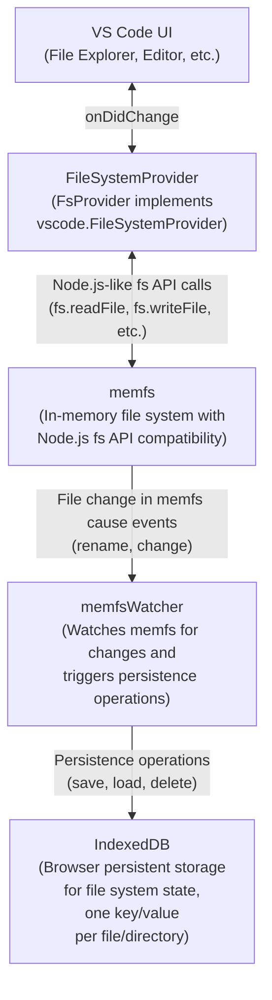
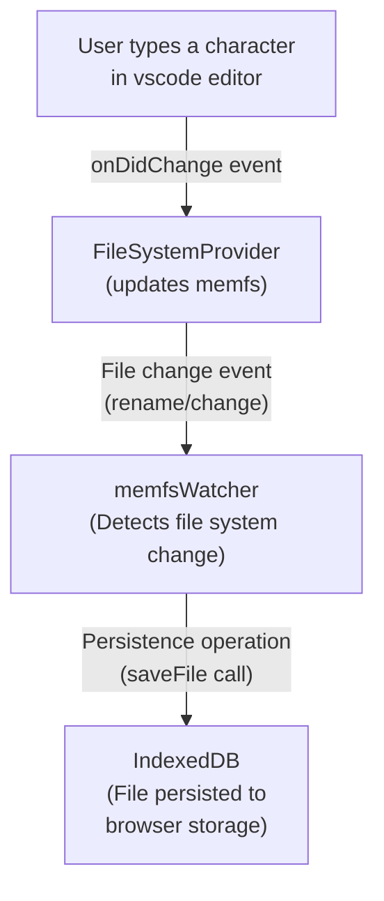
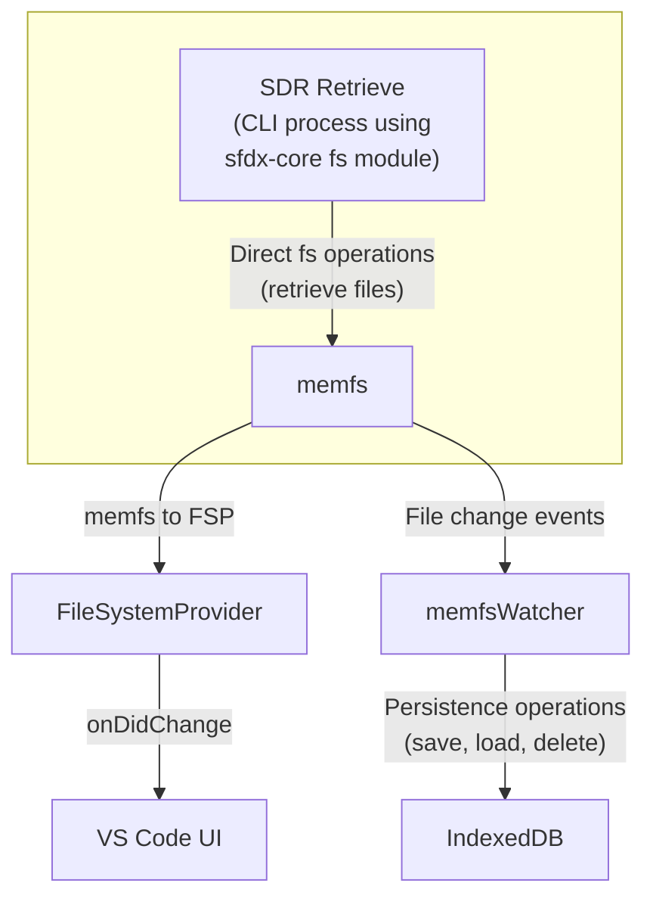

# Virtual Filesystem Provider

on the web, we don't have local fs. So we're going to use memfs as an in-memory fs with an API exactly like `node:fs` and `graceful-fs`.

It doesn't have persistence, so we need to write transactions to browser storage (IndexDB).

## Big picture

### Component Responsibilities:

- **VS Code UI**: User interface for file operations (Explorer, Editor)
- **FileSystemProvider**: VS Code API implementation that bridges UI to file system
- **memfs**: In-memory file system providing Node.js fs API compatibility
- **memfsWatcher**: Monitors file changes and triggers persistence to browser storage
- **IndexedDB**: Browser persistent storage ensuring data survives page reloads

## Example data flows

### User edits a file

Every change by the user generates a VSCode onDidChange event. We want to alway write every change to memfs so the user doesn't have to save files manually (think google docs, not old-school Word)

The change flows from top to bottom:

### Rehydrating the project

When the project loads, we need to populate everything from indexDB into memfs and then hook that into fsp for vscode.

[it's the same diagram as "edit a file" but arrows start athe bottom and go upward.]

When there aren't fils in the browser storage, the Extension activate function will write them to memfs. The flow is similar to what SDR does in the next example.

### Some process edits a file directly in mems

the CLI libraries now use an `fs` module from sfdx-core. It **could** be memfs, or regular `node:fs`. This allows **any other process** (ex: SDR retrieve) to edit memfs directly and have those changes flow "upward" to the vscode UI and down to browser storage

