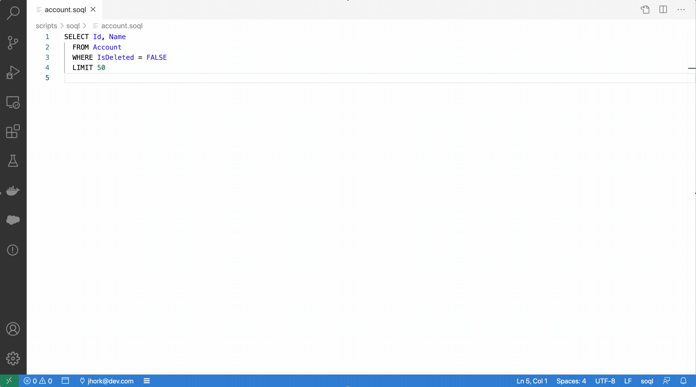

# SOQL Builder for Visual Studio Code

SOQL Builder enables you to interactively build a SOQL query via a form-based visual editor, view the query as you build, and save query results as a .csv or .json file. When the query is a normal file on disk, export uses the system save dialog with a default next to that file. When the document is not on disk (for example untitled editors, VS Code for the Web, or a virtual workspace), export prompts for a file name and a project output directory—the same pattern as **SFDX: Create Query in SOQL Builder**.

## Documentation

For documentation, visit the [Salesforce Extensions for Visual Studio Code](https://developer.salesforce.com/tools/vscode) documentation site.

## Bugs and Feedback

To report issues with Salesforce Extensions for VS Code, open a [bug on GitHub](https://github.com/forcedotcom/salesforcedx-vscode/issues/new?template=Bug_report.md). If you would like to suggest a feature, create a [feature request on GitHub](https://github.com/forcedotcom/salesforcedx-vscode/issues/new?template=Feature_request.md).

## Resources

- Doc: [SOQL and SOSL Reference](https://developer.salesforce.com/docs/atlas.en-us.soql_sosl.meta/soql_sosl/sforce_api_calls_soql_sosl_intro.htm)
- Doc: [SOQL and SOSL Queries](https://developer.salesforce.com/docs/atlas.en-us.apexcode.meta/apexcode/langCon_apex_SOQL.htm)
- Trailhead: [Get Started with SOQL Queries](https://trailhead.salesforce.com/content/learn/modules/soql-for-admins/get-started-with-soql-queries)

---

Currently, Visual Studio Code extensions are not signed or verified on the Microsoft Visual Studio Code Marketplace. Salesforce provides the Secure Hash Algorithm (SHA) of each extension that we publish. Consult [Manually Verify the salesforcedx-vscode Extensions' Authenticity](../../SHA256.md) to learn how to verify the extensions.

---
